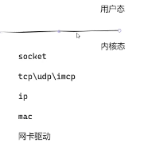

# boost.asio

## 什么是boost.asio?

同步IO       reactor 、 阻塞IO网络模型           
异步IO       iocp         

**接口上：**

同步IO ：       read   /  accept  /  connect  /  write    （返回代表IO操作完成）
异步IO ：     WSARecv  / AcceptEx / ConnectEx / WSASend   （返回代表提出了一个操作请求[操作系统代为处理]，不代表操作完成）

阻塞IO ： 阻塞当前线程，等待客户端发送数据
非阻塞IO：用epoll、select、poll检测缓冲区是否有数据

**原理上：**

场景：淘宝多家店下单
阻塞IO ： 下单之后直接去菜鸟驿站等，货到了拿回来继续等。
reactor ：（只需注册一次）告诉菜鸟驿站，有物品通知我们。通知后我们去取，然后返回。每次通知都去取。
asio IO ：（抛出请求）告诉菜鸟驿站有货物，给菜鸟驿站准备一个篮子。物品到达后驿站装到篮子中主动给我们（完成这次投递）。如需继续接收则需要继续投递请求。

## boost.asio是如何解决问题的

### 命名空间：

**reactor流程**：绑定socket，epoll检测就绪，非阻塞操作io（事件循环当中）

**boost::asio**：提供了一个核心类以及重要的函数

io_context相当于reactor、iocp的对象 ，需要绑定socket

同步io函数：（类似于posix api）connect 、accept、read_some、write_some

异步io函数：async_connect 、async_accept、async_read_some、async_write_some

**boost::asio::ip**：管理socket到ip三层内容


ip地址封装 ： ip::address

端点：绑定具体ip地址 、 port 、ip4/ip6 、 tcp/udp等具体信息 ， 绑定io_context 

ip : ip::tcp::endpoint/ip::udp::endpoint
socket : ip::tcp::socket/ip::udp::socket
套接字控制：set_option\get_option\io_contro


**库文件：**

boost::system库：

同步IO出错：抛异常、获取错误码。（函数重载）
```cpp
connect(socket);//只抛出异常
connect(socket,boost::system::error_code err);//err为错误码
```
异步io函数：
```cpp
asyn_read_some(buffer(data,length),[](boost::system::error_code err , size_t transferedBytes){});
//buffer为给操作系统装返回值的篮子
//err为读出数据错误值，transferedBytes为放入的数据量
```

boost::regex 、read_until 、async_read_until库： 

## 代码实例

```cpp

class Session : std::enable_shared_from_this<Session>{
public:
    Session(tcp::socket sock) : socket_(std::move(sock)){}

    void Start(){
        if(err){
            do_close();
            return;
        }
        do_read();
    }

private:
    void do_close(){
        socket_.close(boost::system::error_code err);
    }

    void do_read(){
        auto self(shared_from_this());
        socket_.async_read_some(buffer(readbuffer, max_packet_len), 
            [this,slef](boost::system::error_code err , size_t transfered){//回调函数是异步操作，在别的线程执行，不添加self会可能导致主线程析构掉
                if(err){
                    do_close();
                    return;
                }
                
                do_read();
            }
        );
    }

    void do_write(){
        auto self(shared_from_this());
        socket_.async_write_some(buffer(readBuffer_, max_packet_len),
            [this,self](boost::system::error_code err , size_t transfered){
                if(err){
                    do_close();
                    return ;
                }
                do_read();
            }
        )
    }

    tcp::socket socket_;
    enum {max_packet_len = 1024};
    char readbuffer[max_packet_len];
}

class Server{
public:
    Server(io_context& io_ctx , short port):acceptor_(io_ctx , tcp::endpoint(tcp::v4(),port)){}
private:
    void do_accept(){
        acceptor_.async_accept(
            [this](boost::system::error_code err , tcp::socket sock){
                if(!err){
                    std::make_shared<Session>(sock) -> Start();//开始监听
                    //由于asio是发一个请求监听一组，所以包装session进行持续的监听
                }
            }
        );
    }
    tcp::acceptor acceptor_;
}

int main(){
    //所有计算机网络模型中，创建socket、绑定地址、开始监听都存在
    io_context io_ctx;

    tcp::acceptor(io_ctx, )

    io_ctx.run();// 启动一个事件循环，处理所有的异步任务（如网络操作、定时器、文件 I/O 等），并在所有任务完成后退出
    
    return 0;
}
```

## 解决了哪些痛点？

1.屏蔽了linux系统中的posix api和windows中iocp的不同，使用容易，可以跨平台
2.异步io编程方式
3.抽象模型简单