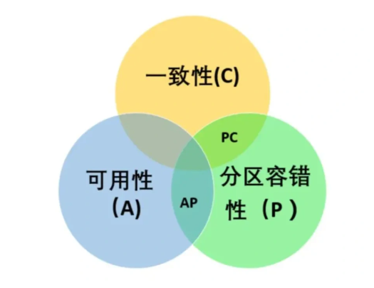
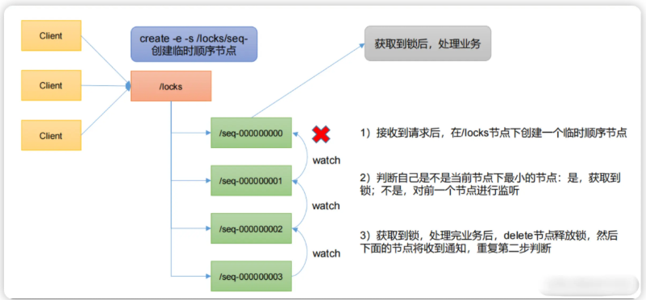
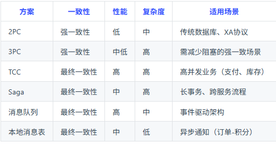

# 分布式

## 分布式理论

**什么是分布式系统**

简单来说，分布式系统就是把多台独立的计算机通过网络连接起来，让它们协同工作，一起去完成同一个任务。对于使用这个系统的用户来说，他感觉不到背后有成百上千台机器，他只会觉得自己在用一台超级强大的计算机。  
为了方便理解，我们可以打个比方：就像开一家饭店。最开始客人少，店里只有一个大厨（单机系统），洗菜、切菜、炒菜他一个人全包了。但后来生意越来越好，一个大厨根本忙不过来（单机遇到性能瓶颈）。这时候，老板没有去高薪聘请一个世界级的三头六臂神厨（垂直扩容，也就是疯狂升级单台服务器的硬件），而是雇了十个普通厨师，有人专门洗菜，有人专门切菜，有人专门炒菜（水平扩容，也就是分布式）。大家通过大喊或者传纸条来配合（网络通信），共同为大堂里的客人上菜。客人根本不在乎后厨是一个人还是十个人，他只在乎菜上得快不快、好不好吃。  
我们在实际开发中之所以要用分布式系统，主要有两个根本原因：

第一是为了高并发和高性能。单台服务器的 CPU、内存再强也是有天花板的，遇到了双十一这种海量流量，单机肯定扛不住，必须要把压力分散到多台机器上去。  
第二是为了高可用。也就是容灾能力。如果只有一台机器，它一旦宕机，整个业务就瘫痪了（单点故障）。而在分布式系统里，哪怕有几台机器坏了，只要其他机器还在运转，整个系统依然能对外提供服务，这叫部分失效，不影响全局。

不过，引入分布式并不是百利而无一害的，它引入了极大的复杂性，这也是我们在分布式开发中最头疼的地方。
举个最典型的例子，数据一致性问题。  
由于机器变多了，它们之间只能通过网络来沟通，但网络是不稳定的。假设用户下了一笔订单，订单节点的机器记录了「已下单」，然后它通过网络告诉库存节点的机器「扣减库存」，结果这个时候网络卡了，库存节点没收到消息。这就麻烦了，订单生成了，但库存没扣，数据就不一致了。  
为了解决这个问题，就会涉及到分布式事务、分布式锁、甚至著名的 CAP 定理等复杂的技术方案。  
总而言之，分布式系统本质上就是用更多的机器和更复杂的软件架构，去换取系统更高的性能、扩展性和可靠性。  


**分布式和微服务有什么区别？**

一句话概括它们的核心区别就是：分布式是一种「物理部署方式」，主要解决单台机器性能扛不住的问题；而微服务是一种「软件架构设计思想」，主要解决系统代码堆积太多、难以维护的问题。  
为了方便理解，我分开给你稍微解释一下:  

首先看「分布式系统」。它是从物理层面出发的。当我们的业务流量越来越大，单台服务器的 CPU 和内存再怎么升级也不起作用时，我们就多买几台机器，把它们连起来一起干活。打个比方，有 1 万块砖要搬，一个人搬不动，我们就雇 10 个人一起搬。只要是多台机器通过网络协同工作来完成一个任务，这就是分布式。它追求的是在这个集群里堆更多的机器，来扛住更高的并发，保证一台机器宕机了别的机器还能顶上（高可用）。  
接着看「微服务」。它是从软件工程和业务逻辑的层面出发的。早期的开发，很多公司习惯把所有的功能（比如订单、用户、支付、积分）全部写在一个庞大的项目里，打包成一个巨大的系统部署。这在业务简单的初期没问题，但如果业务越来越复杂，几百个程序员改同一份代码，牵一发而动全身，系统就会变得极其臃肿且难以维护。所谓的微服务，就是把这个巨大的单体应用，按照业务边界拆分成一个个独立的小服务。就像一家原本什么都卖的超级杂货铺，拆分成了专门卖菜的、专门卖肉的、专门卖衣服的独立店铺（订单服务、支付服务等）。各个店铺只管自己的事，互不干扰，相互之间需要什么就通过明确的接口去沟通。  

那么，这两者到底是怎么联系在一起的，又有什么本质区别呢？这里有一个非常核心的例子，也是初学者最容易陷入的误区：有多个机器在跑，不代表它就是微服务。假设我们有一个传统的、什么功能都塞在一起的巨无霸单体项目，我们把它原封不动地复制了 10 份，部署在 10 台服务器上，前面架设一个 Nginx 做负载均衡。这就叫「分布式系统」（集群部署），因为确实是多台机器在协同工作。但是，这绝对不是微服务，因为它内部依然是一个揉在一起的庞大单体。  
反过来，一旦我们采用了微服务架构，把它拆分成了几十个甚至上百个独立的小服务，一台机器绝对跑不起来这么多服务，通常也是要部署在成百上千台服务器上的。所以，微服务架构天然就是需要用分布式的方式进行部署的。  

总结一下：分布式的核心是「机器的拆分和协同」，微服务的核心是「业务逻辑和业务边界的拆分」。微服务其实就是分布式架构发展到一定阶段后，在软件工程领域总结出来的一种非常优秀、非常具体的架构风格。  

**介绍一下CAP理论**
CAP原则又称CAP定理，指的是再一个分布式系统中Consistency(一致性)、Availability(高可用性)、Partition tolerance(分区管理容错性),三者不可兼得。



**C:一致性**：分布式系统中所有数据备份，在同一时刻是否同样的值（等同于所有节点访问同一份最新的数据副本）
**A:可用性**在集群中一部分节点故障后，集群整体是否能响应客户端的读写请求（对数据更新具备高可用性）
**P：分区容忍性**以实际效果而言，分区相当于对通信的时限要求，系统如果不能在时限内达成数据一致性，就意味着发生了分区的情况，必须就当前的操作在C和A之间做出选择

**怎么理解 BASE 理论？**

BASE 理论其实是我们在做分布式系统时，一种极其务实的架构设计指导思想。  
在解释它之前，不得不稍微提一句大家都很熟悉的 CAP 定理。我们知道，在分布式系统里，为了保证高可用（A），往往就很难保证数据的强一致性（C）。如果我们死磕强一致性，要求所有机器上的数据每时每刻都必须一模一样，那系统在同步数据时稍微遇到点网络波动，可能就得暂停服务，这就导致可用性大大降低了。  
所以，前人们就提出了 BASE 理论。它的核心思想就是：既然强一致性太难做到，也会拖垮系统性能，那我们能不能妥协一下？允许数据在短时间内不一致，只要保证最后的结果是对的就好了，以此来换取系统极高的可用性。  

BASE 是三个英文短语的缩写，为了方便理解，我结合实际应用场景给你挨个解释一下：

第一个是 Basically Available，也就是「基本可用」。它的意思是，当系统遇到机器故障或者前所未有的流量洪峰时，我们允许系统损失掉一部分可用性，来保住核心业务正常运转。这非常像我们生活中的「丢车保帅」。举个例子，双十一零点，大家都集中冲进去买东西，服务器压力极其巨大。这时候，电商平台可能会把「查看商品历史评价」、「申请退款」这类非核心功能暂时停掉（这就叫服务降级）；或者大家觉得页面加载比平时慢了一两秒（响应时间上的妥协）。虽然用户体验打了一点折扣，但大家依然能完成最核心的「下单付款」动作，系统没有直接崩溃，这就是基本可用。  
第二个是 Soft State，也就是「软状态」。传统数据库里，数据要么是成功，要么是失败，这叫「硬状态」。而在分布式系统里，由于机器之间同步数据需要通过网络，网络是有延迟的，所以我们允许数据存在一种「中间状态」，而且这种中间状态的存在，不会影响系统的基本可用性。比如我们在银行 APP 上跨行转账，钱扣了，但是对方还没收到，这时候其实就处于一个叫「转账处理中」的软状态。  
第三个是 Eventually Consistent，也就是「最终一致性」，这也是整个理论的灵魂。既然我们允许了中间状态（软状态）的存在，那系统总不可能一直错下去吧？最终一致性就是保证，不管中间由于网络延迟或者重试折腾了多久，经过一段时间后，所有节点的数据最终一定会达到一个完全一致的正确状态。就像刚刚那个跨行转账的例子，不用非得要求你点完确定的一瞬间对方立刻收到钱（那叫强一致性），只要银行系统内部经过不断地重试和对账，向你承诺「2 小时内一定到账」，最后钱实实在在地被打进了对方账户，这就满足了最终一致性。  


最后总结一下：如果你问我怎么一句话概括 BASE 理论，我会说它就是「对强一致性的一种降级妥协」。在实际业务开发中，除了支付结账这种涉及到钱的极少数场景需要用复杂的方案去死磕强一致性之外，我们绝大部分的互联网高并发架构（比如利用消息队列做异步处理），其实践行的都是 BASE 理论，牺牲短暂的一致性，换取系统的高可用和高性能。

## 分布式锁

**Redis分布式锁**

分布式锁是用于分布式环境下并发控制的一种机制，用于控制某个资源在同一时刻只能被一个应用所用。  

Redis 本身可以被多个客户端共享访问，正好就是一个共享存储系统，可以用来保存分布式锁，而且 Redis 的读写性能高，可以应对高并发的锁操作场景。Redis 的 SET 命令有个 NX 参数可以实现「key 不存在才插入」，所以可以用它来实现分布式锁：  
如果 key 不存在，则显示插入成功，可以用来表示加锁成功；  
如果 key 存在，则会显示插入失败，可以用来表示加锁失败。  

基于 Redis 节点实现分布式锁时，对于加锁操作，我们需要满足三个条件。  

加锁包括了读取锁变量、检查锁变量值和设置锁变量值三个操作，但需要以原子操作的方式完成，所以，我们使用 SET 命令带上 NX 选项来实现加锁；  
锁变量需要设置过期时间，以免客户端拿到锁后发生异常，导致锁一直无法释放，所以，我们在 SET 命令执行时加上 EX/PX 选项，设置其过期时间；  
锁变量的值需要能区分来自不同客户端的加锁操作，以免在释放锁时，出现误释放操作，所以，我们使用 SET 命令设置锁变量值时，每个客户端设置的值是一个唯一值，用于标识客户端；  
满足这三个条件的分布式命令如下：  
```sh
SET lock_key unique_value NX PX 10000
```
lock_key 就是 key 键；  
unique_value 是客户端生成的唯一的标识，区分来自不同客户端的锁操作；  
NX 代表只在 lock_key 不存在时，才对 lock_key 进行设置操作；  
PX 10000 表示设置 lock_key 的过期时间为 10s，这是为了避免客户端发生异常而无法释放锁。  

而解锁的过程就是将 lock_key 键删除（del lock_key），但不能乱删，要保证执行操作的客户端就是加锁的客户端。所以，解锁的时候，我们要先判断锁的 unique_value 是否为加锁客户端，是的话，才将 lock_key 键删除。  
可以看到，解锁是有两个操作，这时就需要 Lua 脚本来保证解锁的原子性，因为 Redis 在执行 Lua 脚本时，可以以原子性的方式执行，保证了释放锁操作的原子性。  
```lua
// 释放锁时，先比较 unique_value 是否相等，避免锁的误释放
if redis.call("get",KEYS[1]) == ARGV[1] then
    return redis.call("del",KEYS[1])
else
    return 0
end
```
这样一来，就通过使用 SET 命令和 Lua 脚本在 Redis 单节点上完成了分布式锁的加锁和解锁。

**zookeeper 实现分布式锁**



ZooKeeper 做分布式锁，核心依赖两个能力：  
1.临时节点：客户端会话断开，节点自动删除。  
2.顺序节点：创建节点时，ZooKeeper 会自动给节点加一个递增序号。  

为什么要用zookeeper来进行分布式锁？  
基于redis的锁会导致以下几个问题：1.当锁释放时，所有等待锁的进程都会去试图抢锁，产生惊群效应，压力很大。 2. 抢锁导致谁先抢到不一定有序，容易造成竞争混乱。

ZooKeeper 分布式锁一般通过临时顺序节点实现。每个客户端到锁目录下创建一个临时顺序节点，序号最小的节点获得锁，其他客户端只监听自己前一个节点的删除事件。这样既保证了锁的有序竞争，也避免了所有客户端同时被唤醒造成的惊群效应。由于节点是临时的，如果持锁客户端宕机，会话失效后节点会自动删除，锁能够自动释放。

**优点：** 不会死锁  、 公平性较好   、 能避免惊群效应
**缺点：** 性能不算特别高、 获取锁涉及网络通信和节点操作、 不适合超高频短临界区场景

ZooKeeper 的 Leader 选举发生在集群启动或 Leader 故障时。每个节点初始先投自己，然后交换投票信息，比较 epoch、zxid 和 myid，优先选择任期更新、数据更新的节点作为 Leader。当某个节点获得超过半数投票后，就会成为 Leader。这样可以保证整个集群始终只有一个被多数节点认可的主节点，从而维持一致性。

## 分布式ID

**什么情况需要用分布式ID**

首先，分布式 ID 要解决的核心痛点，就是在「多节点、多数据库环境下，如何生成一个全局唯一且最好是有序的标识」。在业务发展初期，也就是单体架构时代，我们其实根本不需要分布式 ID。比如存个订单，直接依托 MySQL 单表主键的「自增属性」（从 1，2，3 这样往上加）就完美搞定了，既不重复，插入性能又好。  

但在系统发展到一定体量后，有几种情况就会逼着我们必须引入分布式 ID：  

第一种情况，也就是最绝对的刚需，数据库的分库分表。假设单聊订单业务，当每天产生几百万订单，单张 MySQL 表肯定装不下、也扛不住并发了，我们必须把这单表拆分成比如 10 张或者 100 张表（分散在多个库里）。一旦拆表，原来最省事的「数据库自增主键」就立刻失效了。为什么呢？因为各个子表之间是不知道对方状态的，表 A 自己从 1 开始递增，刚刚生成了 ID 为「1」的订单；表 B 也在运行，也从 1 开始，生成了 ID 也是「1」的订单。这时候如果你想查这条订单，系统就彻底懵了。  
所以，在分库分表场景下，我们迫切需要剥离出这个生成 ID 的权力，找一个「凌驾于所有子表之上」的独立系统或算法来充当发号器，保证它发出来的 ID 绝对不会重复。这就必须要用分布式 ID 了。

第二种情况是高并发的微服务多节点环境，并且对数据库写入性能有极高要求。 这时候你可能会有个疑问：既然多台机器容易生成同样的 ID，那我本地自己生成一个永远不重复的 UUID 不就行了吗？ 确实，UUID 是全球唯一的，但在实际工程里，特别是 Java 搭配 MySQL 的架构里，我们极简不推荐用 UUID 做核心表的主键。因为 UUID 是一串非常长且毫无规律的字符串。如果把它作为主键存进 MySQL，因为存储是按照主键排序的，这种杂乱无章的 ID 会导致每一次插入新数据，数据库可能都要在底层的 B + 树索引中间硬塞进去，引发非常影响性能的「页分裂」现象，导致写入极慢、占用空间极大。  
因此，我们需要一种既能在成百上千台机器并发时绝不碰撞（唯一），又能在进入数据库时不乱插队、大致保持「递增趋势」的 ID 生成的方案（这就必须要用到分布式 ID 中的雪花算法一类的技术）。

第三种情况是多系统打通合并数据。 比如咱们公司收购了一个竞品，或者要把原来独立的 A 系统和 B 系统的数据汇总到数据仓库里做个报表。如果当初他们各自用的都是自己库里的自增 ID，这两套数据一相遇，ID 必定有大量重叠冲突，合并起来简直是灾难。这也是为什么大厂在设计一开始，只要是核心业务对象，都会采用全局唯一的分布式 ID。  
总结一下： 当我们遇到底层数据库必须分库分表，或者是在微服务高并发环境下对数据库插入性能与检索性能有较高要求（排斥 UUID）时，传统的单机生成 ID 方案就玩不转了，这时候我们就必须引入分布式 ID。

**分布式 ID 有什么方案？**

关于分布式 ID 的生成方案，业界在不断的摸索和演进中，沉淀了几种最主流的做法。在平时开发中我们要根据业务体量来选型，我给您梳理一下最常见的四种方案，并稍微讲一下它们的优缺点：

第一种方案最简单粗暴，就是 UUID。UUID 的代码本地一行就能敲出来，也确实能保证全球唯一。但咱们在实际也就是基于 MySQL 存储的业务中，尤其是核心表，几乎极少用 UUID 当主键。为什么呢？首先它是一串 32 位的乱码字符串，占用的存储空间太大了。更要命的是，它是无序的。MySQL 底层一般采用 B + 树索引，它最喜欢「趋势递增」的数据，这样能按顺序往后排。如果您拿一堆杂乱无章的 UUID 往里插，每次都会在索引树的中间硬挤进去，导致极其消耗性能的「页分裂」现象。所以 UUID 只适合用于日志跟踪之类的非核心场景。

第二种方案是 数据库号段模式。既然 UUID 不递增，那我们就用数据库专门做个「发号器」拿自增 ID 好了。但每次生成一个 ID 都要去查一次数据库，并发一高数据库肯定被压垮。所以后来大家把它优化成了「号段模式」。这个很容易理解，就像是去批发市场进货。业务节点不再是每次都去数据库要「1 个」ID，而是一次去求数据库分配「1000 个」ID 作为一个号段，拿到本地内存里缓存起来慢慢分配，发完了再回头找数据库要下一个 1000 的号段。这种方案不仅性能大幅提升，而且就算数据库短暂宕机，系统靠着本地库存还能顶住一段时间的业务，非常稳定。美团开源的 Leaf 组件里就有这种模式的身影。

第三种方案是 基于 Redis 的生成。说白了就是利用 Redis 的 INCR 指令这种单线程原子操作，让它帮我们不断地加 1 去计数。好处是 Redis 全内存操作，速度比数据库快非常多，而且生成的 ID 是纯数字、绝对递增的。但这种方案的硬伤在于「重度依赖 Redis」。如果是小公司还好说，如果是大厂，为了生成 ID 去专门维护一套能够抗住极高并发不宕机、且要保证数据严格持久化不丢失的 Redis 集群，运维成本和网络开销其实是不低的。

第四种方案，也就是目前高并发场景下最主流的 雪花算法（Snowflake）。前面不管是查数据库还是查 Redis，都要走一趟网络请求。雪花算法的巧妙之处就在于，它是一个完全不需要依赖外部服务、在机器本地纯计算生成 ID 的算法。它的核心思想是拼凑出一个 64 位的超级长的长整型数字。怎么拼呢？它按照规定把这个数字砍成了几段：最前头存的是当前系统的时间戳，中间存这台机器的机器标识，末尾存这段时间内的自增流水号。这样设计极其精妙：  
因为开头存的是时间，所以随着时间推移，生成的 ID 肯定是一直变大的，完美迎合了 MySQL 对递增的需求。   
因为中间放了机器号，所以全网所有机器分别只管自己生成，绝对不会重复。性能极高。当然，多交代一句，雪花算法也有个公认的软肋叫「时钟回拨」：因为严重依赖机器当前的时间，万一一台机器的时间被操作系统的服务器往回调了几毫秒，那生成的 ID 就会跟刚才过去的重复。这在实际应用中往往需要通过一些特殊的时间校验代码来防范。  

总结一下：如果您问我在实际业务中怎么选，我觉得：对于绝大部分普通公司，要求稳定且开发成本低，用数据库号段模式就非常香了；但如果是像咱们这种对并发量、延迟要求极严苛的大厂或者核心系统，那就一定得上基于雪花算法的方案（或者直接用百度、美团开源的封装好的发号器框架）。

## 分布式事务

**什么情况下需要使用分布式事务？**

简单的说，只要我们的业务往往超出了「单一数据库连接」的范畴，需要跨越多个物理上分离的数据库，或者跨越多个微服务，同时又必须保证这些跨节点的数据操作「要么全部成功，要么全部回滚」时，我们就必须得引入分布式事务了。  
在实际开发开发中，通常有以下两种最典型的场景会逼着我们使用分布式事务：

第一种情况最常见：微服务架构下的跨服务协同。  
在微服务时代，我们推崇「一个服务专属一个自己的数据库」。我给您举个特别经典的电商下单例子：用户点击支付后，后台其实需要做三件事：订单服务去更新订单状态，库存服务去扣减库存，账户服务去扣减余额。 这三个动作发生在三个独立的系统和三个独立的数据库里。假设前两步都成功了，但在调用账户服务扣钱时，账户所在的服务器宕机了。这时候，传统的本地事务根本无能为力，它只能回滚当前账户库的报错，完全没办法隔空把已经成功提交的「订单」和「库存」撤销掉。这就会导致商家的货少扣了，但用户的钱没扣。 为了让这分散在各个地方的三个操作绑在一条战壕里，做到一损俱损、一荣俱荣，我们就必须引入像 Seata 这样的分布式事务组件来做全局的调度。  
第二种情况是底层由于数据量大，做了「分库分表」。  
这可能发生在单体应用里。假如咱们没有做微服务架构，所有的代码都在一起，但是底层由于数据太多，把一个大库拆成了库 A 和库 B。如果我们在一个方法里，同时往库 A 里插入账单，又往库 B 里插入流水。由于它们在物理上已经是两个独立的数据库实例、走的是两条独立的网络连接了，Spring 自带的本地事务就无法再确保这两个连接能同时完美提交了，一旦一边成功一边挂掉，也会产生脏数据。这种情况同样也得靠分布式事务来解决。  

不过，站在实际架构面试者的视角，我还想补充非常重要的一点：权衡与妥协。虽然分布式事务能解决跨库的数据一致性，但业界有个共识，能绕开不用，就尽量不用。因为强一致性的分布式事务（比如传统的两阶段提交）是非常重的，它会让多个节点的数据库锁互相等待，极其拖慢系统的响应速度，根本抗不住互联网的高并发。  
所以，在真实的互联网公司里，除非是像核心银行转账这样对钱要求「强一致性」（必须立刻、马上分毫不差）的场景才会咬牙使用传统的分布式事务。  
而对于大多数微服务场景，我们通常会退而求其次，利用消息队列（MQ）+ 本地消息表，或者重试机制，来实现业务的「最终一致性」。也就是说：允许短时间内数据有点误差，只要保证过一会儿大家的数据能最终对齐就行，以此来换取系统极高的性能。  

总结一下：当我们遇到跨服务调用、或者底层有跨数据库（分库分表）操作时，想要保证数据完全一致，就需要使用分布式事务。但在实际落地选型时，还要根据业务对延迟的容忍度，去选择是硬扛「强一致性」框架，还是用消息队列去做「最终一致性」。

**分布式事务的解决方案你知道哪些？**


两阶段提交协议（2PC）：为准备阶段和提交阶段。准备阶段，协调者向参与者发送准备请求，参与者执行事务操作并反馈结果。若所有参与者就绪，协调者在提交阶段发送提交请求，参与者提交；否则发送回滚请求。实现简单，能保证事务强一致性。存在单点故障，协调者故障会影响事务流程；性能低，多次消息交互增加延迟；资源锁导致资源长时间占用，降低并发性能。适用于对数据一致性要求高、并发度低的场景，如金融系统转账业务。  
三阶段提交协议（3PC）：在 2PC 基础上，将准备阶段拆分为询问阶段和准备阶段，形成询问、准备和提交三个阶段。询问阶段协调者询问参与者能否执行事务，后续阶段与 2PC 类似。降低参与者阻塞时间，提高并发性能，引入超时机制一定程度解决单点故障问题。无法完全避免数据不一致，极端网络情况下可能出现部分提交部分回滚。用于对并发性能有要求、对数据一致性要求相对较低的场景。  
TCC：将业务操作拆分为 Try、Confirm、Cancel 三个阶段。Try 阶段预留业务资源，Confirm 阶段确认资源完成业务操作，Cancel 阶段在失败时释放资源回滚操作。可根据业务场景定制开发，性能较高，减少资源占用时间。开发成本高，需实现三个方法，要处理异常和补偿逻辑，实现复杂度大。适用于对性能要求高、业务逻辑复杂的场景，如电商系统订单处理、库存管理。  
Saga：将长事务拆分为多个短事务，每个短事务有对应的补偿事务。某个短事务失败，按相反顺序执行补偿事务回滚系统状态。性能较高，短事务可并行执行减少时间，对业务侵入性小，只需实现补偿事务。只能保证最终一致性，部分补偿事务失败可能导致系统状态不一致。适用于业务流程长、对数据一致性要求为最终一致性的场景，如旅游系统订单、航班、酒店预订。   
可靠消息最终一致性方案：基于消息队列，业务系统执行本地事务时将业务操作封装成消息发至消息队列，下游系统消费消息并执行操作，失败则消息队列重试。实现简单，对业务代码修改小，系统耦合度低，能保证数据最终一致性。消息队列可靠性和性能影响大，可能出现消息丢失或延迟，需处理消息幂等性。适用于对数据一致性要求为最终一致性、系统耦合度低的场景，如电商订单支付、库存扣减。  
本地消息表：业务与消息存储在同一个数据库，利用本地事务保证一致性，后台任务轮询消息表，通过 MQ 通知下游服务，下游消费成功后确认消息，失败则重试。简单可靠，无外部依赖。消息可能重复消费，需幂等设计。适用场景是异步最终一致性（如订单创建后通知积分服务）。  

分布式事务方案本质上是在一致性、性能和复杂度之间做权衡。2PC 和 3PC 更偏协议层强一致，但阻塞明显、性能较差；TCC 是业务层强一致方案，灵活但开发复杂；Saga 通过补偿事务保证最终一致，适合长流程；可靠消息最终一致性和本地消息表更适合互联网高并发场景，通过异步消息和重试机制保证最终一致。

**阿里的 seata 框架了解过吗？**

Seata 是开源分布式事务解决方案，支持多种模式：  
AT 模式：是 Seata 默认的模式，基于支持本地 ACID 事务的关系型数据库。在 AT 模式下，Seata 会自动生成回滚日志，在业务 SQL 执行前后分别记录数据的快照。当全局事务需要回滚时，根据回滚日志将数据恢复到事务开始前的状态。  
TCC 模式：需要开发者手动编写 Try、Confirm 和 Cancel 三个方法。Try 方法用于对业务资源进行预留，Confirm 方法用于确认资源并完成业务操作，Cancel 方法用于在业务执行失败时释放预留的资源。  
SAGA 模式：将一个长事务拆分为多个短事务，每个短事务都有一个对应的补偿事务。当某个短事务执行失败时，会按照相反的顺序执行之前所有短事务的补偿事务，将系统状态回滚到初始状态。

Seata 是一个开源分布式事务解决方案，面向微服务架构，核心角色有 TC、TM 和 RM。TC 负责协调全局事务，TM 负责发起和结束全局事务，RM 负责分支事务资源管理。Seata 支持 AT、TCC、Saga 和 XA 四种模式。AT 模式是最常用的，基于数据源代理、undo log 和全局锁实现，对业务侵入较小；TCC 由业务自己实现 Try、Confirm、Cancel，适合核心强一致场景；Saga 适合长事务和最终一致场景；XA 则基于标准 XA 协议实现强一致，但性能相对较差。官方最新可下载版本页面显示 Seata Server 当前提供 2.6.0 版本下载，GitHub Releases 也显示 2.6.0 为最新发布。

## 分布式组件

**RPC 的概念是什么？**

RPC 即远程过程调用，允许程序调用运行在另一台计算机上的程序中的过程或函数，就像调用本地程序中的过程或函数一样，而无需了解底层网络细节。  
一个典型的 RPC 调用过程通常包含以下几个步骤：  
客户端调用：客户端程序调用本地的一个「伪函数」（也称为存根，Stub），并传入所需的参数。这个「伪函数」看起来和普通的本地函数一样，但实际上它会负责处理远程调用的相关事宜。  
请求发送：客户端存根将调用信息（包括函数名、参数等）进行序列化，然后通过网络将请求发送到服务器端。  
服务器接收与处理：服务器端接收到请求后，将请求信息进行反序列化，然后找到对应的函数并执行。  
结果返回：服务器端将函数的执行结果进行序列化，通过网络发送回客户端。  
客户端接收结果：客户端接收到服务器返回的结果后，将其反序列化，并将结果返回给调用者。
常见的 RPC 框架  
gRPC：由 Google 开发的高性能、开源的 RPC 框架，支持多种编程语言，使用 Protocol Buffers 作为序列化协议，具有高效、灵活等特点。  
Thrift：由 Facebook 开发的跨语言的 RPC 框架，支持多种数据传输协议和序列化格式，具有良好的可扩展性和性能。  
Dubbo：阿里巴巴开源的高性能 Java RPC 框架，提供了服务治理、集群容错、负载均衡等功能，广泛应用于国内的互联网企业。  

**zookeeper 拿来做什么？核心的原理是什么？**

zookeeper 是分布式协调服务，它能很好地支持集群部署，并且具有很好的分布式协调能力，可以让我们在分布式部署的应用之间传递数据，保证顺序一致性（全序广播） 而不是强一致性，以下是其常见的应用场景：  

配置管理：在分布式系统中，不同节点往往需要相同的配置信息，如数据库连接参数、服务端口等。ZooKeeper 可以将这些配置信息集中存储，当配置发生变更时，能及时通知到各个节点。例如，一个由多个微服务组成的系统，各个服务实例可以从 ZooKeeper 中获取统一的配置，当配置更新时，ZooKeeper 会通知所有相关服务重新加载配置。
服务注册与发现：服务注册与发现是微服务架构中的关键环节。服务提供者在启动时将自己的服务信息（如服务名称、地址、端口等）注册到 ZooKeeper 中，服务消费者通过 ZooKeeper 查找并获取服务提供者的信息。当服务提供者发生变化（如上线、下线、故障等）时，ZooKeeper 会实时更新服务列表并通知服务消费者。像 Dubbo 框架就可以利用 ZooKeeper 实现服务的注册与发现。  
分布式锁：在分布式环境下，多个进程或线程可能会竞争同一资源，为了避免数据不一致等问题，需要实现分布式锁。ZooKeeper 可以通过创建临时顺序节点来实现分布式锁。当一个客户端需要获取锁时，它会在 ZooKeeper 中创建一个临时顺序节点，然后检查自己创建的节点是否是序号最小的节点，如果是，则表示获取到了锁；如果不是，则等待前一个节点释放锁。  
ZooKeeper 的数据模型类似于文件系统的树形结构，每个节点称为 Znode。每个 Znode 可以存储数据，也可以有子节点。Znode 有不同的类型，包括持久节点（PERSISTENT）、临时节点（EPHEMERAL）和顺序节点（SEQUENTIAL）。  
持久节点：一旦创建，除非主动删除，否则会一直存在。  
临时节点：与客户端会话绑定，当客户端会话结束时，临时节点会自动被删除。  
顺序节点：在创建时，ZooKeeper 会为其名称添加一个单调递增的序号，保证节点创建的顺序性。  
ZooKeeper 使用ZAB 协议来保证集群中数据的一致性。ZAB 协议基于主从架构，有一个领导者（Leader）和多个跟随者（Follower）。  
消息广播：当客户端发起写请求时，请求会先到达领导者。领导者将写操作封装成一个事务提案，并广播给所有跟随者。跟随者收到提案后，将其写入本地日志，并向领导者发送确认消息。当领导者收到超过半数跟随者的确认消息后，会发送提交消息给所有跟随者，跟随者收到提交消息后，将事务应用到本地状态机。  
崩溃恢复：当领导者出现故障时，ZooKeeper 会进入崩溃恢复阶段。在这个阶段，集群会选举出新的领导者，并确保在新领导者产生之前，不会处理新的写请求。选举过程基于节点的事务 ID 和节点 ID 等信息，保证新选举出的领导者包含了所有已提交的事务。  

## 分布式场景 

**常见限流算法**

一、核心算法总览  
滑动窗口限流算法：是对固定窗口限流算法的改进，有效解决了窗口切换时可能会产生两倍于阈值流量请求的问题。  
漏桶限流算法：能够对流量起到整流的作用，让随机不稳定的流量以固定的速率流出，但是不能解决流量突发的问题。  
令牌桶算法：作为漏斗算法的一种改进，除了能够起到平滑流量的作用，还允许一定程度的流量突发。  

二、固定窗口限流算法   
原理：固定窗口限流算法就是对一段固定时间窗口内的请求进行计数，如果请求数超过了阈值，则舍弃该请求；如果没有达到设定的阈值，则接受该请求，且计数加 1。当时间窗口结束时，重置计数器为 0。  
优缺点：  
优点：实现简单。    
缺点：存在「流量吐刺」问题。假设窗口大小为 1s，限流大小为 100，恰好在某个窗口的第 999ms 来了 100 个请求（窗口前期无请求，全部通过），下一个窗口的第 1ms 又来了 100 个请求（也全部通过），则 2ms 内通过了 200 个请求，达到阈值的两倍，会给系统造成巨大负载压力。  

三、滑动窗口限流算法  
原理：改进固定窗口缺陷的方法是采用滑动窗口限流算法，将限流窗口内部切分成一些更小的时间片，在时间轴上滑动，每次滑过一个小时间片，就形成一个新的限流窗口（即滑动窗口），在滑动窗口内执行固定窗口算法。  
特点：滑动窗口可以避免固定窗口出现的放过两倍请求的问题，因为一个短时间内出现的所有请求必然在一个滑动窗口内，所以一定会被滑动窗口限流。（注：每个滑动窗口内的请求数都不能超过设定的阈值流量）  

四、漏桶限流算法  
原理：漏桶限流算法是模拟水流过一个有漏洞的桶进而限流的思路：水龙头的水先流入漏桶，再通过漏桶底部的孔流出。如果流入的水量太大，底部的孔来不及流出，就会导致水桶太满溢出去。
从系统角度，加漏桶限流后，能保证请求以恒定的速率流出，让系统始终以平滑的传输速率处理请求，起到保护作用。  
缺点：1.即使系统资源很空闲，多个请求同时到达时，漏桶也是慢慢地一个接一个地处理请求，浪费计算资源。2.不能解决流量突发的问题：假设漏斗速率是 2 个 / 秒，突然来了 10 个请求，受限于漏斗容量，仅 5 个被接受、5 个被拒绝；且被接受的 5 个请求处理速度仍为 2 个 / 秒，无法应对突发流量。

五、令牌桶限流算法
原理：令牌桶是另一种桶限流算法，模拟一个特定大小的桶，向桶中以特定的速度放入令牌（token），请求到达后，必须从桶中取出一个令牌才能继续处理。如果桶中已经没有令牌，当前请求就被限流；如果桶中的令牌放满了，令牌桶也会溢出。  
放令牌的动作持续不断进行，桶中令牌数达到上限则丢弃令牌，因此桶中可持有大量可用令牌，请求进来可直接拿令牌执行。例如设置 qps 为 100，限流器初始化 1 秒后，桶中已有 100 个令牌，若此前无请求，突然来 100 个请求可直接处理，仅当桶中无令牌时请求才会等待，最终实现以一定速率执行。  
特点：令牌桶限流算法综合效果比较好，能在最大程度利用系统资源处理请求的基础上，实现限流的目标，建议通常场景中优先使用该算法。【与漏桶相比，令牌桶在面对瞬时爆发时，可以进行瞬时的处理，因为桶里有足够令牌，这 20 个请求都能立刻拿到令牌，所以它们不需要在限流器这一步等待。】

## 分布式一致性算法

**说下 Raft 算法？**

Raft 算法是现在工业界非常常用的分布式一致性算法，它就是为了解决多个节点之间数据保持一致的问题，设计上比 Paxos 简单易懂很多，它把整个一致性过程拆成了三个很清晰的部分：选主、日志复制、安全性保证。  
首先说节点状态，一个集群里的节点只会有三种身份：领导者、跟随者、候选人。正常情况下只有一个领导者，其他都是跟随者，跟随者不主动发请求，只听领导者的。  
然后是选主过程。如果跟随者一段时间没收到领导者的心跳，就会觉得领导者挂了，自己变成候选人去发起选举，给自己投票，再向其他节点拉票。只要拿到超过半数的投票，就能成为新的领导者，之后领导者会不断发心跳，告诉大家「我还在」，避免重复选举。  
接下来是最核心的日志复制。客户端的请求都会发给领导者，领导者把这个操作写成一条日志，先不提交，而是同步给所有跟随者。等超过半数的节点都确认收到这条日志，领导者就认为这条日志可以提交，然后自己提交，再通知所有跟随者一起提交，这样整个集群的数据就完全一致了。  
最后是安全性，简单说就是已经提交过的日志，永远不会被覆盖或丢失，就算节点重启、网络波动，新选出来的领导者一定拥有最全、最新的已提交日志，保证数据不会乱。  
总结一下，Raft 就是用选主 + 日志复制 + 半数确认这套简单机制，保证分布式系统强一致，好理解也好实现，像 etcd、K8s 里都是用的 Raft。  

**说一下 Paxos 协议？**

Paxos 是分布式系统里实现一致性的经典协议，简单说就是解决「多个节点协同，最终达成同一个决策」的问题，比如分布式集群里同步数据，避免各节点数据不一样，这也是它的核心价值。  
它主要有三个核心角色，我用通俗的话讲一下，更容易理解。  
第一个是提议者，就是发起提案的节点，比如客户端要修改集群里的数据，接收这个请求的节点就会成为提议者，负责把这个修改请求做成提案发出去。  
第二个是接受者，集群里大部分节点都是接受者，负责接收提案、投票决定要不要同意这个提案，相当于「投票人」。  
第三个是学习者，不参与投票，只同步最终达成一致的提案结果，比如一些备份节点，负责数据就行。  

核心流程是两阶段提交，这部分稍微难一点，我慢慢说。  
第一阶段是准备阶段，提议者先给所有接受者发一个准备请求，还得带一个唯一的提案编号，这个编号必须比之前所有的都大，目的是防止多个提议者同时发提案，乱了顺序。接受者收到后，会判断如果没答应过比这个编号更大的提案，就回复同意，还会告诉提议者自己之前接受过的最大编号提案（如果有的话）；要是已经答应过更大编号的提案，就直接拒绝。  
第二阶段是接受阶段，只有提议者收到超过半数接受者的同意，才能进入这一步。  
这里要重点说下，必须超过半数，比如 3 个节点要 2 个同意，5 个节点要 3 个同意，这样能避免出现多个提案同时通过的情况，保证最终只有一个结果。  
这时候提议者就把具体提案内容（比如「把数据 A 改成 B」）发给同意的接受者，请求它们接受。接受者只要没收到更大编号的准备请求，就会接受这个提案，然后反馈给提议者。等提议者收到超过半数的接受反馈，就说明提案达成一致了，再通知所有学习者同步这个结果。  
简单总结下，Paxos 就是靠「唯一提案编号 + 半数以上同意」的机制，就算出现节点故障、网络延迟这些情况，也能保证最终只有一个正确提案被所有节点认可，实现分布式数据一致性。  


**raft 协议和 paxos 协议的原理？**

Raft 和 Paxos 是两种经典的分布式一致性算法，旨在实现多节点状态机的高可靠一致性。两者核心目标相同（保证分布式系统数据一致性），但设计理念和实现方式有区别。

**raft 协议的原理：**   
Raft 算法由 leader 节点来处理一致性问题。leader 节点接收来自客户端的请求日志数据，然后同步到集群中其它节点进行复制，当日志已经同步到超过半数以上节点的时候，leader 节点再通知集群中其它节点哪些日志已经被复制成功，可以提交到 raft 状态机中执行。  
通过以上方式，Raft 算法将要解决的一致性问题分为了以下几个子问题。  
leader 选举：集群中必须存在一个 leader 节点。  
日志复制：leader 节点接收来自客户端的请求然后将这些请求序列化成日志数据再同步到集群中其它节点。  
安全性：如果某个节点已经将一条提交过的数据输入 raft 状态机执行了，那么其它节点不可能再将相同索引的另一条日志数据输入到 raft 状态机中执行。  

Raft 算法需要有两个比较重要的机制：   
角色转换与选举机制  
Raft 将系统中的节点分为三种角色：领导者（Leader）、跟随者（Follower）和 候选人（Candidate）。系统启动时，所有节点都是跟随者。跟随者会定期从领导者处接收心跳信息以确认领导者的存活。如果跟随者在一段时间内（选举超时时间）没有收到领导者的心跳，它会转变为候选人，发起新一轮的选举。候选人向其他节点发送请求投票消息。其他节点根据收到的请求投票消息，决定是否为该候选人投票。当候选人获得超过半数节点的投票时，它就成为新的领导者。领导者会周期性地向所有跟随者发送心跳消息，以维持自己的领导地位。每个领导者的领导周期称为一个任期（Term），任期号是单调递增的。  
日志复制机制  
客户端的请求会被领导者作为日志条目添加到自己的日志中。领导者将新的日志条目复制到其他跟随者节点。它会通过附加日志消息将日志条目发送给跟随者，跟随者收到消息后会将日志条目追加到自己的日志中，并向领导者发送确认消息。当领导者得知某个日志条目已经被大多数节点复制时，它会将该日志条目标记为已提交，并将其应用到状态机中。然后，领导者会通知其他节点该日志条目已提交，跟随者也会将已提交的日志条目应用到自己的状态机中。

**paxos 协议的原理：**    
Paxos 算法的核心思想是将一致性问题分解为多个阶段，每个阶段都有一个专门的协议来处理。  Paxos 算法的主要组成部分包括提议者（Proposer）、接受者（Acceptor）和投票者（Voter）。  
提议者：提议者是负责提出一致性问题的节点，它会向接受者发送提议，并等待接受者的回复。  
接受者：接受者是负责处理提议的节点，它会接收提议者发送的提议，并对提议进行判断。如果接受者认为提议是有效的，它会向投票者发送请求，并等待投票者的回复。  
投票者：投票者是负责决定提议是否有效的节点，它会接收接受者发送的请求，并对请求进行判断。如果投票者认为请求是有效的，它会向接受者发送投票，表示支持或反对提议。  
Paxos 算法的流程如下（以 Basic Paxos 算法为例子）  
准备阶段：提议者选择一个提案编号，并向所有接受者发送准备请求。提案编号是一个全局唯一的、单调递增的数字。接受者收到准备请求后，如果提案编号大于它之前接受过的任何提案编号，它会承诺不再接受编号小于该提案编号的提案，并返回它之前接受过的最大编号的提案信息（如果有）。  
接受阶段：如果提议者收到了超过半数接受者的响应，它会根据这些响应确定要提议的值。如果接受者返回了之前接受过的提案信息，提议者会选择编号最大的提案中的值作为要提议的值；如果没有，提议者可以选择自己的值。提议者向所有接受者发送接受请求，包含提案编号和要提议的值。
学习阶段：当提议者收到超过半数接受者对某个提案的接受响应时，该提案被认为达成共识。学习者通过接受者的通知得知达成共识的值。  

**对比总结**
Raft 更易于理解和实现，它将共识过程分解为选举和日志复制两个相对独立的子问题，并且对选举超时时间等参数进行了明确的定义和限制，降低了算法的复杂度。  
Paxos 是一种更通用、更基础的共识算法，它的理论性更强，在学术界有广泛的研究和应用。但 Paxos 的实现相对复杂，理解和调试难度较大。  

**有什么框架或技术用了 raft 协议？**

Etcd：一个开源的分布式键值存储系统，用于共享配置和服务发现等。它使用 Raft 协议来实现数据的一致性和分布式共识，确保在分布式环境中数据的可靠存储和访问，常被用于 Kubernetes 等容器编排系统中，为其提供配置管理和服务发现等功能。  
Consul：是一个用于实现服务发现、配置管理和分布式一致性的工具，它使用 Raft 协议来管理集群状态和实现数据复制，确保在分布式环境中服务的注册、发现和配置信息的一致性和可靠性，为微服务架构等提供了重要的基础设施支持。

**描述一下 ZAB 协议？**

首先明确，ZAB 协议是 ZooKeeper 专门设计的分布式一致性协议，核心作用就是保证 ZK 集群里所有节点的数据一致，比如我们用 ZK 做分布式锁、配置中心，能正常工作，全靠它来同步各节点的数据，避免出现数据不一样的情况。  
首先说下集群节点角色，很简单，只有三种：Leader（领导者）、Follower（跟随者）、Observer（观察者）。正常情况下只有一个 Leader，是整个集群的核心，负责接收客户端的写请求、发指令；Follower 就是跟着 Leader 走，参与投票和数据同步，还能处理读请求；Observer 比较特殊，不参与投票，只同步数据、处理读请求，目的是提升读性能，这个不用重点记，核心是 Leader 和 Follower。  

接下来是 ZAB 的核心工作流程，它分两种模式，正常工作的广播模式和 Leader 挂了之后的崩溃恢复模式。  
先讲广播模式，就是集群正常运行时的状态。客户端发一个写请求（比如创建节点、修改数据），会先发给 Leader。Leader 收到后，会把这个请求做成一个「事务提案」，还会给这个提案分配一个唯一的 zxid（事务 ID），这个 zxid 很关键，能保证所有提案的顺序，不会乱。然后分两步执行：第一步是提议阶段，Leader 把这个提案和 zxid 发给所有 Follower；Follower 收到后，先把提案写到自己的本地日志里（相当于先备份，防止数据丢失），然后回复 Leader 一个确认消息，说「我收到并备份好了」。第二步是提交阶段，这里重点来了，Leader 必须收到超过半数 Follower 的确认（比如 3 个节点要 2 个确认，5 个节点要 3 个），才能广播提交指令，为啥要超过半数？就是为了避免脑裂，保证整个集群只有一个正确的结果。Follower 收到提交指令后，就把之前备份的提案真正执行，这样所有节点的数据就完全一致了。    
然后是崩溃恢复模式，要是 Leader 突然挂了，或者网络断了，Follower 一段时间没收到 Leader 的心跳，就会认为 Leader 失效了。这时候不会乱，会触发选举，所有 Follower 会参与投票，选出一个新的 Leader。新 Leader 选出来后，第一件事就是同步所有 Follower 的日志，把大家的日志统一成和自己一样的（确保新 Leader 拥有最新、最全的已提交日志），等所有节点日志同步完成，就切换回广播模式，继续处理客户端请求，保证数据不会丢失、不会错乱。
简单总结一下，ZAB 协议就是靠「Leader 主导 + 半数确认 + 崩溃恢复」这一套机制，专门为 ZK 量身定制，保证集群数据一致性，支撑 ZK 的各种分布式场景，而且它和 Raft、Paxos 不一样，是 ZK 专属的，更贴合 ZK 的工作场景。  
