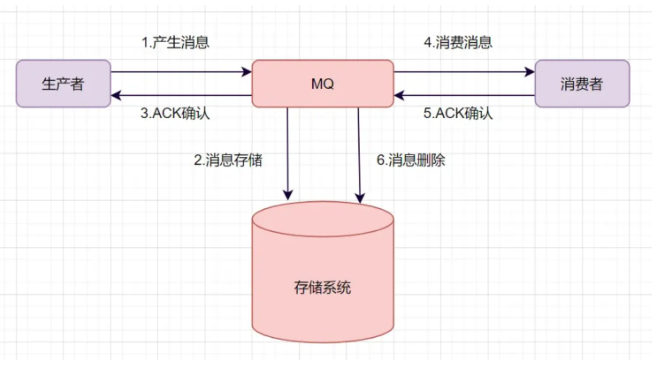
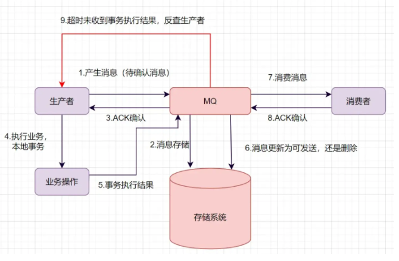
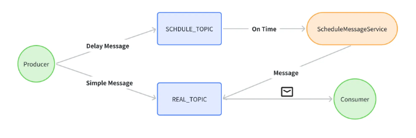
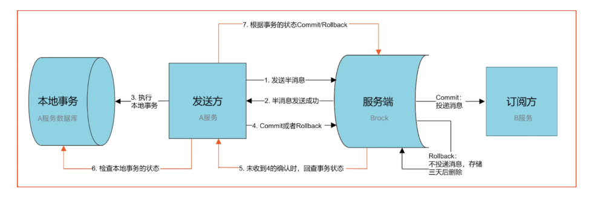
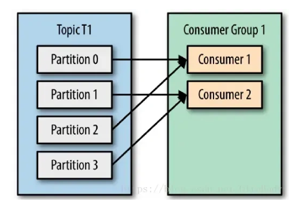
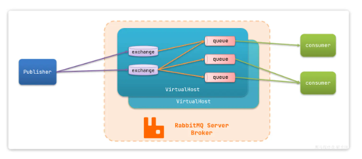
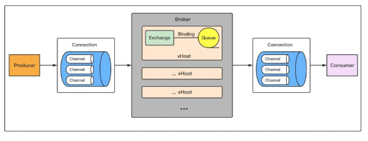
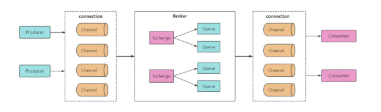
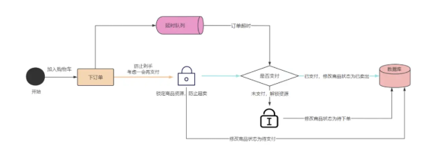
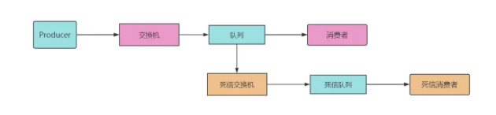

# 消息队列

## 消息队列场景

**什么是消息队列**

可以理解为使用队列来通信的组件。本质是个转发器，包含发消息、存消息、消费消息的过程。

**为什么要消息队列**

为了解决系统架构中的三大痛点：解耦、异步、削峰。

第一点：最核心的作用是为了「解耦」（把绑定在一起的系统拆开）。在没有 MQ 的时候，假设我们做个电商系统，用户付款完，系统要干好几件事：扣库存、发优惠券、加积分、还要发短信通知。如果订单系统直接用 RPC 调用去挨个通知这些子系统，那代码就高度耦合在了一起。万一有一天不需要发短信了，或者新加了一个自动发货服务，订单系统的研发就得整天去改代码重新发布；更别提如果哪天「发积分服务」挂了报错，甚至会连累整个订单支付流程跟着失败。引入 MQ 后，整个逻辑就变了。订单系统付款完，它只需要对着 MQ 丢一句话（发一条消息）：「用户 A 支付成功了」，它的主线任务就彻底结束了。后续不管有几个子系统关心这件事，它们自己去订阅 MQ 就好，哪怕以后新加再多依赖服务，订单系统的代码也一行都不用改。这就达到了物理和逻辑上的彻底解耦，系统容错率极高。

第二点：顺理成章带来的性能提升叫作「异步」。紧接上面的例子，如果要串行调用发短信、加积分等等这么多非核心流程，哪怕每个接口只用 50 毫秒，加起来用户在页面等待的时间可能就得大半秒甚至好几秒，疯狂转圈圈，体验极差。有了 MQ，主流程其实只需要把状态改掉，然后往 MQ 里抛一条消息（耗时大概几毫秒），立刻就可以给前端响应「恭喜你支付成功」了。像发短信、加积分这种「不是非得在这零点几秒内完成」的操作，完全可以让系统在后台顺着 MQ 慢慢执行，这样前台接口的响应时间就大幅缩短了。

第三点：是高并发场景下的保命神器，叫作「削峰填谷」。平常我们底层的 MySQL 数据库，一秒钟扛个一两千并发可能没事。但是一旦搞促销、秒杀，瞬间如果有两万的请求涌进来，如果直接打到数据库上，数据库绝对当场宕机。这个时候，MQ 就扮演了一个极其关键的「蓄水池」或者「排队区」的作用。这两万个瞬时狂暴请求过来，我们统一先扔进 MQ 里暂存着。然后后端的订单处理程序，根据自己数据库真实的抗压能力，平稳地、以一秒钟一两千个的速度，慢慢从 MQ 里往外拉任务往外处理。这就像游乐场门口的蛇形排队通道，把瞬间爆发的流量洪峰（削峰），分散到了后续慢慢处理（填谷）。虽然用户体感上可能是排队多了几秒钟，但总比整个大盘系统崩溃要好无数倍。

总结一下：引入消息队列，确实会让系统整体变复杂，还需要处理消息不丢失、不重复消费这些麻烦事儿。但是为了换取各个服务之间的解耦、核心接口通过异步大幅减少响应时间、以及面对几倍几十倍突发流量时的削峰保命，这在稍微复杂一点的系统里都是极其必要的。这就是我们需要 MQ 的根本原因。

**消息队列有什么缺点**

关于消息队列（MQ）的优缺点，在软件架构设计里有一句老话叫「没有银弹」。引入 MQ 绝对是一次典型的 Trade-off（技术权衡），它既能拯救系统，又能带来一堆让人头疼的麻烦。

我们可以分两面来看：

首先是它的优点，总结起来就是「系统架构救命的三板斧」：

解耦：把各个原本互相关联的系统拆解开。A 系统只要把消息丢给 MQ 就完事了，B 系统或者日后新加的 C 系统想要数据，自己去 MQ 拿就行。A 系统的代码不用再为了别的系统频繁修改，大家各干各的。  
异步：提升了用户的响应速度。一些非核心、但又很费时间的操作（比如发短信、送积分），全部扔进 MQ 后台慢慢执行。主流程几毫秒就结束了，用户的体感极佳。  
削峰：这是大促、秒杀时挡在数据库前面的超级盾牌。把洪水猛兽般瞬间涌入的并发请求，先拦截在 MQ 的队列里，变成了细水长流，让数据库能按照自己的节奏平稳处理，保住系统不崩溃。  

但是，既然它这么好，为什么不每个地方都加呢？这就不得不提它带来的三大缺点或者说是巨大挑战：

第一，系统整体的「可用性」反而变低了。在没有 MQ 时，A 系统直接调 B 系统，只要它俩不出问题就行。现在中间横插了一个 MQ 组件，多拉了一个「中间人」。一旦这个机器宕机、网络故障，整个业务链路直接瘫痪。所以引入 MQ，你就不得不花大价钱和精力去搭比如主从集群，去保证 MQ 的绝对高可用，不然这就是给系统埋下了一颗大雷。  
第二，系统的「开发复杂性」呈指数级上升。原本很简单的一个方法调用，换成发消息之后，开发人员就面临无数个让人掉头发的异常场景。比如：网络抖动导致一条消息发了两次，B 系统怎么保证不把老王的钱扣两次？（这就需要做业务的防重和幂等性设计）；再比如，MQ 自己重启了，还没处理完的消息怎么保证不丢失？这些都需要我们在写代码时增加非常多的确认机制、补偿机制。  
第三，最头疼的「数据一致性」问题。A 系统本地业务执行成功了，消息发给 MQ 了，就高高兴兴告诉前端「操作成功」。结果下游的 B 系统拿到这条消息后，由于一条空指针异常没处理好，业务失败了。现在好了，A 以为成功了，B 实际失败了，两边的数据产生彻底的脱节。想要解决这个问题，我们就不得不引入相对复杂的「分布式事务」方案，或者开发额外的对账及人工补偿工具。  

总结一下：MQ 就像是一把威力巨大的重型武器，优点极其耀眼。但它的缺点决定了，我们绝不是逢坑就用。只有当业务场景真的对解耦、异步、抗并发有强烈需求，且这部分收益远远大过引入这些复杂性带来的麻烦时，我们才会去谨慎地使用它。

**消费队列怎么选型**

Kafka、ActiveMQ、RabbitMQ、RocketMQ 来进行不同维度对比。

|特性	|ActiveMQ|	RabbitMQ|	RocketMQ|	Kafka|
|---|---|---|---|---|
|单机吞吐量|	万级	|万级|	10 万级|	10 万级|
|时效性	|毫秒级|	微秒级|	毫秒级|	毫秒级|
|可用性	|高（主从）|	高（主从）|	非常高（分布式）|	非常高（分布式）|
|消息重复|	至少一次|	至少一次	|至少一次最多一次|	至少一次最多一次|
|消息顺序性|	有序|	有序|	有序|	分区有序|
|支持主题数|	千级|	百万级|	千级|	百级，多了性能严重下滑|
|消息回溯|	不支持|	不支持|	支持（按时间回溯）|	支持（按 offset 回溯）|
|管理界面|	普通	|普通|	完善|	普通|

选型的时候，我们需要根据业务场景，结合上述特性来进行选型。  
比如你要支持天猫双十一类超大型的秒杀活动，这种一锤子买卖，那管理界面、消息回溯啥的不重要。我们需要看什么？看吞吐量！所以优先选 Kafka 和 RocketMQ 这种更高吞吐的。  
比如做一个公司的中台，对外提供能力，那可能会有很多主题接入，这时候主题个数又是很重要的考量，像 Kafka 这样百级的，就不太符合要求，可以根据情况考虑千级的 RocketMQ，甚至百万级的 RabbitMQ。  
又比如是一个金融类业务，那么重点考虑的就是稳定性、安全性，分布式部署的 Kafka 和 Rocket 就更有优势。  
特别说一下时效性，RabbitMQ 以微秒的时效作为招牌，但实际上毫秒和微秒，在绝大多数情况下，都没有感知的区别，加上网络带来的波动，这一点在生产过程中，反而不会作为重要的考量。  

**消息重复怎么解决**

生产端为了保证消息发送成功，可能会重复推送（直到收到成功 ACK），会产生重复消息。但是一个成熟的 MQ Server 框架一般会想办法解决，避免存储重复消息（比如：空间换时间，存储已处理过的 message_id，给生产端提供一个幂等性的发送消息接口）。
但是消费端却无法根本解决这个问题，在高并发标准要求下，拉取消息 + 业务处理 + 提交消费位移需要做事务处理，另外消费端服务可能宕机，很可能会拉取到重复消息。
所以，只能业务端自己做控制，对于已经消费成功的消息，本地数据库表或 Redis 缓存业务标识，每次处理前先进行校验，保证幂等。

**消息丢失怎么解决的？**

使用一个消息队列，其实就分为三大块：生产者、中间件、消费者，所以要保证消息就是保证三个环节都不能丢失数据。

消息生产阶段 → send/ack → 消息中间件 → pull/ack → 消息消费阶段  

消息生产阶段：生产者会不会丢消息，取决于生产者对于异常情况的处理是否合理。从消息被生产出来，然后提交给 MQ 的过程中，只要能正常收到（MQ 中间件）的 ack 确认响应，就表示发送成功，所以只要处理好返回值和异常，如果返回异常则进行消息重发，那么这个阶段是不会出现消息丢失的。  
消息存储阶段：Kafka 在使用时是部署一个集群，生产者在发布消息时，队列中间件通常会写「多个节点」，也就是有多个副本，这样一来，即便其中一个节点挂了，也能保证集群的数据不丢失。  
消息消费阶段：消费者接收消息 + 消息处理之后，才回复 ack 的话，那么消费阶段的消息不会丢失。不能收到消息就回 ack，否则可能消息处理中途挂掉了，消息就丢失了。  

**消息队列的可靠性、顺序性怎么保证？**

消息可靠性可以通过下面这些方式来保证：
消息持久化：确保消息队列能够持久化消息是非常关键的。在系统崩溃、重启或者网络故障等情况下，未处理的消息不应丢失。例如，像 RabbitMQ 可以通过配置将消息持久化到磁盘，通过将队列和消息都设置为持久化的方式（设置 durable = true），这样在服务器重启后，消息依然可以被重新读取和处理。  
消息确认机制：消费者在成功处理消息后，应该向消息队列发送确认（acknowledgment）。消息队列只有收到确认后，才会将消息从队列中移除。如果没有收到确认，消息队列可能会在一定时间后重新发送消息给其他消费者或者再次发送给同一个消费者。以 Kafka 为例，消费者通过 commitSync 或者 commitAsync 方法来提交偏移量（offset），从而确认消息的消费。  
消息重试策略：当消费者处理消息失败时，需要有合理的重试策略。可以设置重试次数和重试间隔时间。例如，在第一次处理失败后，等待一段时间（如 5 秒）后进行第二次重试，如果重试多次（如 3 次）后仍然失败，可以将消息发送到死信队列，以便后续人工排查或者采取其他特殊处理。  

消息顺序性保证的方式如下：
有序消息处理场景识别：首先需要明确业务场景中哪些消息是需要保证顺序的。例如，在金融交易系统中，对于同用户的转账操作顺序是不能打乱的。对于需要顺序处理的消息，要确保消息队列和消费者能够按照特定的顺序进行处理。  
消息队列对顺序性的支持：部分消息队列本身提供了顺序性保证的功能。比如 Kafka 可以通过将消息划分到同一个分区（Partition）来保证消息在分区内是有序的，消费者按照分区顺序读取消息就可以保证消息顺序。但这也可能会限制消息的并行处理程度，需要在顺序性和吞吐量之间进行权衡。  
消费者顺序处理策略：消费者在处理顺序消息时，应该避免并发处理可能导致顺序打乱的情况。例如，可以通过单线程或者使用线程池并对顺序消息进行串行化处理等方式，确保消息按照正确的顺序被消费。  

**如何保证幂等等写？**

幂等性是指同一操作的多次执行对系统状态的影响与一次执行结果一致。例如，支付接口若因网络重试被多次调用，最终应确保仅扣款一次。实现幂等写的核心方案：  
唯一标识（幂等键）：客户端为每个请求生成全局唯一 ID（如 UUID、业务主键），服务端校验该 ID 是否已处理，适用场景接口调用、消息消费等。  
数据库事务 + 乐观锁：通过版本号或状态字段控制并发并更新，确保多次更新等同于单次操作，适用场景数据库记录更新（如余额扣减、订单状态变更）。  
数据库唯一约束：利用数据库唯一索引防止重复数据写入，适用场景数据插入场景（如订单创建）。  
分布式锁：通过锁机制保证同一时刻仅有一个请求执行关键操作，适用场景高并发下的资源抢夺（如秒杀）。  
消息去重：消息队列生产者为每条消息生成唯一的消息 ID，消费者在处理消息前，先检查该消息 ID 是否已经处理过，如果已经处理过则丢弃该消息。  

**如何处理消息队列的消息积压问题？**

消息积压是因为生产者的生产速度，大于消费者的消费速度。遇到消息积压问题时，我们需要先排查，是不是有 bug 产生了。
如果不是 bug，我们可以优化一下消费的逻辑，比如之前是一条一条消息消费处理的话，我们可以确认是不是可以优为批量处理消息。如果还是慢，我们可以考虑水平扩容，增加 Topic 的队列数，和消费组机器的数量，提升整体消费能力。
如果是 bug 导致几百万消息持续积压几小时。有如何处理呢？需要解决 bug，临时紧急扩容，大概思路如下：
先修复 consumer 消费者的问题，以确保其恢复消费速度，然后将现有 consumer 都停掉。
新建一个 topic，partition 是原来的 10 倍，临时建立好原先 10 倍的 queue 数量。
然后写一个临时的分发数据的 consumer 程序，这个程序部署上去消费积压的数据，消费之后不做耗时的处理，直接均匀轮询写入临时建立好的 10 倍数量的 queue。
接着临时征用 10 倍的机器来部署 consumer，每一批 consumer 消费一个临时 queue 的数据。这种做法相当于是临时将 queue 资源和 consumer 资源扩大 10 倍，以正常的 10 倍速度来消费数据。
等快速消费完积压数据之后，得恢复原先部署的架构，重新用原先的 consumer 机器来消费消息。

**如何保证数据一致性，事务消息的实现**

一、普通 MQ 消息流程  

1. 生产者产生消息，发送带 MQ 服务器  
2. MQ 收到消息后，将消息持久化到存储系统  
3. MQ 服务器返回 ACK 到生产者  
4. MQ 服务器把消息 push 给消费者  
5. 消费者消费完消息，响应 ACK  
6. MQ 服务器收到 ACK，认为消息消费成功，即在存储中删除消息  

二、业务问题示例  
订单系统创建订单后，再发送消息给下游系统。如果订单创建成功，然后消息没有成功发送出去，下游系统就无法感知这个事情，导致数据不一致。  
如何保证数据一致性呢？可以使用事务消息。  

三、事务消息实现流程  

1. 生产者产生消息，发送一条半事务消息到 MQ 服务器  
2. MQ 收到消息后，将消息持久化到存储系统，这条消息的状态是待发送状态  
3. MQ 服务器返回 ACK 确认到生产者，此时 MQ 不会触发消息推送事件  
4. 生产者执行本地事务(比如说在数据库完成订单创建，并扣去物品数量)  
5. 如果本地事务执行成功，即 commit 执行结果到 MQ 服务器；如果执行失败，发送 rollback  
6. 如果是正常的 commit，MQ 服务器更新消息状态为可发送；如果是 rollback，即删除消息  
7. 如果消息状态更新为可发送，则 MQ 服务器会 push 消息给消费者。消费者消费完就回 ACK  
8. 如果 MQ 服务器长时间没有收到生产者的 commit 或者 rollback，它会反查生产者，然后根据查询到的结果执行最终状态  

**消息队列参考了哪种设计模式？**
 
是参考了观察者模式和发布订阅模式，两种设计模式思路是一样的，举个生活例子：  
观察者模式：某公司给自己员工发月饼发粽子，是由公司的行政部门发送的，这件事不适合交给第三方，原因是「公司」和「员工」是一个整体  
发布 - 订阅模式：某公司要给其他人发各种快递，因为「公司」和「其他人」是独立的，其唯一的桥梁是「快递」，所以这件事适合交给第三方快递公司解决  
上述过程中，如果公司自己去管理快递的配送，那公司就会变成一个快递公司，业务繁杂难以管理，影响公司自身的主营业务，因此使用何种模式需要考虑什么情况两者是需要耦合的

观察者模式  
观察者模式实际上就是一个一对多的关系，在观察者模式中存在一个主题和多个观察者，主题也是被观察者，当我们主题发布消息时，会通知各个观察者，观察者将会收到最新消息，图解如下：每个观察者首先订阅主题，订阅成功后当主题发送消息时会循环整个观察者列表，逐一发送消息通知。

发布订阅模式  
发布订阅模式和观察者模式的区别就是发布者和订阅者完全解耦，通过中间的发布订阅中心进行消息通知，发布者并不知道自己发布的消息会通知给谁，因此发布订阅模式有三个重要角色，发布者 -> 发布订阅中心 -> 订阅者。  

**如何设计一个消息队列**

1. 首先是消息队列的整体流程，producer 发送消息给 broker，broker 存储好，broker 再发送给 consumer 消费，consumer 回复消费确认等。
2. producer 发送消息给 broker，broker 发消息给 consumer 消费，那就需要两次 RPC 了，RPC 如何设计呢？可以参考开源框架 Dubbo，你可以说说服务发现、序列化协议等等
3. broker 考虑如何持久化呢，是放文件系统还是数据库呢，会不会消息堆积呢，消息堆积如何处理呢。
4. 消费关系如何保存呢？点对点还是广播方式呢？广播关系又是如何维护呢？zk 还是 config server
5. 消息可靠性如何保证呢？如果消息重复了，如何幂等处理呢？
6. 消息队列的高可用如何设计呢？可以参考 Kafka 的高可用保障机制。多副本 -> leader & follower -> broker 挂了重新选举 leader 即可对外服务。
7. 消息事务特性，与本地业务同个事务，本地消息落库；消息投递到服务端，本地才删除；定时任务扫描本地消息库，补偿发送。
8. MQ 得伸缩性和可扩展性，如果消息积压或者资源不够时，如何支持快速扩容，提高吞吐？可以参照一下 Kafka 的设计理念，broker -> topic -> partition，每个 partition 放一个机器，就存一部分数据。如果现在资源不够了，简单啊，给 topic 增加 partition，然后做数据迁移，增加机器，不就可以存放更多数据，提供更高的吞吐量了。

## RocketMQ

**RocketMQ是怎么进行消息管理的？**

RocketMQ 物理上是“顺序写入 CommitLog”，逻辑上才是“按 Topic 下的多个 MessageQueue 划分队列”。（顺序写入保证了在有大量不同主题消息写入时，可以不管消息类别进行写入）  
官方文档明确说，RocketMQ 的底层采用“两级组织”方式：物理日志队列（commitlog）+ 轻量逻辑队列索引（consume queue）。所以你看到“顺序存入”，说的是物理写盘；你问“怎么划分队列”，说的是逻辑索引层。

RocketMQ 不是给每个队列单独开一份物理消息文件来写，而是：  
所有消息先顺序追加到 CommitLog 里；然后再为每个 Topic 的每个 MessageQueue 建立一份 ConsumeQueue 索引。  
也就是说，真正的“队列划分”不是靠物理分文件完成的，而是靠 索引映射 完成的。官方文档在消息存储结构里直接说明：commitlog 文件夹存物理消息文件，consumeQueue 文件夹存逻辑队列索引。

与kafka相近，RocketMQ也是会将数据存入磁盘中，那为什么不像kafka一样长期保留数据，而要设置一个过期时间呢？  
因为kafka侧重的是数据管理部分RocketMQ 其实并不是消费后立即清理，它同样支持在保留期内重复消费和重读，消息是否删除只和存储时长有关，和是否被消费无关。Kafka 和 RocketMQ 的区别不在于谁能不能重读，而在于系统定位不同。Kafka 本质是分布式日志和事件流平台，长期保留和历史回放是核心能力，所以它天然把消费状态和删除解耦。RocketMQ 虽然也能通过重置 offset 回读历史消息，但它更偏业务消息中间件，核心目标是高性能消息投递、顺序、延时、事务等能力，因此默认不会把长期保留历史消息作为主要设计方向。

**消息队列为什么选择 RocketMQ 的？**

开发语言优势：RocketMQ 使用 Java 语言开发，比起使用 Erlang 开发的 RabbitMQ 来说，有着更容易上手的阅读体验和受众。在遇到 RocketMQ 较为底层的问题时，大部分熟悉 Java 的同学都可以深入阅读其源码，分析、排查问题。  
社区氛围活跃：RocketMQ 是阿里巴巴开源且内部在大量使用的消息队列，说明 RocketMQ 是的确经得起残酷的生产环境考验的，并且能够针对线上环境复杂的需求场景提供相应的解决方案。  
特性丰富：根据 RocketMQ 官方文档的列举，其高级特性达到了 12 种，例如顺序消息、事务消息、消息过滤、定时消息等。RocketMQ 丰富的特性，能够为我们在复杂的业务场景下尽可能多地提供思路及解决方案。

**RocketMQ 和 Kafka 的区别是什么？如何做技术选型？**

Kafka 的优缺点：
优点：首先，Kafka 的最大优势就在于它的高吞吐量，在普通机器 4CPU8G 的配置下，一台机器可以抗住十几万的 QPS，这一点还是相当优越的。Kafka 支持集群部署，如果部分机器宕机不可用，则不影响 Kafka 的正常使用。  
缺点：Kafka 有可能会造成数据丢失，因为它在收到消息的时候，并不是直接写到物理磁盘的，而是先写入到磁盘缓冲区里面的。Kafka 功能比较单一，主要的就是支持收发消息，高级功能基本没有，就会造成适用场景受限。  

RocketMQ（阿里巴巴开源的消息中间件）优缺点：
优点：支持功能比较多，比如延迟队列、消息事务等等，吞吐量也高，单机吞吐量达到 10 万级，支持大规模集群部署，线性扩展方便，Java 语言开发，满足了国内绝大部分公司技术栈。  
缺点：性能相比 kafka 是弱一点，因为 kafka 用到了 sendfile 的零拷贝技术，而 RocketMQ 主要是用 mmap+write 来实现零拷贝。  

该怎么选择呢？  
如果我们业务只是收发消息这种单一类型的需求，而且可以允许小部分数据丢失的可能性，但是又要求极高的吞吐量和高性能的话，就直接选 Kafka 就行了，就好比我们公司想要收集和传输用户行为日志以及其他相关日志的处理，就选用的 Kafka 中间件。  
如果公司的需要通过 mq 来实现一些业务需求，比如延迟队列、消息事务等，公司技术栈主要是 Java 语言的话，就直接一步到位选择 RocketMQ，这样会省很多事情。

**RocketMQ 延时消息的底层原理**

总体的原理示意图，如下所示： 

Producer 发送普通消息到 REAL_TOPIC，发送延时消息到 SCHEDULE_TOPIC,SCHEDULE_TOPIC 的消息会被 ScheduleMessageService 定时扫描  
当消息到达设定时间后，ScheduleMessageService 将消息转发到 REAL_TOPIC，最终由 Consumer 消费  
broker 在接收到延时消息的时候，会将延时消息存入到延时 Topic 的队列中，然后在ScheduleMessageService 中，每个 queue 对应的定时任务会不停地被执行，检查 queue 中哪些消息已到设定时间，然后转发到消息的原始 Topic，这些消息就会被各自的 consumer 消费了。  (在这个结构中SCHEDULE_TOPIC是储存消息的队列，而ScheduleMessageService是一段定时扫描并且按照原有目的投放的定时投放程序)

**RocketMQ 怎么处理分布式事务？**

RocketMQ 是一种最终一致性的分布式事务，就是说它保证的是消息最终一致性，而不是像 2PC、3PC、TCC 那样强一致分布式事务。（这都是什么？）  

假设 A 给 B 转 100 块钱，同时它们不是同一个服务上，现在目标就是是 A 减 100 块钱，B 加 100 块钱。  
实际情况可能有四种：  
A 账户减 100（成功），B 账户加 100（成功）  
A 账户减 100（失败），B 账户加 100（失败）  
A 账户减 100（成功），B 账户加 100（失败）  
A 账户减 100（失败），B 账户加 100（成功）  
这里第 1 和第 2 种情况是能够保证事务的一致性的，但是第 3 和第 4 是无法保证事务的一致性的。那我们来看下 RocketMQ 是如何来保证事务的一致性的。  

分布式事务的流程：

A 服务先发送个 Half Message（是指暂不能被 Consumer 消费的消息。Producer 已经把消息成功发送到了 Broker 端，但此消息被标记为暂不能投递状态，处于该种状态下的消息称为半消息。需要 Producer 对消息的二次确认后，Consumer 才能去消费它）给 Broker 端，消息中携带 B 服务即将要 + 100 元的信息。  
当 A 服务知道 Half Message 发送成功后，那么开始第 3 步执行本地事务。  
执行本地事务（会有三种情况：1、执行成功；2、执行失败；3、网络等原因导致没有响应）  
4.1) 如果本地事务成功，那么 Producer 向 Broker 服务器发送 Commit，这样 B 服务就可以消费该 message。  
4.2) 如果本地事务失败，那么 Producer 向 Broker 服务器发送 Rollback，那么就会直接删除上面这条半消息。  
4.3) 如果因为网络等原因迟迟没有返回失败还是成功，那么会执行 RocketMQ 的回调接口，来进行事务的回查。  
从上面流程可以得知：只有 A 服务本地事务执行成功，B 服务才能消费该 message。  
A 账户减 100（成功），B 账户加 100（失败）时的处理方案  
如果 B 最终执行失败，几乎可以断定就是代码有问题所以才引起的异常，因为消费端 RocketMQ 有重试机制，如果不是代码问题一般重试几次就能成功。  
如果是代码的原因引起多次重试失败后，也没有关系，将该异常记录下来，由人工处理，人工兜底处理后，就可以让事务达到最终的一致性。  

**RocketMQ 消息顺序怎么保证？**

消息的有序性是指消息的消费顺序能够严格保存与消息的发送顺序一致。例如，一个订单产生了 3 条消息，分别是订单创建、订单付款和订单完成。在消息消费时，同一条订单要严格按照这个顺序进行消费，否则业务会发生混乱。同时，不同订单之间的消息又是可以并发消费的，比如可以先执行第三个订单的付款，再执行第二个订单的创建。   
RocketMQ 采用了局部顺序一致性的机制，实现了单个队列中的消息严格有序。也就是说，如果想要保证顺序消费，必须将一组消息发送到同一个队列中，然后再由消费者进行依次消费。  
RocketMQ 推荐的顺序消费解决方案是：按业务划分不同的队列，然后将需要顺序消费的消息发往同一队列中即可，不同业务之间的消息仍采用并发消费。这种方式在满足顺序消费的同时提高了消息的处理速度，在一定程度上避免了消息堆积问题。  

RocketMQ 顺序消息的原理是：

在 Producer（生产者）把一批需要保证顺序的消息发送到同一个 MessageQueue
Consumer（消费者）则通过加锁的机制来保证消息消费的顺序性，Broker 端通过对 MessageQueue 进行加锁，保证同一个 MessageQueue 只能被同一个 Consumer 进行消费。

**RocketMQ 怎么保证消息不被重复消费？**
在业务逻辑中实现幂等性，确保即使消息被重复消费，也不会影响业务状态。  
例如，对于支付或转账类操作，可以使用唯一订单号或事务 ID 作为幂等性的标识符，确保同样的操作只会被执行一次。  

**RocketMQ 消息积压了，怎么办？**

处理 RocketMQ 的消息积压，其实有点像「大禹治水」，总体思路可以分为「紧急疏通止损」和「事后排查根因」两步走。  
如果在生产上突然告警，发现有几百万条消息堆积了，我们通常会按以下几个层次来应对：

第一招，也是最本能的反应：尝试给消费者（Consumer）扩容。既然处理慢了，那直接加几台消费者服务器不就行了吗？但这里有一个非常核心、且经常让人踩坑的 RocketMQ 知识点：在 RocketMQ 里，一个队列（MessageQueue）同一时刻只能被一个消费者机器全权占有。比如，你这个 Topic 默认只有 4 个队列，那你当初部署了 4 台消费机器，速度已经达到上限了。这时候就算你紧急再加 10 台机器进去，这 10 台机器也会在那儿干瞪眼，根本分不到队列，也就起不到任何加速排队的作用。

那怎么办呢？这就引出我们的第二招，遇到海量积压时真正的「大招」：临时 Topic 嫁接技术。如果积压实在太多，为了快速恢复正常业务，我们会立刻写一套非常简单的「搬砖程序」上线。这个程序没有任何复杂的业务逻辑，它唯一的任务，就是全速把积压的老 Topic 里的消息拉出来，原封不动地发到一个临时建立的新 Topic 里去。绝妙的地方在于，建新 Topic 的时候，我们可以一口气给它分配数十或上百个队列。  
接着，我们再部署几十台真正干活的业务消费者机器，去对接这个多队列的新 Topic。这样就能突破原来老队列数量的物理限制，以十倍甚至几十倍的速度把积压的账给清掉。等积压处理完了，再切回原来的老 Topic 架构。

第三招，业务兜底方案。如果跟业务方沟通后，发现系统已经濒临崩溃，而且这些积压的消息（比如一些用户的非关键点击日志、普通的埋点数据）丢了也不影响核心营收。那也可以直接在 RocketMQ 的控制台上，一键把消费组的「消费点位（Offset）」重置到最新的时间点。这就相当于人为地把之前积压的消息全部跳过作废了，先保住当下的系统可用性。  
最后，当积压处理完了，一定要去做「事后诸葛亮」排查根因。消息为什么会积压？十有八九不是因为前面发得太快，而是因为后面消费得太慢了。比如你的消费者代码里是不是在调第三方的接口，恰好那个接口今天网络抖动一直在超时连累了你？又或者是消费者在写 MySQL 的时候，出现了慢查询甚至死锁？只有找到代码里卡脖子的地方，优化掉它（比如引入缓存、优化 SQL），才能保证以后不再发洪水。

总结一下我的回答：面对 RocketMQ 消息积压，首先要评估积压量，少量积压通过扩容 Consumer（前提是队列数足够干活）来解决；海量积压则使用「转存临时扩容 Topic」的杀手锏进行极致加速；当然业务允许的话跳过消费也是止血捷径；最后再回过头来死磕消费者代码里的性能瓶颈。这是我们排查这类问题的一套比较连贯的组合拳。

## kafka

**对 Kafka 有什么了解吗？**

Kafka 特点如下：  
高吞吐量、低延迟：kafka 每秒可以处理几十万条消息，它的延迟最低只有几毫秒，每个topic 可以分多个 partition，consumer group 对 partition 进行 consume 操作。  
可扩展性：kafka 集群支持热扩展。  
持久性、可靠性：消息被持久化到本地磁盘，并且支持数据备份防止数据丢失。  
容错性：允许集群中节点失败（若副本数量为 n，则允许 n-1 个节点失败）。  
高并发：支持数千个客户端同时读写。  

**Kafka 为什么这么快？**

顺序写入优化：Kafka 将消息顺序写入磁盘，减少了磁盘的寻道时间。这种方式比随机写入更高效，因为磁盘读写头在顺序写入时只需移动一次。  
批量处理技术：Kafka 支持批量发送消息，这意味着生产者在发送消息时可以等待直到有足够的数据积累到一定量，然后再发送。这种方法减少了网络开销和磁盘 I/O 操作的次数，从而提高了吞吐量。  
零拷贝技术：Kafka 使用零拷贝技术，可以直接将数据从磁盘发送到网络套接字，避免了在用户空间和内核空间之间的多次数据拷贝。这大幅降低了 CPU 和内存的负载，提高了数据传输效率。  
压缩技术：Kafka 支持对消息进行压缩，这不仅减少了网络传输的数据量，还提高了整体的吞吐量。  

**kafka 的模型介绍 & 推送 / 拉取模型**

消息由生产者发送到 kafka 集群后，会被消费者消费。消费模型分为推送模型（push）和拉取模型（pull），kafka 采用拉取模型（pull）。  

推送模型（push）
基于 push 的消息系统，由消息代理记录消费者的消费状态。
消息代理将消息推送到消费者后，会标记消息已消费，但这种方式无法很好保证消息被处理；若要保证处理，需将状态设为「已发送」，收到消费者确认后才更新为「已消费」，需要代理记录所有消费状态，实现成本高。  
缺点：  
push 模式很难适应消费速率不同的消费者。  
消息发送速率由 broker 决定，易造成 consumer 来不及处理，表现为拒绝服务、网络拥塞。

拉取模型（pull）
kafka 采用拉取模型，由消费者自己记录消费状态，每个消费者互相独立地顺序拉取每个分区的消息。  
说明：  
不同消费者组可拉取同一主题消息，各自维护消费进度。  
消费者拉取的上限由最高水位（watermark）控制，未达到备份数量的消息对消费者不可见。  
消费者可控制偏移量：可重置到旧偏移量重新处理，或直接跳到最新位置开始消费。  
优点：  
可根据 consumer 的消费能力以适当速率消费消息。  
缺点：  
若无数据，消费者可能循环获取空数据；kafka 通过timeout参数解决，无数据时等待指定时长后再返回。  

消费者组（consumer group）  
kafka 消费者以组的方式工作，一个组由一个或多个消费者组成，共同消费一个 topic。
规则：每个分区在同一时间只能由 group 中的一个消费者读取，但多个 group 可同时消费该分区。  
优点：  
消费者可水平扩展，同时读取大量消息。  
若一个消费者失败，组内其他成员会自动负载均衡，读取其之前负责的分区。  

消费方式总结：  
kafka 消费者采用pull（拉）模式从 broker 读取数据：  
优势：消费节奏由消费者掌控，适配不同消费能力。  
劣势：空数据轮询问题，通过timeout参数规避。  
配合消费者组机制，实现高吞吐、高可用的消费能力。  

**Kafka 如何保证顺序读取消息？**

Kafka 天然保证同一分区内的消息有序：生产者写入同一分区的消息会按写入顺序追加到日志文件，消费者也会按此顺序读取。  
要实现顺序读取，需结合生产者、消费者配置与业务逻辑：  
生产者端：通过自定义分区器，为消息指定相同 Key，确保同 Key 消息发送到同一分区，保证写入顺序。  
消费者端：必须单线程消费同一分区的消息，若多线程消费同一分区则无法保证处理顺序。  

若需全局顺序性（跨分区），有两种方案：  
单分区方案：所有消息写入同一分区，消费者也只消费该分区，但会牺牲 Kafka 多分区并行处理的性能优势。  
业务层方案：在消息中添加编号或时间戳标识，消费者消费后根据标识自行排序，会增加业务代码复杂度。  

**kafka 消息积压怎么办？**

消息积压会导致数据处理延迟，影响业务运行，常用解决方法：  
增加消费者实例：提升消费速度，需注意消费者组内实例数不超过分区数（一个分区同一时间只能被一个消费者消费）。  
增加主题分区数：提升并行处理能力，新增分区后需重新平衡消费者组，让更多消费者可同时消费。  

**Kafka 为什么一个分区只能由消费者组的一个消费者消费？这样设计的意义是什么？**

同一时刻，一条消息只能被组中的一个消费者实例消费。  
如果两个消费者负责同一个分区，意味着两个消费者会同时读取分区消息：  
消费者各自控制读取的 offset，可能出现「C1 才读到 offset 2，C2 已经读到 offset 3」的情况，导致消息处理重复。  
多消费者并行读取同一分区，会破坏 Kafka 天然的分区内消息顺序性，无法保证消息按写入顺序处理，造成业务逻辑混乱。  

**消费线程数与分区数的关系**

核心规则：一个分区只能被同一个消费组下的一个消费线程消费；但一个消费线程可以消费多个分区的数据（例如 ConsoleConsumer 默认用一个线程消费所有分区）。 

上限约束：分区数决定了同组消费线程数的上限。  
若 Topic 有 10 个分区，同组最多只能有 10 个消费线程在工作，再多的线程会闲置，浪费资源。  
最佳实践：  
当分区数为 N 时，将消费线程数也设为 N，通常能达到最大消费吞吐量。  
线程数超过 N 时，多出的线程无法分配到任何分区，只会造成系统资源浪费。  

**消息中间件如何做到高可用？**

关于消息中间件如何做到高可用，其实无论我们用的是 Kafka、RocketMQ 还是 RabbitMQ，它们底层实现高可用的「核心心法」都是相通的。  
如果用大白话来概括，消息中间件的高可用其实就是要保障两件事：第一是「机器挂了服务不能停」，第二是「机器挂了数据不能丢」。  

为了做到这两点，业界通常会组合采用三套关键机制，我给你梳理一下：

首先第一步，也是最基础的：打破单点，采用「集群与多副本机制」。单机总有罢工的时候，所以咱们必须得上物理集群。但光有集群还不够，如果一条消息只存在 A 机器上，A 机器一断电，消息还是没法消费。所以核心在于「数据要有分身」，也就是要有主从（Master-Slave）或者副本（Replica）。当生产者把消息发给「主节点」后，系统会在后台悄悄把这条消息复制到「从节点」上去。这里通常会有个经典的面试考点，就是怎么复制？如果是「异步复制」，主节点收到消息直接告诉开发者成功了，然后再慢慢同步给从节点，这样速度最快，但如果主节点突然宕机，没来得及同步的数据就丢了。如果是「同步复制」，主节点必须等到从节点也写进磁盘了，才告诉开发者成功。这样极其安全，但性能会受影响。所以在实际生产中，我们通常会根据业务的敏感程度来权衡，找一个合适的折中点。

第二步，有了数据副本之后，还得有「自动选主（故障转移）机制」。打个比方，即使从节点（Slave）手里有完整的数据，但如果主节点（Master）宕机了，从节点不知道自己该转正，系统照样会瘫痪。所以，高可用 MQ 必须有一个「最高指挥部」（比如 Kafka 依赖 Zookeeper/KRaft，RocketMQ 使用底层的 Dledger 机制）。它们的底层会跑着一套类似 Raft 的选举算法，大家时刻保持心跳互相拉扯。一旦大家发现主节点不跳了，就会马上发起「民主投票」，在剩下的从节点里，挑一个数据最全、最健康的从节点，火速提拔为新的主节点，立刻接管写入请求。整个过程往往在秒级甚至毫秒级自动完成，业务层大多数时候甚至感觉不到停顿。

第三步，最外面还需要一层「动态路由感知机制」。现在我们的 MQ 服务端已经能在宕机时自动切换了，那写代码的「生产者」和「消费者」怎么知道该连哪台新机器呢？这就需要类似 RocketMQ 的 NameServer 或者 Kafka 的高可用客户端出场了。这些协调组件时刻盯着 Broker 们的一举一动，一旦发生了上面说的主从切换，它们会迅速把最新的路由表（也就是谁是新老大）下发给业务端的代码。业务代码拿到了最新的地址，就能瞬间调整方向，继续给正常存活的节点发消息。

总结一下：消息中间件的高可用，本质上就是依靠「多节点副本机制」保证了数据不孤单，依靠「自动选举与故障转移」保证了服务端大脑不宕机，最后依靠「动态路由协调组件」无缝衔接了客户端。这三套组合拳打下来，才真正构筑了企业级消息系统极其坚固的高可用基石。

**Kafka 和 RocketMQ 消息确认机制有什么不同？**

关于 Kafka 和 RocketMQ 在消息确认机制（Ack 机制）上的区别，这其实跟它们两者的诞生背景有很大关系。Kafka 骨子里是为了海量日志处理诞生的，追求的是极致的吞吐量；而 RocketMQ 是阿里为了支撑双十一电商业务量身打造的，追求的是极其严苛的业务可靠性。
我们可以从「生产者发消息的确认」和「消费者消费后的确认」两个阶段来看，由于侧重点不同，其实差别挺大的。  

第一，生产者端的确认机制（也就是 MQ 告诉大盘：这条消息我收妥了）  
Kafka：玩的是基于副本的 acks 机制。它给开发者留了三个选项：  
acks=0（发出去就不管了）  
acks=1（只要 Leader 节点存下来就返回成功）  
acks=all/-1（必须等所有同步副本 ISR 都存下来才算成功）  
它的核心设计思路是围绕着分布式集群的副本同步机制来确保存储可靠性的。  
RocketMQ：的侧重点有点不一样，它更关注单层面和主从架构上的物理落盘。它的确认机制主要依赖于你的集群配置：是同步刷盘还是异步刷盘？是同步复制（主从都写完才返回）还是异步复制？相对于 Kafka，RocketMQ 在业务上往往会配置成「同步双写」，也就是追求物理级别的不丢消息。  

第二，消费者端的确认机制（日常写代码时感知最深的区别）  
用一句通俗的话来说：Kafka 是「进度条模式」，而 RocketMQ 是「单据签收模式」。  
Kafka 的消费者确认：叫作「提交偏移量（Offset Commit）」。简单说，Kafka 的队列就像一本书，消费者消费就像在看书，每次告诉 Kafka 的是「我已经看到第 100 页了」。这就带来一个问题：如果是批量消费，第 99 条消息处理失败了，第 100 条成功了。你要是提交了第 100 页的进度，第 99 条就相当于被跳过丢失了；你要是不提交，下次重启又得从头再看一遍。  Kafka 原生没有很好地提供单条消息级别的失败重试机制，通常需要我们在业务代码里自己捕获异常去处理。  
RocketMQ 的消费者确认：是非常贴合业务逻辑的。它虽然底层也有进度，但在代码层面，它要求消费者针对每一条 / 每一批消息明确返回状态：要么是 CONSUME_SUCCESS（消费成功），要么是 RECONSUME_LATER（稍后重试）。绝妙的地方在于，如果你返回了失败或者抛了异常，RocketMQ 不会卡在那里，它会自动把这条消息塞进一个内置的「重试队列」里，并且有一套阶梯式的延迟等待时间（比如等 10 秒、30 秒、1 分钟后再让你消费）；如果重试了十几次都不行，最后它还会帮你把消息放进「死信队列（DLQ）」，方便人工顺藤摸瓜去排查。这种保姆式的单条消息确认和重试机制，对电商等复杂的业务场景极其友好。  

总结一下  
Kafka 的确认机制强调整体批次和吞吐，更注重副本之间的同步，消费者端采用指针偏移量的方式，稍微有点粗粒度；而 RocketMQ 的确认机制带有极强的「业务基因」，不仅关注物理落盘，在消费者端更是提供了精细到单条消息级别的成功 / 失败状态确认和自动重试闭环。这也是为什么在大数据领域大家首选 Kafka，而在稍微复杂的微服务业务里，大家更偏爱 RocketMQ 的原因。  

**Kafka 和 RocketMQ 的 broker 架构有什么区别**

Kafka 是为了大数据领域的日志流处理设计的，而 RocketMQ 是阿里当年在双十一海量业务场景下，因为觉得 Kafka 没法完全满足需求，从而借鉴改造出来的。  
在 Broker 的核心架构设计上，它们最大的区别主要集中在「文件存储模型」、「协调机制」以及「高可用粒度」三个方面，详细说一下：  

最致命、也是最核心的区别：文件存储模型
Kafka 的 Broker：独立的分区文件设计打个比方，Kafka 就像是给每个具体的业务（Partition）单独准备了一个小本子。业务 A 的消息写进 A 的本子，业务 B 的消息写进 B 的本子。当主题（Topic）比较少时，这种设计速度极快，是非常纯粹的磁盘顺序写。但问题来了：在电商微服务场景下，可能成千上万个系统都在用 MQ，如果产生了上万个主题，Kafka 的 Broker 底层层就会有上万个文件同时在写入。原本的「顺序写」瞬间退化成了「磁盘随机写」，性能暴跌，机器卡死。  
RocketMQ 的 Broker：大一统的混合存储设计阿里就是为了解决上面说的海量 Topic 导致性能下降的问题，设计了著名的 CommitLog + ConsumeQueue 架构。不管你有多少个主题，所有的消息来到 Broker 后，不管三七二十一，全部顺序追加写到一个公共的、巨大的日志文件里（也就是 CommitLog）。这就保证了无论 Topic 数量怎么暴增，写入永远是极致的磁盘顺序写。那消费者怎么找自己的消息呢？Broker 后台会有一波专门的线程，实时把大文件里的消息位置挑出来，整理成一本本轻量级的「目录」（也就是 ConsumeQueue）。消费者顺着目录去大文件里掏数据就行了。这就是两者在底层架构上火水不容的区别。  

第二个区别：Broker 身后的「协调大脑」不同  
Kafka：极其依赖外部组件（传统架构依赖 Zookeeper，新版换成了内置的 KRaft）。Kafka 的 Broker 是个纯粹的打工人，它把元数据管理、集群选主这种极其复杂的脑力劳动全交给了 Zookeeper（或者 KRaft 控制器节点）。节点一多，心跳保活和数据同步的开销是非常大的。  
RocketMQ：Broker 搭配的是极其轻量级的 NameServer。阿里当年测试时嫌弃 Zookeeper 实在太重、太容易在网络风暴中崩溃，于是自己写了个极简的 NameServer。NameServer 节点之间甚至都是互相不通信的，全靠底下的 Broker 们主动给所有的 NameServer 进行「多头汇报」。这种设计让挂掉任何一个 NameServer 都不影响大局，Broker 架构变得异常简单稳定。(RocketMQ 的 NameServer 本质上是一个轻量级、无状态的路由注册中心。Broker 启动后会主动向所有 NameServer 注册自己的地址、集群信息和 Topic 路由，并定时发送心跳。NameServer 将这些信息维护在内存表中。Producer 和 Consumer 在需要时向 NameServer 查询 Topic 对应的 Broker 路由，然后直接与 Broker 通信。多个 NameServer 之间互不通信，也不做强一致同步，而是依赖 Broker 向每个节点分别注册来实现最终一致，因此实现简单、性能高、可用性也比较好。)  

第三个区别：高可用的「粒度」不一样
Kafka：高可用是「Partition 分区级别」的。一台 Broker 宕机了，Kafka 是在底层成百上千个小本子（Partition）里，一个个去重新选举新的 Leader，这需要耗费一定时间。  
RocketMQ：高可用是「Broker 服务器节点级别」的。它更偏向于传统数据库的主从模式（Master-Slave）。Master 挂了，消费者就直接无缝切换去读 Slave。相对来说，管理层级更高，机制也更偏向于物理机器层面的容灾。  

总结
Kafka 的 Broker 架构就像是「分布式的文件系统」，每个分区自治，适合大数据场景下少 Topic 的大吞吐量；而 RocketMQ 的 Broker 是典型的「数据库引擎思维」，通过统一的 CommitLog 解决海量 Topic 的写入瓶颈，又用 NameServer 把分布式协调做到极致轻量化，是非常强悍的企业级业务微服务利器。  

## RabbitMQ

**RabbitMQ 和 AMQP 是什么关系？**

如果用一句话来简单概括，那就是：AMQP 是一套理论标准，而 RabbitMQ 是这套标准的具体落地实现。  
如果写过 Java，它俩的关系就像代码里的「接口（Interface）」和「实现类」的关系。我们可以这样来理解：  
首先，AMQP 是「图纸」  
AMQP 的全名叫「高级消息队列协议」。请注意，它是一个协议，本身并不是一个可以直接安装运行的软件。它就像一份详细的交通规则或者建筑图纸，规定了一套理想的消息队列系统应该长什么样。  
比如，它在协议里定义了：消息发出来之后不能直接进队列，中间得有个东西叫「交换机（Exchange）」，还得有路由键来指明消息去哪儿。它只管定规矩，不负责写代码。  
其次，RabbitMQ 是「真房子」  
有了图纸，肯定得有人把它盖出来，RabbitMQ 就是那座盖好的房子。  
其实当年有很多团队想去完成 AMQP 这套理论，而 RabbitMQ 的开发团队用并发性能极高的 Erlang 语言，完美地照着 AMQP 这套协议标准，写出了一个真正可以通电运行的软件产品。可以说，RabbitMQ 是今天市面上把 AMQP 协议贯彻得最原汁原味、也是最知名的一款消息中间件。  
理解这层关系对实际开发的意义  
意义就在于「灵活的路由能力」。很多简单的 MQ 就是生产者发消息、队列存消息、消费者取消息，一条直线而已。但在 AMQP 协议的规范里，事情没那么简单。  
受 AMQP 基因的影响，我们在用 RabbitMQ 的时候，生产者发的消息实际上是先发给了交换机（Exchange），交换机就像一个拥有极其丰富经验的「邮局分拣员」，它可以根据我们配置的各种规则 —— 比如按名字直接投递、按通配符模式投递、或者干脆直接广播打包，把一条消息精准地分发给不同的目标队列。这种非常强大的路由机制，恰恰就是 AMQP 协议赋予 RabbitMQ 最大的一张王牌。  

**RabbitMQ 的核心组件**

RabbitMQ 的核心组件是消息从发送到消费的必备部分，具体如下：  
生产者（Producer）：发送消息的一方，比如业务服务，负责将需要异步处理的消息交给 RabbitMQ，不直接对接消费者。

消费者（Consumer）：监听并处理消息的一方，持续监听队列，一旦有新消息就取出并执行业务逻辑。  
队列（Queue）：RabbitMQ 中真正存储消息的地方，采用 ** 先进先出（FIFO）** 机制，消息会一直存在直到被消费者取走，是消息队列的核心载体。  
交换机（Exchange）：消息的分发器，生产者不直接发消息给队列，而是先发给交换机，再由交换机按规则将消息路由到对应队列（对应四种交换机类型）。  
路由键（RoutingKey）和绑定（Binding）：绑定是交换机与队列关联的纽带；路由键是生产者发消息时携带的标识，交换机会根据路由键和绑定规则，判断消息应投递到哪个队列。  
连接（Connection）和信道（Channel）：Connection 是客户端与 RabbitMQ 之间的 TCP 长连接；Channel 是建立在 Connection 之上的轻量级信道，由于 TCP 连接创建 / 销毁开销大，使用多个信道传输消息可大幅节省资源。  

流程总结  
生产者发消息给交换机 → 交换机通过路由键和绑定将消息投递到队列 → 消费者从队列取消息消费，整个流程由以上核心组件协作完成。  

**RabbitMQ 有哪几种交换机类型？**

RabbitMQ 核心交换机共四种，其中直连、扇形、主题是工作中最常用的，头交换机基本很少用到：  
直连交换机（Direct）：精准匹配模式，消息会根据路由键完全一致才转发到对应队列。比如路由键设为 user.login，就只会发给绑定了这个 exact 键的队列，适合一对一、精准投递的场景。  
扇形交换机（Fanout）：广播模式，完全不看路由键，只要队列绑定了这个交换机，所有消息都会无脑发给所有队列。适合群发通知、多服务同步更新这类场景，效率很高。  
主题交换机（Topic）：支持路由键模糊匹配，用 * 匹配一个单词、# 匹配多个或 0 个单词，是最灵活的一种。比如用 order.#，就能匹配 order.create、order.pay 等所有以 order 开头的路由键，适合按业务主题分类、批量路由的场景。  
头交换机（Headers）：不看路由键，而是根据消息头里的键值对来匹配，但性能较差，实际开发里几乎不用，简单了解即可。  

**RabbitMQ 的核心特性**

RabbitMQ 以可靠性、灵活性和易扩展性为核心优势，适合需要稳定消息传递的复杂系统，在微服务、IoT、金融等领域广泛应用，核心特性如下：

持久化机制：支持消息、队列和交换机的持久化。启用持久化后，消息会被写入磁盘，即使服务器重启也不会丢失。例如声明队列时设置 durable=True 即可实现队列持久化：  

消息确认机制：提供生产者确认和消费者确认机制。  
生产者可设置 confirm 模式，消息成功到达服务器时会收到确认；  
消费者处理完消息后，可发送确认信号告知服务器，服务器才会将消息从队列删除。  

镜像队列：支持创建镜像队列，将队列内容复制到多个节点，提升消息可用性和可靠性。当一个节点故障时，其他节点仍可提供服务，确保消息不丢失。  

多种交换机类型：提供直连交换机（Direct）、扇形交换机（Fanout）、主题交换机（Topic）和头部交换机（Headers），不同类型按不同规则路由消息：  
扇形交换机：广播消息到所有绑定队列；  
主题交换机：根据路由键与绑定键的模糊匹配规则路由。  

**RabbitMQ 的底层架构**

核心组件：生产者负责发送消息到 RabbitMQ、消费者负责从 RabbitMQ 接收并处理消息、RabbitMQ 本身负责存储和转发消息。  
交换机：交换机接收来自生产者的消息，并根据 routing key 和绑定规则将消息路由到一个或多个队列。  
持久化：RabbitMQ 支持消息的持久化，可以将消息保存在磁盘上，以确保在 RabbitMQ 重启后消息不丢失，队列也可以设置为持久化，以保证其结构在重启后不会丢失。  
确认机制：为了确保消息可靠送达，RabbitMQ 使用确认机制，费者在处理完消息后发送确认给 RabbitMQ，未确认的消息会重新入队。  
高可用性：RabbitMQ 提供了集群模式，可以将多个 RabbitMQ 实例组成一个集群，以提高可用性和负载均衡。通过镜像队列，可以在多个节点上复制同一队列的内容，以防止单点故障。  

**RabbitMQ 可靠性保障（消息不丢失、不重复、不积压）**

RabbitMQ 的可靠性保障需要从生产者、服务器、消费者三个环节层层把控：  
1. 生产者环节：确保消息成功投递到交换机  
开启生产者确认机制（Publisher Confirm）：  
消息被交换机接收后，RabbitMQ 会返回确认通知；若投递失败（如交换机不存在），生产者可及时重试。  
事务机制（可选）：  
可开启事务保证原子性，但会影响吞吐量，大部分场景下用确认机制更合适。  
异常处理：  
处理网络异常、连接中断等问题，设置合理的重试次数和间隔，避免临时故障导致消息丢失。  
2. RabbitMQ 服务器环节：防止消息在服务端丢失  
持久化配置：  
队列持久化：保证 RabbitMQ 重启后队列结构不丢失。  
消息持久化：将消息写入磁盘，保证服务器重启后消息不丢失。  
死信机制：  
开启交换机的死信功能，将无法路由的消息转发到死信队列，后续人工处理。  
集群与高可用：  
部署集群，配置主从复制、镜像队列，防止单点故障导致数据丢失。  
3. 消费者环节：确保消息被正确处理且不重复消费  
手动确认模式（ack）：  
只有当业务逻辑执行完成、数据入库成功后，才手动发送 ack 通知 RabbitMQ 删除消息；若处理失败（如业务异常、系统崩溃），则不发送 ack，消息会重新入队等待重试。  
幂等性设计：  
给消息设置唯一 ID，消费时先查询该 ID 是否已处理，若已处理则直接忽略，避免重复执行业务逻辑。  
消费限流：  
通过限流机制（如每次只获取 10 条消息，处理完再获取下一批）控制消费速度，避免因消费过慢导致消息堆积。  

**讲一下 rabbitMQ 的延迟队列和死信机制**

先说说延迟队列，它的核心就是让消息不是发出去就被消费，而是等指定时间后才让消费者处理。

比如电商里订单创建后 30 分钟没支付要自动取消，就不用搞个定时任务一直查数据库，直接用延迟队列就行。具体就是生产者发消息的时候，给消息设置一个延迟时间，这个消息会先到一个专门的延迟交换机（一般是 x-delayed-message 类型），交换机会不会马上转发，而是等够了设置的时间，再把消息转到真正的业务队列，消费者监听这个业务队列，到点就收到消息执行取消订单的逻辑，特别省心。  
再看死信机制，死信就是那些没法正常处理的消息，相当于给这些「问题消息」找个兜底的地方，不让它们一直堆在业务队列里占资源。
  
那什么样的消息会变成死信呢？比如消费者处理消息时出了问题，明确拒绝接收而且不让它重新回到原队列；或者消息在队列里放太久过期了（队列设置了存活时间）；还有队列满了，新消息进不来，最老的那些消息就会被挤成死信。这时候我们给业务队列提前配置好死信交换机和对应的死信队列，一旦有消息变成死信，RabbitMQ 就会自动把它转到死信队列里，之后我们可以专门监听死信队列，要么记录日志找问题，要么人工处理，或者设置重试机制，让问题消息石沉大海。  
实际项目里这俩经常一起用，比如订单取消场景，我们可以给订单队列配置死信交换机和死信队列，生产者通过延迟队列给消息设置 30 分钟延迟。如果 30 分钟内用户支付了，消费者处理成功就正常确认；要是没支付，消息在订单队列里过期就变成死信，自动转到死信队列，死信队列的消费者收到后就执行取消订单、释放库存的操作，同时记录日志，这样既实现了延迟处理，又保证了就算中间出问题，消息也有兜底，流程不会断。  
简单总结下，延迟队列管「消息什么时候处理」，死信机制管「消息处理失败或过期了怎么办」。

## 面试问题

**消息的可靠性**

**重复消费和幂等**

**消息积压**

**Kafka和RocketMQ的区别**

**事务消息**