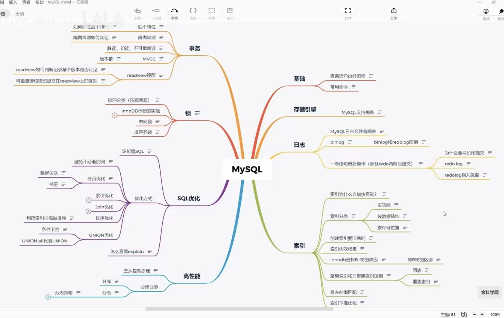

# MySQL



## MySQL是怎么执行一条select语句


连接器：建立连接、校验用户身份

查询缓存：查询语句是否命中查询缓存，如果命中直接返回

解析SQL：词法分析，构建SQL语法树（识别关键字）语法分析，根据语法规则，判断是否为合法的mysql语法

执行SQL：预处理阶段：检查表和字段是否存在（防止sql注入）

优化阶段：指定执行计划，选择查询成本最小的执行计划

执行阶段：从存储引擎获取记录，返回客户端

## 索引

### 索引分类

1.按数据结构分类：B+索引、哈希索引、R树索引、倒排索引

2.按物理存储介质分类：

聚簇索引（Clustered Index）	索引与数据行「物理存储在一起」，叶子节点直接存储整行数据；一张表只能有 1 个聚簇索引（InnoDB 默认主键是聚簇索引，无主键则选唯一非空索引，否则自动生成隐藏聚簇索引）

非聚簇索引（Secondary Index）	索引与数据行分开存储，叶子节点存储「聚簇索引的值」（而非物理地址）；一张表可有多個非聚簇索引，查询时需通过聚簇索引 “回表” 取数据

本质：非聚簇索引只存储聚簇索引的主键值。当我们查询非聚簇索引时，我们只是再索引树中找到主键值，之后需要去聚簇索引树中利用找到主键值去寻找对应的数据。

3.按逻辑功能分类：主键索引、唯一索引、普通索引、联合索引、全文索引、空间索引

### 为什么mysql采用B+树存储

1.目的：

数据存储在磁盘当中，操作系统最小读写单位为4KB

我们想要较少的磁盘IO

高效的单点查询和高效的范围查询. mysql就地更新

（为什么不用hash，因为要实现范围查询）

2.二分查找： 

有序数组、平衡二叉树、跳表【多层级有序链表】

基于有序数组时间复杂度O(log(n)),缺点插入数据性能太低

平衡二叉树查询需遍历很多节点，磁盘IO太多。树越高，磁盘IO越多【降低树的高度：1.节点数据量要多2.节点子节点要多】

B树：节点容量更多，节点子节点更多，从而降低树的高度【面对范围查询时会面对：1.随机IO问题 （节点不相邻）2.回溯的问题】

B+树：叶子节点存储实际数据（索引、记录）非叶子节点只存放索引数据

      相同层级相邻节点间 有双向循环链表，方便进行范围查询。

3.单点查询：

非叶子节点只存储索引信息，相同数据量下，B+树非叶子节点能存更多节点信息（不需要存储记录）

更加矮胖，更少的磁盘IO

4.范围查询：

有双向链表，不需要回溯。顺序IO。

5.表空间


行-记录-记录存储在行中

页-innodb的数据按页为单位进行读写，默认16KB。一页至少要存储两行数据。若页大小不足，则存储在溢出页中（溢出页、数据页）

区- 默认大小为1MB，64页构成一个区，同一层节点在相同或者相邻的区进行分配

段-数据段（B+树叶子节点所在集合）、索引段（非叶子节点所在集合）、回滚段

## 创建索引注意事项

创建索引后，每次插入数据都会导致写入索引产生延迟。所以要平衡好索引的数量和插入的性能

1.优先给 “高频、高区分度、小字段” 建索引，避免冗余 / 无效索引；
2.联合索引遵循 “最左前缀 + 区分度优先”，控制单表索引数量；（最左前缀：索引的字段顺序按 “区分度从高到低” 排列（如 (name, age) 优于 (age, name)）
3.线上建索引避峰操作，定期清理未使用索引。

## 索引优化

多字段查询：（索引合并开销大）用联合索引替代单列索引；（当我们创建了联合索引时，只要按照最左前缀查询少于联合索引个数的索引时，可以正常索引）
模糊查询：后缀模糊正常走索引，前缀模糊短文本采用全局索引，长文本采用Elasticsearch 代替mysql
排序 / 分组慢（ORDER BY/GROUP BY）创建 “查询字段 + 排序字段” 的覆盖索引，避免文件排序：创建索引时做好排序
JOIN 慢：关联字段必须建索引，然后小表驱动大表
查询索引过多时回表慢：用覆盖索引（包含所有字段的索引）避免回表；
索引失效：保证查询条件的字段类型与索引字段一致：
分页查询慢（LIMIT 大偏移量）：先通过 “排序字段索引” 找到「大偏移量位置对应的主键值」（只查主键，速度快）；再用主键索引直接定位到该位置，然后取后续 N 行（无需跳过前 N 行）。

索引下推优化：ICP 的本质是：将部分 WHERE 条件的过滤逻辑 “下推” 到存储引擎层—— 存储引擎遍历索引时，不仅过滤索引最左前缀字段，还会过滤「索引中包含的其他字段」，只把真正符合条件的主键 id 返回给服务器层，从而减少回表次数。

## 如何理解Buffer Pool

Buffer Pool是innodb存储引擎中维护的一个缓存池，用于减少磁盘IO的速度

BufferPool中以页为单位，与表空间当中的页是对应，默认16KB。缓存内容有：缓存数据页、索引页、回滚页（undolog页）、自适应哈希索引、锁信息

BufferPool用于减少磁盘IO。

步骤：（与cache相近）

读取数据：BufferPool命中直接读取返回、未命中，去磁盘读取，再缓存

修改数据：Bufferpool如果命中，标记脏页，后续选择合适的时机将脏页刷到磁盘（与page cache对比。用户层不能高度定制化pagecache行为只能维护一个Bufferpool）【用户层常用的PageCache策略：小文件数据直接缓存、大文件数据DIRECT_IO，大文件数据不会缓存在PageCache】。

LRU策略，新读出的数据放在链表中间


## MySQL 事务隔离级别如何实现？

### 一、事务定义：

用户定义的一系列操作，这些操作要么都做，要么都不做，是一个不可分割的单位。用于并发连接中。（eg A给B转账，A账户减少1000，B就一定要增加1000）

```sql
start transaction;
select * from table where id > 10 for update;
根据返回的结果
update table set
age = age + 1 where
id = 20;

commit
```
1.建立链接

2.start transaction开启事务for update加锁

3.select *

4.update

5.commit提交事务

在如上流程中1.3.5是相关的语句 3.4是用户定义的操作，所以3.4要么都做要么都不做。不会出现一个中间状态。

### 二、事务有哪些特性？

原子性：要么全部完成、要么全部不完成

一致性：数据库完整约束一致、逻辑一致.事务执行的结果必须是使数据库从一个一致性状态变到另一个一致性状态。因此当数据库只包含成功事务提交的结果时，就说数据库处于一致性状态。如果数据库系统运行中发生故障，有些事务尚未完成就被迫中断，这些未完成事务对数据库所做的修改有一部分已写入物理数据库，这时数据库就处于一种不正确的状态，或者说是不一致的状态

隔离性：一个事务的执行不能其它事务干扰。即一个事务内部的//操作及使用的数据对其它并发事务是隔离的，并发执行的各个事务之间不能互相干扰。

持久性：也称永久性，指一个事务一旦提交，它对数据库中的数据的改变就应该是永久性的。接下来的其它操作或故障不应该对其执行结果有任何影响。

### 三、说一下MySQL 的四种隔离级别？

Read Uncommitted（读取未提交内容）在该隔离级别，所有事务都可以看到其他未提交事务的执行结果。本隔离级别很少用于实际应用，因为它的性能也不比其他级别好多少。读取未提交的数据，也被称之为脏读（Dirty Read）。

Read Committed（读取提交内容）这是大多数数据库系统的默认隔离级别（但不是 MySQL 默认的）。它满足了隔离的简单定义：一个事务只能看见已经提交事务所做的改变。这种隔离级别 也支持所谓 的 不可重复读（Nonrepeatable Read），因为同一事务的其他实例在该实例处理其间可能会有新的 commit，所以同一 select 可能返回不同结果。

Repeatable Read（可重读）这是 MySQL 的默认事务隔离级别，它确保同一事务的多个实例在并发读取数据时，会看到同样的数据行。不过理论上，这会导致另一个棘手的问题：幻读 （Phantom Read）。

Serializable（可串行化）通过强制事务排序，使之不可能相互冲突，从而解决幻读问题。简言之，它是在每个读的数据行上加上共享锁。在这个级别，可能导致大量的超时现象和锁竞争。


脏读：读取到其他事务未提交的数据；eg:事务 A 读取了事务 B 更新的数据，然后 B 回滚操作，那么 A 读取到的数据是脏数据

不可重复读：同一事务内多次读取同一数据，结果不一致（被其他事务修改并提交）；eg:事务A多次读取同一数据，事务B在事务A多次读取的过程中，对数据作了更新并提交，导致事务A多次读取同一数据时，结果不一致

幻读：同一事务内多次执行同一查询，结果集行数不一致（被其他事务插入 / 删除并提交）。eg:系统管理员 A 将数据库中所有学生的成绩从具体分数改为 ABCDE 等级，但是系统管理员 B 就在这个时候插入了一条具体分数的记录，当系统管理员 A 改结束后发现还有一条记录没有改过来，就好像发生了幻觉一样，这就叫幻读

不可重复读侧重于修改，幻读侧重于新增或删除（多了或少量行），脏读是一个事务回滚影响另外一个事务。

### 四、事务是基于重做日志文件(redo log)和回滚日志(undo log)实现的。

每提交一个事务必须先将该事务的所有日志写入到重做日志文件进行持久化，数据库就可以通过重做日志来保证事务的原子性和持久性。

每当有修改事务时，还会产生 undo log，如果需要回滚，则根据 undo log 的反向语句进行逻辑操作，比如 insert 一条记录就 delete 一条记录。undo log 主要实现数据库的一致性。

redo log 不是随着事务的提交才写入的，而是在事务的执行过程中，便开始写入 redo 中。具体的落盘策略可以进行配置 。防止在发生故障的时间点，尚有脏页未写入磁盘，在重启 MySQL 服务的时候，根据 redo log 进行重做，从而达到事务的未入磁盘数据进行持久化这一特性。RedoLog 是为了实现事务的持久性而出现的产物。

undo log 用来回滚行记录到某个版本。事务未提交之前，Undo 保存了未提交之前的版本数据，Undo 中的数据可作为数据旧版本快照供其他并发事务进行快照读。是为了实现事务的原子性而出现的产物,在 MySQL innodb 存储引擎中用来实现多版本并发控制。

### 五、Mysql中日志：undolog、redolog、binlog

1.redo log（重做日志）redo log 是 InnoDB 存储引擎专属 的日志（MyISAM 没有），核心目的是保证 MySQL 崩溃后的数据持久性（ACID 中的 D - Durability）。
作用：
MySQL 中数据最终存在磁盘的「数据页」里，但磁盘 IO 速度极慢。为了提升性能，InnoDB 会先把数据修改写入内存的「缓冲池（Buffer Pool）」，再异步刷盘到磁盘。如果此时 MySQL 崩溃，缓冲池里的修改就会丢失。
redo log 就是解决这个问题的：只要事务提交，修改就会先写入 redo log（顺序写，速度极快），即使崩溃，重启后 MySQL 会通过 redo log 恢复未刷盘的数据，保证 “事务提交了，数据就不会丢”。

2.binlog 是 MySQL 服务器层 的日志（所有存储引擎都支持），核心目的是记录数据修改，用于数据恢复、主从复制。
作用：
逻辑日志：默认记录的是 “执行了什么 SQL 语句”（STATEMENT 格式），或 “哪一行数据被修改成了什么”（ROW 格式，推荐）；追加写：文件大小达到阈值后自动生成新文件，不会覆盖旧日志（可配置过期清理）；


3.undo log 本质是记录数据修改前的状态，核心解决两个核心问题：
事务回滚：当事务执行出错或执行 ROLLBACK 时，通过 undo log 恢复数据到修改前的状态，保证事务的原子性（ACID 中的 A - Atomicity）；
MVCC（多版本并发控制）：MySQL 实现 “读已提交”“可重复读” 隔离级别的核心依赖（通过 undo log 生成数据的历史版本，让读操作不阻塞写操作）。

|维度|	undo log|	redo log|	binlog|
|---|---|---|---|
|所属层级|	InnoDB 引擎层|	InnoDB 引擎层|	MySQL 服务器层|
|日志类型|	逻辑日志（反向操作）|	物理日志（数据页修改）|	逻辑日志（SQL / 行修改）|
|核心目的|	事务回滚、MVCC|	崩溃恢复、保证持久性|	数据恢复、主从复制|
|写入时机|	事务执行时（修改数据）|	事务提交时（prepare 阶段）|	事务提交时（prepare 后）|
|清理方式|	后台 purge 线程自动清理|	环形覆盖（刷盘后）|	配置过期时间自动清理|


### 六、MySQL（InnoDB 存储引擎）实现隔离级别

核心是锁解决写冲突，MVCC解决读冲突，两者结合平衡并发和隔离性。

**1.锁机制：解决写操作的并发问题**

锁是控制并发写的核心，InnoDB 中的锁分为两类核心锁：
（1）行级锁（InnoDB 特有，MyISAM 只有表锁）：  
共享锁（S 锁）：读操作加 S 锁，多个事务可同时加 S 锁（共享）；  
排他锁（X 锁）：写操作（增删改）加 X 锁，加了 X 锁的行，其他事务无法加 S/X 锁（排他）。  
（2）间隙锁 / Next-Key 锁（解决幻读）：  
间隙锁：锁定索引记录之间的间隙（比如 id 10 和 20 之间），防止插入新数据；  
Next-Key 锁：行锁 + 间隙锁的组合，是 InnoDB 默认的行锁算法，在 REPEATABLE READ 级别下，通过 Next-Key 锁解决了幻读问题。  

锁的作用场景：  
写操作（update/delete/insert）默认加 X 锁，阻止其他事务同时修改同一行；  
显式加锁（如 select ... for update）会加 X 锁，select ... lock in share mode 加 S 锁；  
串行化（SERIALIZABLE）级别下，普通读操作也会加 S 锁，导致所有事务串行执行。  

**2.MVCC（多版本并发控制）：解决读操作的并发问题**

MVCC 是 “读不加锁，读写不冲突” 的核心，InnoDB 通过为每行数据维护多个版本，让读操作访问历史版本，避免阻塞写操作。

(1)MVCC 的核心规则：Read View（读视图）Read View 是事务执行读操作时生成的 “可见性规则”，包含 4 个核心属性：
m_ids：当前活跃的事务 ID 列表；
min_trx_id：m_ids 中的最小事务 ID；
max_trx_id：下一个即将分配的事务 ID；
creator_trx_id：生成 Read View 的事务 ID。

(2)不同隔离级别下，Read View 的生成时机不同（核心区别）：
READ COMMITTED（读已提交）：每次执行读操作时，重新生成 Read View → 能看到其他事务刚提交的数据 → 解决脏读，但会出现不可重复读；
REPEATABLE READ（可重复读）：事务启动时生成一次 Read View，后续读操作复用 → 整个事务内看到的都是同一版本的数据 → 解决不可重复读和幻读；
SERIALIZABLE：不依赖 MVCC，直接用锁串行化执行。

(3)MVCC 的执行流程（以 REPEATABLE READ 为例）：
事务 A 启动，生成 Read View（记录当前活跃事务 ID）；
事务 B 修改行数据，将原数据写入 undo log，更新行的 DB_TRX_ID 为 B 的事务 ID；
事务 A 读该行数据时，根据 Read View 检查版本链：
如果行的 DB_TRX_ID 小于 min_trx_id → 该版本已提交，可见；
如果行的 DB_TRX_ID 在 min_trx_id 和 max_trx_id 之间，且不在 m_ids 中 → 可见；
否则，通过 DB_ROLL_PTR 回溯 undo log，找符合条件的历史版本。

(4)MVCC的原理大致理解为：
InnoDB 每一行数据都有一个隐藏的回滚指针，用于指向该行修改前的最后一个历史版本，这个历史版本存放在 undo log 中。如果要执行更新操作，会将原记录放入 undo log 中，并通过隐藏的回滚指针指向 undo log 中的原记录。其它事务此时需要查询时，就是查询 undo log 中这行数据的最后一个历史版本。

MVCC 最大的好处是读不加锁，读写不冲突，极大地增加了 MySQL 的并发性。通过 MVCC，保证了事务 ACID 中的 I（隔离性）特性。

**3.readview**

当一个事务执行「快照读」（普通 SELECT，非 FOR UPDATE/LOCK IN SHARE MODE）时，InnoDB 会生成一个 ReadView，它的核心作用是：

1.划定可见范围：决定当前事务能看到哪些事务修改的数据，哪些数据不可见；
2.避免脏读 / 不可重复读 / 幻读：通过 ReadView 过滤掉未提交的修改、已提交但晚于当前事务启动的修改，保证隔离性；
3.基于 undo log 实现：如果数据的最新版本不可见，ReadView 会引导 InnoDB 从 undo log 中读取历史版本，直到找到可见版本。

|隔离级别|	ReadView 生成时机|	隔离性表现|
|---|---|---|
|读未提交（RU）|	不生成 ReadView，直接读最新版本|	能看到未提交事务的修改（脏读），几乎不用|
|读已提交（RC）|	每次执行 SELECT 时都生成新的 ReadView|	避免脏读；但同一事务内多次 SELECT 可能看到不同结果（不可重复读）|
|可重复读（RR）|	事务启动后第一次 SELECT 时生成 ReadView，后续复用|	避免脏读、不可重复读；InnoDB 还通过间隙锁避免幻读（MySQL 默认隔离级别）|
|串行化（SR）|	不依赖 ReadView，直接加表锁 / 行锁，串行执行|	完全隔离，但性能极差，几乎不用|

### 七、锁

当多个用户并发地存取数据时，在数据库中就会产生多个事务同时存取同一数据的情况。若对并发操作不加控制就可能会读取和存储不正确的数据，破坏数据库的一致性。锁用于保证多用户环境下保证数据库完整性和一致性

**1.按照锁的粒度分数据库锁有哪些？**

在关系型数据库中，可以按照锁的粒度把数据库锁分为行级锁(INNODB引擎)、表级锁(MYISAM引擎)和页级锁(BDB引擎 )。

行级锁:行级锁是MySQL中锁定粒度最细的一种锁，表示只针对当前操作的行进行加锁。行级锁能大大减少数据库操作的冲突。其加锁粒度最小，但加锁的开销也最大。行级锁分为共享锁和排他锁。开销大，加锁慢；会出现死锁；锁定粒度最小，发生锁冲突的概率最低，并发度也最高。

表级锁:表级锁是MySQL中锁定粒度最大的一种锁，表示对当前操作的整张表加锁，它实现简单，资源消耗较少，被大部分MySQL引擎支持。最常使用的MYISAM与INNODB都支持表级锁定。表级锁定分为表共享读锁（共享锁）与表独占写锁（排他锁）。开销小，加锁快；不会出现死锁；锁定粒度大，发出锁冲突的概率最高，并发度最低。

页级锁:页级锁是MySQL中锁定粒度介于行级锁和表级锁中间的一种锁。表级锁速度快，但冲突多，行级冲突少，但速度慢。所以取了折衷的页级，一次锁定相邻的一组记录。BDB支持页级锁。开销和加锁时间界于表锁和行锁之间；会出现死锁；锁定粒度界于表锁和行锁之间，并发度一般

**2.从锁的类别上分MySQL都有哪些锁呢？**

从锁的类别上来讲，有共享锁和排他锁。

共享锁: 又叫做读锁。 当用户要进行数据的读取时，对数据加上共享锁。共享锁可以同时加上多个。

排他锁: 又叫做写锁。 当用户要进行数据的写入时，对数据加上排他锁。排他锁只可以加一个，
他和其他的排他锁，共享锁都相斥。

用上面的例子来说就是用户的行为有两种，一种是来看房，多个用户一起看房是可以接受的。 一种是真正的入住一晚，在这期间，无论是想入住的还是想看房的都不可以。

**3.数据库的乐观锁和悲观锁是什么？怎么实现的？**

数据库管理系统（DBMS）中的并发控制的任务是确保在多个事务同时存取数据库中同一数据时不破坏事务的隔离性和统一性以及数据库的统一性。乐观并发控制（乐观锁）和悲观并发控制（悲观锁）是并发控制主要采用的技术手段。

悲观锁：假定会发生并发冲突，屏蔽一切可能违反数据完整性的操作。在查询完数据的时候就把事务锁起来，直到提交事务。实现方式：使用数据库中的锁机制

乐观锁：假设不会发生并发冲突，只在提交操作时检查是否违反数据完整性。在修改数据的时候把事务锁起来，通过version的方式来进行锁定。实现方式：乐一般会使用版本号机制或CAS算法实现。

两种锁的使用场景

从上面对两种锁的介绍，我们知道两种锁各有优缺点，不可认为一种好于另一种，像乐观锁适用于写比较少的情况下（多读场景），即冲突真的很少发生的时候，这样可以省去了锁的开销，加大了系统的整个吞吐量。

但如果是多写的情况，一般会经常产生冲突，这就会导致上层应用会不断的进行retry，这样反倒是降低了性能，所以一般多写的场景下用悲观锁就比较合适。

**4.InnoDB引擎的行锁是怎么实现的？**

InnoDB是基于索引来完成行锁

例: select * from tab_with_index where id = 1 for update;

for update 可以根据条件来完成行锁锁定，并且 id 是有索引键的列，如果 id 不是索引键那么InnoDB将完成表锁，并发将无从谈起

**5.什么是死锁？怎么解决？**

死锁是指两个或多个事务在同一资源上相互占用，并请求锁定对方的资源，从而导致恶性循环的现象。

常见的解决死锁的方法

1、如果不同程序会并发存取多个表，尽量约定以相同的顺序访问表，可以大大降低死锁机会。

2、在同一个事务中，尽可能做到一次锁定所需要的所有资源，减少死锁产生概率；

3、对于非常容易产生死锁的业务部分，可以尝试使用升级锁定颗粒度，通过表级锁定来减少死锁产生的概率；

如果业务处理不好可以用分布式事务锁或者使用乐观锁

**6.隔离级别与锁的关系**

在Read Uncommitted级别下，读取数据不需要加共享锁，这样就不会跟被修改的数据上的排他锁冲突

在Read Committed级别下，读操作需要加共享锁，但是在语句执行完以后释放共享锁；

在Repeatable Read级别下，读操作需要加共享锁，但是在事务提交之前并不释放共享锁，也就是必须等待事务执行完毕以后才释放共享锁。

SERIALIZABLE 是限制性最强的隔离级别，因为该级别锁定整个范围的键，并一直持有锁，直到事务完成。

**7.优化锁方面的意见？**

使用较低的隔离级别

设计索引，尽量使用索引去访问数据，加锁更加精确，从而减少锁冲突

选择合理的事务大小，给记录显示加锁时，最好一次性请求足够级别的锁。列如，修改数据的话，

最好申请排他锁，而不是先申请共享锁，修改时在申请排他锁，这样会导致死锁

不同的程序访问一组表的时候，应尽量约定一个相同的顺序访问各表，对于一个表而言，尽可能的

固定顺序的获取表中的行。这样大大的减少死锁的机会。

尽量使用相等条件访问数据，这样可以避免间隙锁对并发插入的影响

不要申请超过实际需要的锁级别

数据查询的时候不是必要，不要使用加锁。MySQL的MVCC可以实现事务中的查询不用加锁，优化事务性能：MVCC只在committed read（读提交）和 repeatable read （可重复读）两种隔离级别

对于特定的事务，可以使用表锁来提高处理速度活着减少死锁的可能。

## 分库分表

**1.为什么要分库分表？**

分表:比如你单表都几千万数据了，你确定你能扛住么？绝对不行，单表数据量太大，会极大影响你的 sql执行的性能，到了后面你的 sql 可能就跑的很慢了。一般来说，就以我的经验来看，单表到几百万的时候，性能就会相对差一些了，你就得分表了。

分表就是把一个表的数据放到多个表中，然后查询的时候你就查一个表。比如按照用户 id 来分表，将一个用户的数据就放在一个表中。然后操作的时候你对一个用户就操作那个表就好了。这样可以控制每个表的数据量在可控的范围内，比如每个表就固定在 200 万以内。

分库:分库就是你一个库一般我们经验而言，最多支撑到并发 2000，一定要扩容了，而且一个健康的单库并发值你最好保持在每秒 1000 左右，不要太大。那么你可以将一个库的数据拆分到多个库中，访问的时候就访问一个库好了。


**2.如何对数据库如何进行垂直拆分或水平拆分的？**

水平拆分的意思，就是把一个表的数据给弄到多个库的多个表里去，但是每个库的表结构都一样，只不过每个库表放的数据是不同的，所有库表的数据加起来就是全部数据。水平拆分的意义，就是将数据均匀放更多的库里，然后用多个库来抗更高的并发，还有就是用多个库的存储容量来进行扩容。

垂直拆分的意思，就是把一个有很多字段的表给拆分成多个表，或者是多个库上去。每个库表的结构都不一样，每个库表都包含部分字段。一般来说，会将较少的访问频率很高的字段放到一个表里去，然后将较多的访问频率很低的字段放到另外一个表里去。因为数据库是有缓存的，你访问频率高的行字段越少，就可以在缓存里缓存更多的行，性能就越好。这个一般在表层面做的较多一些。

两种分库分表的方式：
一种是按照 range 来分，就是每个库一段连续的数据，这个一般是按比如时间范围来的，但是这种一般较少用，因为很容易产生热点问题，大量的流量都打在最新的数据上了。

或者是按照某个字段hash一下均匀分散，这个较为常用。

range 来分，好处在于说，扩容的时候很简单，因为你只要预备好，给每个月都准备一个库就可以了，到了一个新的月份的时候，自然而然，就会写新的库了；缺点，但是大部分的请求，都是访问最新的数据。实际生产用 range，要看场景。hash 分发，好处在于说，可以平均分配每个库的数据量和请求压力；坏处在于说扩容起来比较麻烦，会有一个数据迁移的过程，之前的数据需要重新计算 hash 值重新分配到不同的库或表

## 读写分离、主从同步
**1.什么是MySQL主从同步？**

主从同步使得数据可以从一个数据库服务器复制到其他服务器上，在复制数据时，一个服务器充当主服务器（master），其余的服务器充当从服务器（slave）。

因为复制是异步进行的，所以从服务器不需要一直连接着主服务器，从服务器甚至可以通过拨号断断续续地连接主服务器。通过配置文件，可以指定复制所有的数据库，某个数据库，甚至是某个数据库上的某个表。

**2.MySQL主从同步的目的？为什么要做主从同步？**

通过增加从服务器来提高数据库的性能，在主服务器上执行写入和更新，在从服务器上向外提供读功能，可以动态地调整从服务器的数量，从而调整整个数据库的性能。

提高数据安全-因为数据已复制到从服务器，从服务器可以终止复制进程，所以，可以在从服务器上备份而不破坏主服务器相应数据

在主服务器上生成实时数据，而在从服务器上分析这些数据，从而提高主服务器的性能

数据备份。一般我们都会做数据备份，可能是写定时任务，一些特殊行业可能还需要手动备份，有些行业要求备份和原数据不能在同一个地方，所以主从就能很好的解决这个问题，不仅备份及时，而且还可以多地备份，保证数据的安全

**3.如何实现MySQL的读写分离？**

其实很简单，就是基于主从复制架构，简单来说，就搞一个主库，挂多个从库，然后我们就单单只是写主库，然后主库会自动把数据给同步到从库上去。

**4.MySQL主从复制流程和原理？**

基本原理流程，是3个线程以及之间的关联

主：binlog线程——记录下所有改变了数据库数据的语句，放进master上的binlog中；

从：io线程——在使用start slave 之后，负责从master上拉取 binlog 内容，放进自己的relay log中；

从：sql执行线程——执行relay log中的语句；

复制过程如下：

第一步：master在每个事务更新数据完成之前，将该操作记录串行地写入到binlog文件中。

第二步：salve开启一个I/O Thread，该线程在master打开一个普通连接，主要工作是binlog dump process。如果读取的进度已经跟上了master，就进入睡眠状态并等待master产生新的事件。I/O线程最终的目的是将这些事件写入到中继日志中。

第三步：SQL Thread会读取中继日志，并顺序执行该日志中的SQL事件，从而与主数据库中的数据保持一致。

**5.MySQL主从同步延时问题如何解决？**

MySQL 实际上在有两个同步机制，一个是半同步复制，用来 解决主库数据丢失问题；一个是并行复制，用来 解决主从同步延时问题。

半同步复制，也叫 semi-sync 复制，指的就是主库写入 binlog 日志之后，就会将强制此时立即将数据同步到从库，从库将日志写入自己本地的 relay log 之后，接着会返回一个 ack 给主库，主库接收到至少一个从库的 ack 之后才会认为写操作完成了。

并行复制，指的是从库开启多个线程，并行读取 relay log 中不同库的日志，然后并行重放不同库的日志，这是库级别的并行。

## MySQL优化
**1.如何定位及优化SQL语句的性能问题？**

对于低性能的SQL语句的定位，最重要也是最有效的方法就是使用执行计划，MySQL提供了explain命令来查看语句的执行计划。 我们知道，不管是哪种数据库，或者是哪种数据库引擎，在对一条SQL语句进行执行的过程中都会做很多相关的优化，对于查询语句，最重要的优化方式就是使用索引。

而执行计划，就是显示数据库引擎对于SQL语句的执行的详细情况，其中包含了是否使用索引，使用什么索引，使用的索引的相关信息等。

**2.大表数据查询，怎么优化**

优化shema、sql语句+索引；  
加缓存，memcached, redis；  
主从复制，读写分离；  
垂直拆分，根据你模块的耦合度，将一个大的系统分为多个小的系统，也就是分布式系统；  
水平切分，针对数据量大的表，这一步最麻烦，最能考验技术水平，要选择一个合理的sharding key, 为了有好的查询效率，表结构也要改动，做一定的冗余，应用也要改，sql中尽量带sharding key，将数据定位到限定的表上去查，而不是扫描全部的表；  

**3.超大分页怎么处理?**

数据库层面,这也是我们主要集中关注的(虽然收效没那么大),类似于select * from table where age > 20 limit 1000000,10 这种查询其实也是有可以优化的余地的. 这条语句需要 load1000000 数据然后基本上全部丢弃,只取 10 条当然比较慢. 当时我们可以修改为select * from table where id in (select id from table where age > 20 limit 1000000,10).这样虽然也 load 了一百万的数据,但是由于索引覆盖,要查询的所有字段都在索引中,所以速度会很快。

解决超大分页,其实主要是靠缓存,可预测性的提前查到内容,缓存至redis等k-V数据库中,直接返回即可.

**4.统计过慢查询吗？对慢查询都怎么优化过？**

在业务系统中，除了使用主键进行的查询，其他的我都会在测试库上测试其耗时，慢查询的统计主要由运维在做，会定期将业务中的慢查询反馈给我们。

慢查询的优化首先要搞明白慢的原因是什么？ 是查询条件没有命中索引？是load了不需要的数据列？还是数据量太大？

所以优化也是针对这三个方向来的，

首先分析语句，看看是否load了额外的数据，可能是查询了多余的行并且抛弃掉了，可能是加载了许多结果中并不需要的列，对语句进行分析以及重写。

分析语句的执行计划，然后获得其使用索引的情况，之后修改语句或者修改索引，使得语句可以尽可能的命中索引。

如果对语句的优化已经无法进行，可以考虑表中的数据量是否太大，如果是的话可以进行横向或者纵向的分表。

**5.如何优化查询过程中的数据访问**

访问数据太多导致查询性能下降  
确定应用程序是否在检索大量超过需要的数据，可能是太多行或列  
确认MySQL服务器是否在分析大量不必要的数据行  
查询不需要的数据。解决办法：使用limit解决  
多表关联返回全部列。解决办法：指定列名  
总是返回全部列。解决办法：避免使用SELECT *  
重复查询相同的数据。解决办法：可以缓存数据，下次直接读取缓存  
是否在扫描额外的记录。解决办法： 使用explain进行分析，如果发现查询需要扫描大量的数据，但只返回少数的行，可以通过如下技巧去优化： 使用索引覆盖扫描，把所有的列都放到索引中，这样存储引擎不需要回表获取对应行就可以返回结果。  
改变数据库和表的结构，修改数据表范式  
重写SQL语句，让优化器可以以更优的方式执行查询。  

**6.如何优化关联查询**

确定ON或者USING子句中是否有索引。  
确保GROUP BY和ORDER BY只有一个表中的列，这样MySQL才有可能使用索引。

**7.数据库结构优化**

一个好的数据库设计方案对于数据库的性能往往会起到事半功倍的效果。

需要考虑数据冗余、查询和更新的速度、字段的数据类型是否合理等多方面的内容。

将字段很多的表分解成多个表。对于字段较多的表，如果有些字段的使用频率很低，可以将这些字段分离出来形成新表。

因为当一个表的数据量很大时，会由于使用频率低的字段的存在而变慢。

增加中间表：对于需要经常联合查询的表，可以建立中间表以提高查询效率。

通过建立中间表，将需要通过联合查询的数据插入到中间表中，然后将原来的联合查询改为对中间表的查询。

增加冗余字段：设计数据表时应尽量遵循范式理论的规约，尽可能的减少冗余字段，让数据库设计看起来精致、优雅。但是，合理的加入冗余字段可以提高查询速度。

表的规范化程度越高，表和表之间的关系越多，需要连接查询的情况也就越多，性能也就越差。

注意：冗余字段的值在一个表中修改了，就要想办法在其他表中更新，否则就会导致数据不一致的问题。

**8.MySQL数据库cpu飙升到500%的话怎么处理？**

当 cpu 飙升到 500%时，先用操作系统命令 top 命令观察是不是 MySQLd 占用导致的，如果不是，找出占用高的进程，并进行相关处理。
如果是 MySQLd 造成的， show processlist，看看里面跑的 session 情况，是不是有消耗资源的 sql 在运行。找出消耗高的 sql，看看执行计划是否准确， index 是否缺失，或者实在是数据量太大造成。

一般来说，肯定要 kill 掉这些线程(同时观察 cpu 使用率是否下降)，等进行相应的调整(比如说加索引、改 sql、改内存参数)之后，再重新跑这些 SQL。
也有可能是每个 sql 消耗资源并不多，但是突然之间，有大量的 session 连进来导致 cpu 飙升，这种情况就需要跟应用一起来分析为何连接数会激增，再做出相应的调整，比如说限制连接数等。

**9.大表怎么优化？**

类似的问题：某个表有近千万数据，CRUD比较慢，如何优化？分库分表了是怎么做的？分表分库了有什么问题？有用到中间件么？他们的原理知道么？

当MySQL单表记录数过大时，数据库的CRUD性能会明显下降，一些常见的优化措施如下：

限定数据的范围： 务必禁止不带任何限制数据范围条件的查询语句。比如：我们当用户在查询订单历史的时候，我们可以控制在一个月的范围内；  
读/写分离： 经典的数据库拆分方案，主库负责写，从库负责读；  
缓存： 使用MySQL的缓存，另外对重量级、更新少的数据可以考虑；  
通过分库分表的方式进行优化，主要有垂直分表和水平分表。  