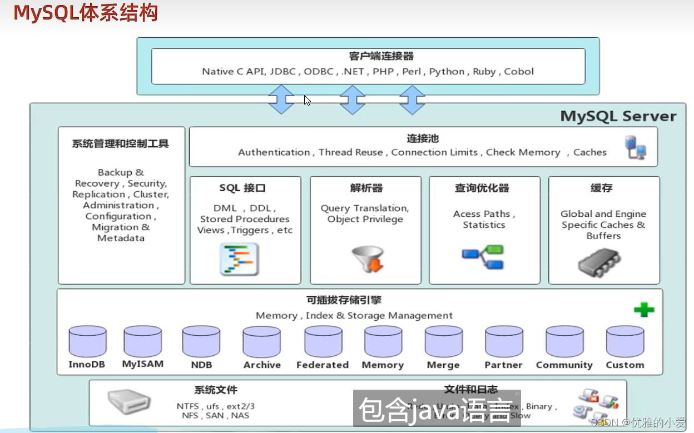
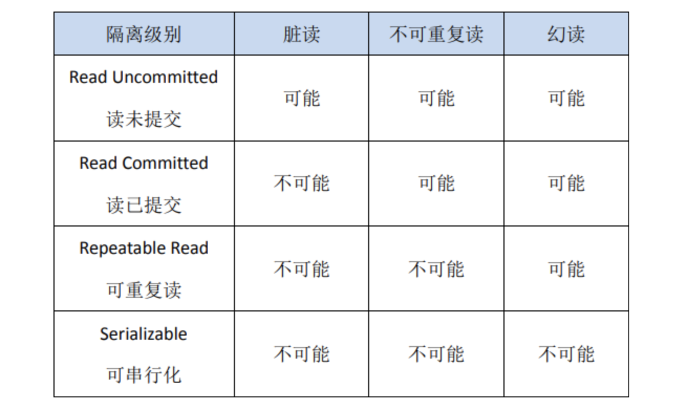

# MySQL

## MySQL是怎么执行一条select语句



连接器：建立连接、校验用户身份

查询缓存：查询语句是否命中查询缓存，如果命中直接返回

解析SQL：词法分析，构建SQL语法树（识别关键字）语法分析，根据语法规则，判断是否为合法的mysql语法

执行SQL：预处理阶段：检查表和字段是否存在（防止sql注入）、优化阶段：指定执行计划，选择查询成本最小的执行计划、执行阶段：从存储引擎获取记录，返回客户端

## MySQL为什么采用B+树存储？

1.目的：

数据存储在磁盘当中，操作系统最小读写单位为4KB

我们想要较少的磁盘IO

高效的单点查询和高效的范围查询. mysql就地更新

（为什么不用hash，因为要实现范围查询）

2.二分查找： 

有序数组、平衡二叉树、跳表【多层级有序链表】

基于有序数组时间复杂度O(log(n)),缺点插入数据性能太低

平衡二叉树查询需遍历很多节点，磁盘IO太多。树越高，磁盘IO越多【降低树的高度：1.节点数据量要多2.节点子节点要多】

B树：节点容量更多，节点子节点更多，从而降低树的高度【面对范围查询时会面对：1.随机IO问题 （节点不相邻）2.回溯的问题】

B+树：叶子节点存储实际数据（索引、记录）非叶子节点只存放索引数据

      相同层级相邻节点间 有双向循环链表，方便进行范围查询。

3.单点查询：

非叶子节点只存储索引信息，相同数据量下，B+树非叶子节点能存更多节点信息（不需要存储记录）

更加矮胖，更少的磁盘IO

4.范围查询：

有双向链表，不需要回溯。顺序IO。

5.表空间


行-记录-记录存储在行中

页-innodb的数据按页为单位进行读写，默认16KB。一页至少要存储两行数据。若页大小不足，则存储在溢出页中（溢出页、数据页）

区- 默认大小为1MB，64页构成一个区，同一层节点在相同或者相邻的区进行分配

段-数据段（B+树叶子节点所在集合）、索引段（非叶子节点所在集合）、回滚段

## 如何理解Buffer Pool

Buffer Pool是innodb存储引擎中维护的一个缓存池，用于减少磁盘IO的速度

BufferPool中以页为单位，与表空间当中的页是对应，默认16KB。缓存内容有：缓存数据页、索引页、回滚页（undolog页）、自适应哈希索引、锁信息

BufferPool用于减少磁盘IO。

步骤：（与cache相近）

读取数据：BufferPool命中直接读取返回、未命中，去磁盘读取，再缓存

修改数据：Bufferpool如果命中，标记脏页，后续选择合适的时机将脏页刷到磁盘（与page cache对比。用户层不能高度定制化pagecache行为只能维护一个Bufferpool）【用户层常用的PageCache策略：小文件数据直接缓存、大文件数据DIRECT_IO，大文件数据不会缓存在PageCache】。

LRU策略，新读出的数据放在链表中间


## MySQL 事务隔离级别如何实现？

### 一、事务定义：
用户定义的一系列操作，这些操作要么都做，要么都不做，是一个不可分割的单位。用于并发连接中。（eg A给B转账，A账户减少1000，B就一定要增加1000）

```sql
start transaction;
select * from table where id > 10 for update;
根据返回的结果
update table set
age = age + 1 where
id = 20;

commit
```
1.建立链接

2.start transaction开启事务for update加锁

3.select *

4.update

5.commit提交事务

在如上流程中1.3.5是相关的语句 3.4是用户定义的操作，所以3.4要么都做要么都不做。不会出现一个中间状态。

### 二、事务有哪些特性？

原子性：要么全部完成、要么全部不完成

一致性：数据库完整约束一致、逻辑一致.事务执行的结果必须是使数据库从一个一致性状态变到另一个一致性状态。因此当数据库只包含成功事务提交的结果时，就说数据库处于一致性状态。如果数据库系统运行中发生故障，有些事务尚未完成就被迫中断，这些未完成事务对数据库所做的修改有一部分已写入物理数据库，这时数据库就处于一种不正确的状态，或者说是不一致的状态

隔离性：一个事务的执行不能其它事务干扰。即一个事务内部的//操作及使用的数据对其它并发事务是隔离的，并发执行的各个事务之间不能互相干扰。

持久性：也称永久性，指一个事务一旦提交，它对数据库中的数据的改变就应该是永久性的。接下来的其它操作或故障不应该对其执行结果有任何影响。

### 三、说一下MySQL 的四种隔离级别？

Read Uncommitted（读取未提交内容）在该隔离级别，所有事务都可以看到其他未提交事务的执行结果。本隔离级别很少用于实际应用，因为它的性能也不比其他级别好多少。读取未提交的数据，也被称之为脏读（Dirty Read）。

Read Committed（读取提交内容）这是大多数数据库系统的默认隔离级别（但不是 MySQL 默认的）。它满足了隔离的简单定义：一个事务只能看见已经提交事务所做的改变。这种隔离级别 也支持所谓 的 不可重复读（Nonrepeatable Read），因为同一事务的其他实例在该实例处理其间可能会有新的 commit，所以同一 select 可能返回不同结果。

Repeatable Read（可重读）这是 MySQL 的默认事务隔离级别，它确保同一事务的多个实例在并发读取数据时，会看到同样的数据行。不过理论上，这会导致另一个棘手的问题：幻读 （Phantom Read）。

Serializable（可串行化）通过强制事务排序，使之不可能相互冲突，从而解决幻读问题。简言之，它是在每个读的数据行上加上共享锁。在这个级别，可能导致大量的超时现象和锁竞争。



脏读：读取到其他事务未提交的数据；eg:事务 A 读取了事务 B 更新的数据，然后 B 回滚操作，那么 A 读取到的数据是脏数据

不可重复读：同一事务内多次读取同一数据，结果不一致（被其他事务修改并提交）；eg:事务A多次读取同一数据，事务B在事务A多次读取的过程中，对数据作了更新并提交，导致事务A多次读取同一数据时，结果不一致

幻读：同一事务内多次执行同一查询，结果集行数不一致（被其他事务插入 / 删除并提交）。eg:系统管理员 A 将数据库中所有学生的成绩从具体分数改为 ABCDE 等级，但是系统管理员 B 就在这个时候插入了一条具体分数的记录，当系统管理员 A 改结束后发现还有一条记录没有改过来，就好像发生了幻觉一样，这就叫幻读

不可重复读侧重于修改，幻读侧重于新增或删除（多了或少量行），脏读是一个事务回滚影响另外一个事务。

### 四、事务是基于重做日志文件(redo log)和回滚日志(undo log)实现的。

每提交一个事务必须先将该事务的所有日志写入到重做日志文件进行持久化，数据库就可以通过重做日志来保证事务的原子性和持久性。

每当有修改事务时，还会产生 undo log，如果需要回滚，则根据 undo log 的反向语句进行逻辑操作，比如 insert 一条记录就 delete 一条记录。undo log 主要实现数据库的一致性。

redo log 不是随着事务的提交才写入的，而是在事务的执行过程中，便开始写入 redo 中。具体的落盘策略可以进行配置 。防止在发生故障的时间点，尚有脏页未写入磁盘，在重启 MySQL 服务的时候，根据 redo log 进行重做，从而达到事务的未入磁盘数据进行持久化这一特性。RedoLog 是为了实现事务的持久性而出现的产物。

undo log 用来回滚行记录到某个版本。事务未提交之前，Undo 保存了未提交之前的版本数据，Undo 中的数据可作为数据旧版本快照供其他并发事务进行快照读。是为了实现事务的原子性而出现的产物,在 MySQL innodb 存储引擎中用来实现多版本并发控制。

### 五、MySQL（InnoDB 存储引擎）实现隔离级别

核心是 锁 解决写冲突，MVCC 解决读冲突，两者结合平衡并发和隔离性。
1.锁机制：解决写操作的并发问题
锁是控制并发写的核心，InnoDB 中的锁分为两类核心锁：
（1）行级锁（InnoDB 特有，MyISAM 只有表锁）：
共享锁（S 锁）：读操作加 S 锁，多个事务可同时加 S 锁（共享）；
排他锁（X 锁）：写操作（增删改）加 X 锁，加了 X 锁的行，其他事务无法加 S/X 锁（排他）。
（2）间隙锁 / Next-Key 锁（解决幻读）：
间隙锁：锁定索引记录之间的间隙（比如 id 10 和 20 之间），防止插入新数据；
Next-Key 锁：行锁 + 间隙锁的组合，是 InnoDB 默认的行锁算法，在 REPEATABLE READ 级别下，通过 Next-Key 锁解决了幻读问题。

锁的作用场景：
写操作（update/delete/insert）默认加 X 锁，阻止其他事务同时修改同一行；
显式加锁（如 select ... for update）会加 X 锁，select ... lock in share mode 加 S 锁；
串行化（SERIALIZABLE）级别下，普通读操作也会加 S 锁，导致所有事务串行执行。

2.MVCC（多版本并发控制）：解决读操作的并发问题
MVCC 是 “读不加锁，读写不冲突” 的核心，InnoDB 通过为每行数据维护多个版本，让读操作访问历史版本，避免阻塞写操作。

MVCC 的核心规则：Read View（读视图）Read View 是事务执行读操作时生成的 “可见性规则”，包含 4 个核心属性：
m_ids：当前活跃的事务 ID 列表；
min_trx_id：m_ids 中的最小事务 ID；
max_trx_id：下一个即将分配的事务 ID；
creator_trx_id：生成 Read View 的事务 ID。

不同隔离级别下，Read View 的生成时机不同（核心区别）：
READ COMMITTED（读已提交）：每次执行读操作时，重新生成 Read View → 能看到其他事务刚提交的数据 → 解决脏读，但会出现不可重复读；
REPEATABLE READ（可重复读）：事务启动时生成一次 Read View，后续读操作复用 → 整个事务内看到的都是同一版本的数据 → 解决不可重复读和幻读；
SERIALIZABLE：不依赖 MVCC，直接用锁串行化执行。

MVCC 的执行流程（以 REPEATABLE READ 为例）：
事务 A 启动，生成 Read View（记录当前活跃事务 ID）；
事务 B 修改行数据，将原数据写入 undo log，更新行的 DB_TRX_ID 为 B 的事务 ID；
事务 A 读该行数据时，根据 Read View 检查版本链：
如果行的 DB_TRX_ID 小于 min_trx_id → 该版本已提交，可见；
如果行的 DB_TRX_ID 在 min_trx_id 和 max_trx_id 之间，且不在 m_ids 中 → 可见；
否则，通过 DB_ROLL_PTR 回溯 undo log，找符合条件的历史版本。