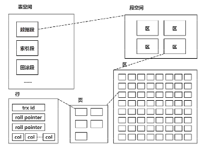

# MySQL

## MySQL是怎么执行一条select语句


连接器：建立连接、校验用户身份

查询缓存：查询语句是否命中查询缓存，如果命中直接返回

解析SQL：词法分析，构建SQL语法树（识别关键字）

        语法分析，根据语法规则，判断是否为合法的mysql语法

执行SQL：预处理阶段：检查表和字段是否存在（防止sql注入）
        
        优化阶段：指定执行计划，选择查询成本最小的执行计划

        执行阶段：从存储引擎获取记录，返回客户端

## MySQL为什么采用B+树存储？

1.目的：

数据存储在磁盘当中，操作系统最小读写单位为4KB

我们想要较少的磁盘IO

高效的单点查询和高效的范围查询. mysql就地更新

（为什么不用hash，因为要实现范围查询）

2.二分查找： 

有序数组、平衡二叉树、跳表【多层级有序链表】

基于有序数组时间复杂度O(log(n)),缺点插入数据性能太低

平衡二叉树查询需遍历很多节点，磁盘IO太多。树越高，磁盘IO越多【降低树的高度：1.节点数据量要多2.节点子节点要多】

B树：节点容量更多，节点子节点更多，从而降低树的高度【面对范围查询时会面对：1.随机IO问题 （节点不相邻）2.回溯的问题】

B+树：叶子节点存储实际数据（索引、记录）非叶子节点只存放索引数据

      相同层级相邻节点间 有双向循环链表，方便进行范围查询。

3.单点查询：

非叶子节点只存储索引信息，相同数据量下，B+树非叶子节点能存更多节点信息（不需要存储记录）

更加矮胖，更少的磁盘IO

4.范围查询：

有双向链表，不需要回溯。顺序IO。

5.表空间



行-记录-记录存储在行中

页-innodb的数据按页为单位进行读写，默认16KB。一页至少要存储两行数据。若页大小不足，则存储在溢出页中（溢出页、数据页）

区- 默认大小为1MB，64页构成一个区，同一层节点在相同或者相邻的区进行分配

段-数据段（B+树叶子节点所在集合）、索引段（非叶子节点所在集合）、回滚段

## 如何理解Buffer Pool

Buffer Pool是innodb存储引擎中维护的一个缓存池，用于减少磁盘IO的速度

BufferPool中以页为单位，与表空间当中的页是对应，默认16KB。缓存内容有：缓存数据页、索引页、回滚页（undolog页）、自适应哈希索引、锁信息

BufferPool用于减少磁盘IO。

步骤：（与cache相近）

读取数据：BufferPool命中直接读取返回、未命中，去磁盘读取，再缓存

修改数据：Bufferpool如果命中，标记脏页，后续选择合适的时机将脏页刷到磁盘（与page cache对比。用户层不能高度定制化pagecache行为只能维护一个Bufferpool）【用户层常用的PageCache策略：小文件数据直接缓存、大文件数据DIRECT_IO，大文件数据不会缓存在PageCache】。

LRU策略，新读出的数据放在链表中间


## MySQL 事务隔离级别如何实现？

事务：用户定义的一系列操作，这些操作要么都做，要么都不做，是一个不可分割的单位。用于并发连接中。

```sql
start transaction;
select * from table where id > 10 for update;
根据返回的结果
update table set
age = age + 1 where
id = 20;

commit
```
1.建立链接

2.start transaction开启事务for update加锁

3.select *

4.update

5.commit提交事务

在如上流程中1.3.5是相关的语句 3.4是用户定义的操作，所以3.4要么都做要么都不做。不会出现一个中间状态。

事务有哪些特性？

原子性：要么全部完成、要么全部不完成

一致性：数据库完整约束一致、逻辑一致

隔离性：适当破坏逻辑上的一致，提升mysql的并发性能

持久性：对数据库的更改得以时间内保存