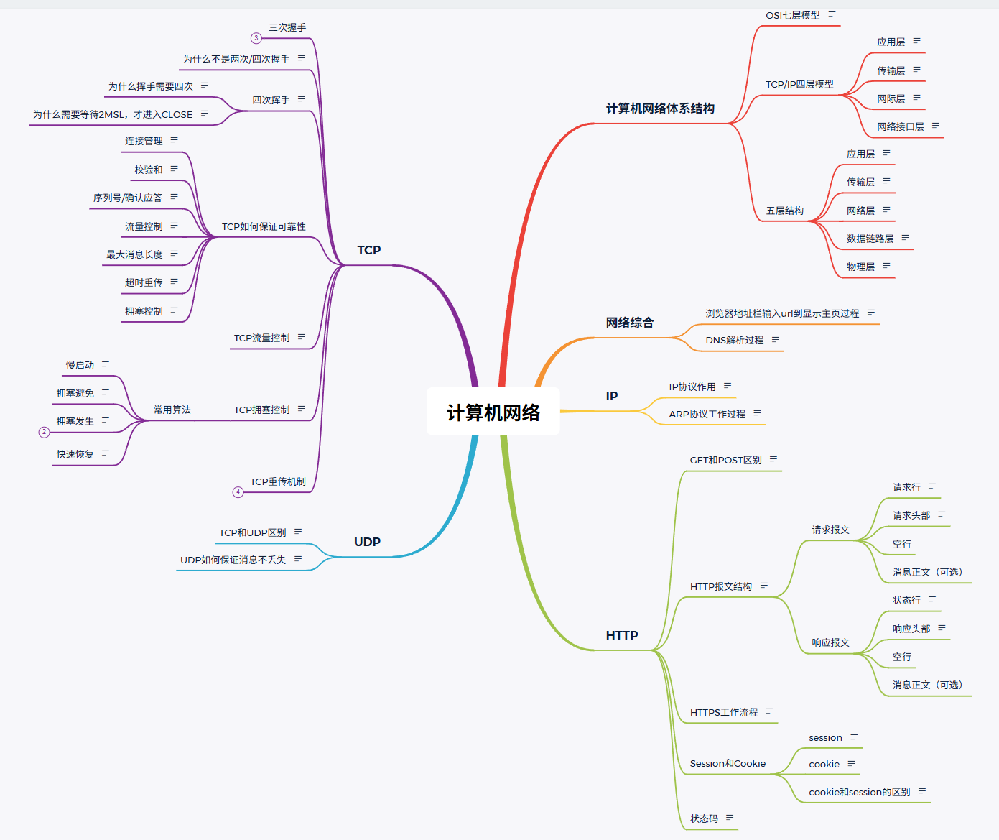
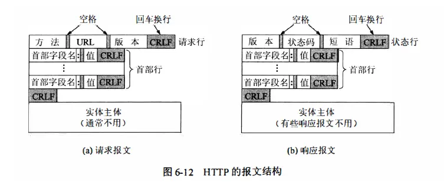
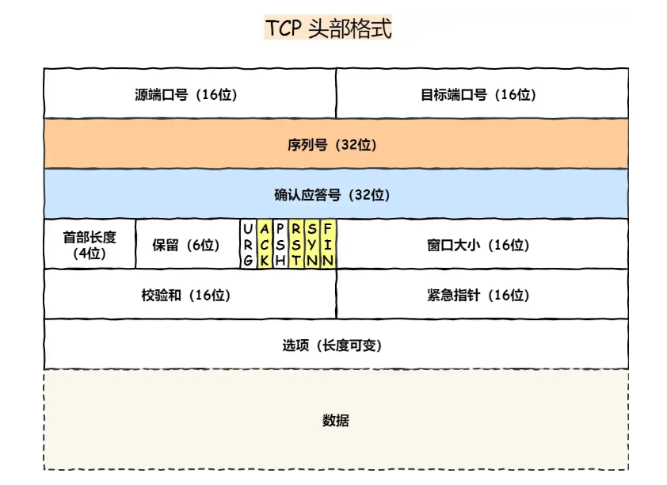
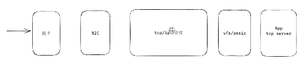
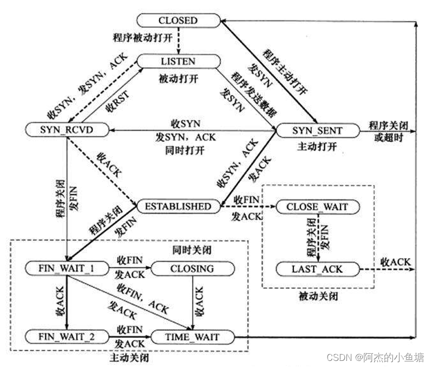

# network

## 计算机网络体系结构

### OSI七层模型

物联网书会使用

应用层：给用户用的协议（HTTP、FTP）  
表示层：加密、压缩、格式转换  
会话层：建立、管理、断开连接  
传输层：可靠传输（TCP、UDP）  
网络层：寻址、路由（IP）  
数据链路层：相邻设备传输（MAC）  
物理层：电压、光信号、网线、网卡  

### TCP/IP四层模型

应用层：HTTP FTP SMTP （面向用户和应用程序，定义业务数据的格式与含义，提供具体网络服务（网页、邮件、文件传输等），是网络功能的最终体现。）

传输层：TCP、UDP （保证数据传输的可靠性和顺序性）

网际层：IP、ARP、ICMP （给每台设备编地址，负责 “找路）

网络接口层：以太网、WiFi、MAC 地址 （把数据变成电信号 / 无线信号，真的传过去）

### 五层结构

应用层

传输层

网络层

数据链路层

物理层

## 网络综合

**浏览器地址输入URL到显示主页的过程：**

DNS解析：浏览器发起一个DNS请求到DNS服务器，将域名解析为服务器IP地址

TCP连接：浏览器通过解析得到的IP地址与服务器建立TCP连接（通常是通过443端口进行SSl加密的HTTPS连按）。这一步涉及到了TCP的三次握手过程，确保双方都准备好进行数据传输。

发送HTTP请求：浏览器构建HTTP请求消息，包括请求行（如GET/HTTP/1.1）、请求头（包含用户代理、接受的内容类型等信息）和请求体：将请求发送到服务器。

服务器处理请求：服务器接收到HTTP请求后，根据请求的资源路径，经过后端处理，生成HTTP响应消息； 响应消息包括：状态行、响应头和响应体

浏览器接收HTTP响应：浏览器接收到HTTP响应数据，开始解析响应体中的HTML内容；然后构建DOM树 、解析CSS和JAVAScript文件等，最终渲染页面

断开连接：TCP四次挥手，连接结束

**DNS解析过程**

浏览器检查浏览器DNS缓存中是否有域名对应的IP地址，有就直接返回

检查本地操作系统DNS缓存是否有该域名的记录，没有就向根域名服务器发送请求

根域名服务器将请求指向更具体服务，返回顶级域名服务器

顶级域名服务器在将请求指向权限域名服务器对应的IP地址

浏览器使用获得的ip地址发起一个HTTP请求到目标服务器

## IP

**IP协议作用**

寻址和路由：在IP数据报中携带源IP地址和目的IP地址来表示该数据报的源主机和目标主机。IP数据报在传输途中，每个中间节点（IP网关、路由器）只根据网络地址来转发，如果中间节点是路由器，则路由器会根据路由表选择合适的路径。IP协议根据路由选择协议提供的路由信息对IP数据报进行转发，直至目标主机。

分段和重组：IP数据报在传输过程中可能会经过不同的网络，在不同的网络中数据报的最大长度限制是不同的，IP协议通过给每个IP数据报分配一个标识符以及分段与组装的相关信息，使得数据报在不同的网络中能够被传输，被分段后的IP数据报可以独立的在网络中进行转发，在达到目标主机后由目标主机完成重组工作，恢复出原来的IP数据报。

**ARP协议的工作流程**

广播请求，单播应答

ARP请求：当主机A要给主机B发送数据时，首先会在自己的ARP缓存中查找主机B的Mac地址。如果没有找到，主机A会向网络中广播一个ARP请求数据报，请求网络中的所有主机告诉他们的Mac地址；这个请求包含了请求设备和目标设备的IP和Mac地址。

ARP应答：网络中所有的主机都会收到这个ARP请求，但只有主机B会回复ARP应答，告诉主机A自己的Mac地址。并且主机B会将主机A的IP和Mac地址映射关系缓存到自己的ARP缓存中，以便下次通信时直接使用。

更新ARP缓存：主机A收到主机B的ARP应答后，也会将主机B的IP和Mac地址的映射关系缓存到自己的ARP缓存中

## HTTP

**HTTP的报文结构**

请求报文 ： 请求行（方法（get、post） ， 请求的URL和HTTP协议版本） 、 请求头（包含关于请求的附加信息，如Host、User-Agent、Content-Type等） 、 空行 、 消息正文（可选）

响应报文 ： 状态行（HTTP协议版本、状态码和状态消息） 、 响应头部 、 空行 、 消息正文（可选）

**HTTPS的工作原理**

客户端向服务器发起请求

服务器收到请求后返回自己的数字证书，包含公钥、颁发机构等信息

客户端收到服务的数字证书后，验证服务器证书的合法性。如果合法，就会生成一个随机码，然后用服务器的公钥加密这个随机码，发送给服务器

服务器收到回话密钥后，用私钥解密，得到会话密钥

客户端和服务器通过会话密码对通信内容加密，然后传输。如果通信内容被截取，但由于没有绘画密钥所以无法解密。当通话结束后，连接通道会关闭，会话密钥也会被销毁，下次通信会重新生成一个会话密钥

HTTS：在不同阶段会选择不同的加密方式

**GET和Post的区别**

报文层面：GET请求将信息放在URL，POST请求将信息放在请求体，get携带的数据量有限，post对大小无限制，get放在url上不太安全

数据库层面：get符合幂等性（请求前后数据库数据一致）和安全性（不做修改），post不符合，get用于查看信息，不改变服务器上信息，post用于改变服务器上的信息

其他层面：get请求能被缓存，保存在浏览器的浏览记录，get的url能被保存为书签。post不能

**HTTP长连接**

HTTP是基于TCP传输协议实现的；所以如果我们想要建立客户端和服务器之间的联系：

我们需要在发送请求前三次握手建立链接，在收到回复后四次挥手断开链接。但如果我们需要频繁的请求响应，我们需要频繁的建立断开连接（HTTP短链接）

我们为了应对频繁请求响应的场景，建立HTTP长链接机制，在我请求获得响应后不会自动断开TCP链接，只有有人请求断开TCP链接时，才会断开TCP链接（长链接）

**Session和Cookie**

session：指的是服务器和客户端一次会话的过程，它是另一种记录客户状态的机制，不同的是cookie保存在客户端浏览器中，而session保存在服务器上。客户端浏览器访问服务器时，服务器把客户端信息以某种形式存在服务器上，这就是session。客户端浏览器再次访问时只需要从该session中查找用户的状态

cookie：是保存在客户端的一小块文本串的数据。客户端在向服务器发起请求时，服务器会向客户端发送一个cookie，客户端就会把Cookie保存起来。在客户端再次向同一服务器发起请求时，cookie被携带发送到服务器，服务端可以更久这个cookie判断用户的身份和状态

区别：存储位置不同 、 存储数据类型不同（cookie只能时ASIC码形式、session任意） 、 有效期不同（Cookie可以长时间 、 session一般短时间） 、 隐私策略不同（cookie存在客户端中容易被不法获取所以一般不存登录名或者密码 ， session存储在服务器中安全性较高） 、 存储大小不同（Cookie存储大小不能超过4K，而sessin没有限制）

**状态码**

1XX 提示信息（协议处理的中间状态）  
2XX 成功  
    200 一切正常，如果是非HEAD请求服务器返回响应头带有body数据  
    204 正常，与200基本相同，但响应头不带数据  
    206 用于HTTP分块下载或断点续传，相应返回的body数据是资源数据的一部分  
3XX 重定向  
    301 永久重定向，请求资源不存在，改用新的URL访问  
    302 临时重定向，请求资源还在，暂时用另一个URL访问  
    304 不具备跳转含义，资源为修改，重定向已存在的缓冲文件，客户端可以继续用缓存  
4XX 客户端错误  
    400 客户端请求报文有错很笼统  
    403 服务器禁止访问资源，不是客户端有错  
    404 请求资源在服务器上不存在或未找到  
5XX 服务器错误  
    500 笼统的错误码  
    501 客户端请求的功能还不支持  
    502 服务器作为网关或者代理时返回的错误码，服务器自身正常，访问后续服务器发生错误  
    503 服务器当前很忙，暂时无法响应  

## TCP

1.tcp建立的三个过程：

建立连接、传输数据、断开连接

2.TCP数据头：

源端口16bits

目的端口16bits

Sequence Number 32bits                     本机包的序号（本次发送包的序号）

Acknowledgment Number 32bits         对方机的确认信号（表示序号前的包全部收到）

Header Leng 4bits

Resv 4bits

标识位（8个）

windowSize  16bits   告诉对方我的存储大小（我能收多少）

TCP Checksum  16bits

Urgent Pointer  16bits

3..建立连接过程：三次握手

客户端                                    服务器

    ->syn、seqnum

                   suqnum、syn、ack、acknum<-

   ->acknum、ack  

服务器收到第一次 SYN：进入 半连接队列（SYN队列）

完成三次握手：进入全连接队列（accept队列）

半连接队列：syn队列（不限制长度的话，会被攻击syn泛洪）【listen（fd，backlog）backlog是队列限制长度】

全连接队列：accept队列     clientfd = accept（listenfd ， &addr ， &addrlen）；

4.·网络编程、

    网络原理（计算机网络-tcp、ip协议栈）

一个TCP数据包到达服务器后，首先由网卡接收，通过DMA写入内存并触发中断，进入Linux内核网络栈。数据依次经过二层、三层、四层处理，在TCP层根据四元组找到对应socket，将数据放入接收缓冲区，并唤醒阻塞的应用进程。应用通过read或recv系统调用将数据从内核拷贝到用户空间进行处理。

5.Posix API

open、read、write、close、seek、recv、send、connect、accept

6.超时重传：

规定的时间不是固定的时间，是根据回报的时间和网络状态算出来的

7.断开连接（四次挥手）

各自发送fin，回复ack

TIme_wait：

tcb.status = TIME_WAIT;

set_timer();

收到fin进入close_wait状态
发送fin进入fin_wait状态

## UDP
1.包头：（8字节）

Source Port 

Destination Port

Length

CheckSum

## 面试题
1.三次握手过程：

核心目的：

(1)确认双方都有发送和接收能力

(2)同步初始序列号（ISN）

(3)建立可靠连接

第一次握手：客户端发送SYN = 1、seqnum = x（客户端初始序列号

状态：客户端：SYN_SENT

第二次握手：服务器发送SYN = 1、ACK = 1、seqnum = y、acknum = x + 1

状态：服务器：SYN_RCVD

第三次握手：客户端发送ACK = 1、seqnum = x + 1、acknum = y + 1

状态：双方进入 ESTABLISHED

如果两次握手的话：如果客户端发的 SYN 因网络延迟滞留，服务器会误以为客户端要建立连接。第三次握手的作用：防止已失效连接请求报文段突然又传到服务器

2.四次挥手过程

关闭连接必须两边都关闭

第一次握手 ： 客户端 → 服务器   FIN = 1  seq = u

客户端进入：FIN_WAIT_1

第二次握手 ： 服务器 → 客户端  ACK = 1 ack = u + 1

服务器进入：CLOSE_WAIT      客户端进入：FIN_WAIT_2

⚠ 说明：服务器此时可能还有数据要发、所以不能马上关闭

第三次握手 ： 服务器 → 客户端  FIN = 1  seq = v

服务器进入：LAST_ACK

第四次握手 ： 客户端 → 服务器  ACK = 1 ack = v + 1

客户端进入：TIME_WAIT     服务器进入：CLOSED

3.大量close_wait的原因

close_wait状态   -   收到一段发出的close信号后，返回ack后，本端没有调用close（）函数。

在0 = recv后需要清除临时数据后才可以进行close函数的调用              --      没有及时的清除临时数据。 解决方法 ： 清除临时数据放到异步的线程中进行清除   /   先发close再清除临时数据

4.time_wait状态持续时间

客户端要等待 2MSL。   （MSL：最大报文生存时间。）

原因：

    保证最后一个ACK到达  如果服务器没收到，会重发FIN

    防止旧连接报文影响新连接

5.udp并发的实现

并发：同时承载的用户数量

你的项目，并发量怎么样？

1.内部测试

2.真实情况

并发的实现：

1.sendto发送给 udpserver8000

2.udp server recvfrom接收user1的数据

3.分配fd以及另外的端口，回发数据给user1

6.tcp首部长度，有哪些字段

源端口16bits

目的端口16bits

Sequence Number 32bits                     序列号（本次发送包的序号）

Acknowledgment Number 32bits         确认号（表示序号前的包全部收到）

Header Leng 4bits      首部长度

Resv 4bits    保留位

标识位（8个） SYN、ACK、FIN、RST（重新连接）、PSH（立即推送）、URG（紧急数据）

windowSize  16bits   告诉对方我的存储大小（我能收多少）

TCP Checksum  16bits    检测数据是否损坏

Urgent Pointer  16bits    URG为1时表示紧急数据位置

Options 可变    ——     常见 TCP Option：

- MSS（最大报文段）

- Window Scale（窗口扩大）

- SACK（选择确认）

- Timestamp（时间戳）

因为 Option 存在，TCP 首部才会变成 20~60 字节。

7.tcp的listen参数backlog的含义

backlog是队列限制长度

8.accpect发生在三次握手的那一步骤

在三次握手之后

9.tcp/udp的区别

(1)tcp 是 stream ， udp是dgram

(2)tcp保证顺序，udp不保证，实时性更好

(3).tcp保证有拥塞控制，udp没有

(4)tcp一个客户端对应一个soctfd  ， udp直接监听一个sockfd，所有客户端共用一个连接

(5)实时性要求高的会选择udp，迅雷下载，大量传输时选择udp。

10滑动窗口如何实现

TCP发送方有：发送窗口 = min(拥塞窗口cwnd, 接收窗口rwnd)

窗口滑动的本质：

随着ACK到来、左边界右移

11.epoll与select的区别

select/poll/epoll

1.select(maxfd , rfds , wfds , efds, timeout); //最大fd数量，可读，可写，错误，轮询时间。   timeout==    0为立即读取 、 -1为等待时间触发  、 >0 等待固定时长立即返回

每次select调用，需要把rfds、wfds复制到内核    需要通过循环遍历

2.poll（pfds，length，timeout）

每次poll调用，需要把pfds复制到内核空间，之后循环遍历【与select一致】

3.epoll    --    Linux服务器

int epfd  =  epoll_create(size);//创建一个总集

epoll_ctl(epfd ,OPERA , fd ,event);//再总集中增加一个一个的节点

epoll_wait(epfd,events,length,timeout);//把就绪的节点带出来

select要将关注的全部io都copy进去，然后判断状态后全部带出

而epoll只需要一次将全部io都放进去，需要用的时候，带出就绪节点即可

epoll

12.dpdk对传统网络做了哪些改变

网络io -> dpdk

磁盘io -> spdk

旁路技术 -   正常tcp从网卡到协议栈需要进行一次复制，从协议栈到server中需要再进行一次复制。

dpdk将网卡的接收直接映射到了内存中

13.全连接队列和半连接队列：

服务器收到第一次 SYN：进入 半连接队列（SYN队列）

完成三次握手：进入全连接队列（accept队列）

半连接队列：syn队列（不限制长度的话，会被攻击syn泛洪）【listen（fd，backlog）backlog是队列限制长度】

全连接队列：accept队列     clientfd = accept（listenfd ， &addr ， &addrlen）；

14.拥塞四个经典算法：

慢启动：从小到大试探网路能力

拥塞避免：当前发送窗口超过慢启动阈值时，进入拥塞避免阶段。防止突然拥塞

快重传：如果收到三个重复的ACK（因为受到后序包后 会ACK会显示为没收到的包），说明该包丢了可以立即重传丢包，不用等超时。

快恢复： 触发快重传 后    ssthresh = cwnd / 2    cwnd = ssthresh + 3。避免重新慢启动。