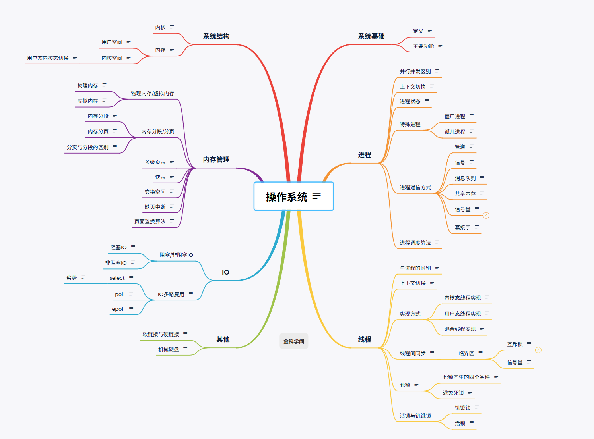

# 操作系统

## 系统基础

定义：操作系统是计算机系统中管理硬件和软件资源的中间层系统，屏蔽了硬件的复杂性，并为用户提供了便捷的交流方式

主要功能：  
1.负责创建和终止进程。进程是正在运行的程序实例，每个进程都有自己的空间和资源  
2.负责为进程分配资源，比如说内存，并在进程终止时回收内存  
3.提供创建、删除、读写文件的功能，并组织文件的存储结构，比如说目录  
4.通过设备驱动程序控制和管理计算机硬件设备，如键盘鼠标打印机等  

## 系统结构

内核：是一个计算机程序，他是操作系统的核心提供了操作系统最核心的能力，可以控制操作系统中所有内容

内存：划分为以下两个区域，这种划分主要用于保护系统的稳定性和安全性。

用户空间：也称用户态，是操作系统为应用程序（如用户运行的进程）分配的内存区域，用户空间中的进程不能直接访问硬件或内核数据结构，只能通过操作系统调用与内核通信

内核空间：也叫做内核态，是操作系统内核代码机器运行时数据结构所在的内存区域，拥有对系统所有资源的完全访问权限，如进程管理、内存管理、文件系统、网络堆栈等。

内核态和用户态切换：当应用程序执行系统调用时，CPU将从用户态切换到内核态，进入内核空间执行相应的内核代码，然后再切换回用户态。（系统调用：是应用程序请求操作系统内核提供服务的接口，如文件操作（如open、read、write）、进程控制（如fork、exec）、内存管理（如mmap）等）

## 进程

**并发和并行**

并发是一段时间内，多个任务都会被处理；但在某一个时刻，只有一个任务再执行。单核处理器做到的并发其实是利用时间片的轮转，例如两个进程A和B，A运行一个时间片后，切换到B，B运行一个时间片后又切换到A。因为切换速度足够快，所以宏观上表现为再一段时间内同时运行多个程序。（为什么并发涉及到上下文切换还要让CPU实现并发？因为大多数任务都是等待时间大于计算时间，所以与其让CPU空等，不如实现并发进行检测）

并行就是在同一时刻，有多个任务在执行。这个需要多核处理器才能完成，在微观上就能同时执行多条指令，不同的程序被放到不同的处理器上运行，这个是物理上的多个进程同时进行。

**上下文切换**

上下文切换时操作系统在多任务处理环境中，将CPU从一个进程切换到另一个进程的过程。通过让多个进程共享CPU资源时系统能够并发执行多个任务。

进程上下文切换通畅包含以下几个步骤：  
保存当前进程的上下文：操作系统保存当前进程的CPU寄存器，程序状态等关键信息。  
选择下一个进程：调度程序选择下一个需要执行的进程  
恢复上一个进程的上下文  
切换到下一个进程  

**进程状态**
运行状态：该时刻进程占用CPU  
就绪状态：可运行，由于其他进程处于运行状态而暂时停止运行  
阻塞状态：该进程正在等某一事件的发生（如：等待输入/输出操作的完成），而暂停运行，这时即使给他CPU控制权也无法运行  
创建状态：进程正在被创建时的状态  
结束状态：进程正在从系统中消失时的状态  

**特殊进程**

1.僵尸进程：已经完成并且处于终止状态，但在进程表中仍然存在的进程。一般发生在有父子关系的进程中，一个子进程的描述符在子进程退出时不会释放只有父进程通过wait()或waitpid()获取子进程信息后才会释放。如果子进程退出，而父进程并没有调用wait或waitpid，那么子进程的进程描述符仍然保存在系统中

2.孤儿进程：一个父进程退出了，而它的一个或多个子进程仍然在运行，那么这些子进程会成为孤儿进程。孤儿进程被init进程所收养(进程id为1的进程)，并由init进程对他们完成状态收集工作。因为孤儿进程会被init进程收养，所以不会对系统造成伤害。

**进程通信方式**

**管道**：进程间的管道就是内核中的一串缓存，从管道的一段写入数据，另一个端读取。数据只能单向流动，遵循先进先出（FIFO）的原则  
**信号**：用于通知接受进程某件事发生了，是一种简单的通信方式  
**消息队列**：保存在内核中的消息链表。按照消息的类型进行消息传递，具有较高的可靠性和稳定性  
**共享内存**：运行两个或多个进程共享一个给定的内存区，一个进程写入的东西，另一个进程马上就能看到。共享内存时最快的进程间通信方式，是针对进程间通信效率低专门设计的  
**信号量**：本质上是一个计数器，用来控制对贡献资源的访问数量。P、V操作（加减原子操作）[当作锁限流时使用]  
**套接字**：提供网络通信的端点，可以让不同机器上运行的进程之间进行双向通信。  

**进程调度算法**

先来先服务：按进程到达就绪队列的先后顺序分配 CPU，先到先执行，直到进程完成或阻塞才释放 CPU。[CPU密集型长作业：如科学计算、大数据处理]

最短作业优先：优先调度运行时间最短的进程（基于预估的运行时间），分为「非抢占式」和「抢占式」（抢占式即下文的最短剩余时间优先）。[适合批处理系统（如后台任务调度）（批处理是一大批任务需要处理，目标整体等待时间最短），需能准确预估进程运行时间]

优先级调度：为每个进程分配优先级，优先调度优先级高的进程，分为「非抢占式」（仅当前进程完成 / 阻塞时切换）和「抢占式」（高优先级进程到达立即抢占）。[桌面系统、实时系统]

时间片轮转：按 FCFS 顺序为进程分配固定长度的时间片（如 10ms），进程用完时间片后被抢占，放回就绪队列尾部，循环执行。 [分时操作系统（早期windows、linux桌面版），是最常用的交互系统调度算法]

最短剩余时间优先：SJF 的抢占式版本：每次有新进程到达时，比较「当前进程剩余运行时间」和「新进程总运行时间」，优先执行剩余时间更短的进程。[适合对短作业响应速度要求极高的批处理系统（如服务器后台任务）]

多级反馈队列：结合了「时间片轮转」和「优先级调度」的混合算法，是操作系统（如 Linux）的实际主流算法：设置多个就绪队列，队列优先级从高到低（如队列 1 > 队列 2 > 队列 3）；高优先级队列时间片更短（如队列 1=10ms，队列 2=20ms，队列 3=40ms）；新进程进入最高优先级队列，用完时间片后降级到下一级队列；仅当高优先级队列为空时，才调度低优先级队列的进程；低优先级进程长时间未执行时，提升优先级（避免饥饿）。[操作系统的主流算法]

## 线程

**与进程的区别**

进程是一个正在执行的程序实例，每个进程都哟自己独立的地址空间，全局变量，堆栈和文件描述符等资源。

线程是进程中的一个执行单元，一个进程可以包含多个线程，他们共享进程的地址空间和资源。

每个进程在独立的地址空间运行，不会直接影响其他进程，线程共享一个进程的内存空间，全局变量和文件描述符。

进程切换需要保存和恢复大量的上下文信息，代价较高，线程切换相对较轻量，因为线程共享进程的地址空间，只需要保存和恢复线程私有的数据。

线程的生命周期是进程控制的，进程终止时线程也会跟着销毁。

进程奔溃不会影响到其他进程，线程崩溃可能会影响到全部的线程

**上下文切换**

线程是不是属于同一个进程：

当两个线程不属于同一个进程，则切换过程就更进程上下文切换一致。  
当两个线程属于同一个进程，因为虚拟内存时共享的，所以切换时。虚拟内存这些资源就保持不动，只需要切换线程的私有数据，寄存器等不共享数据

**实现方式**

1.内核态线程实现：内核创建调度，有 TCB（线程控制块），可并行，开销大。

(1)线程由操作系统内核直接创建、管理、调度。  
(2)内核中维护线程控制块（TCB），记录每个线程的状态、寄存器、栈等信息。  
(3)线程的创建、销毁、切换、调度全部由内核完成。  
(4)线程切换必须从用户态 → 内核态，通过系统调用实现。  
(5)一个进程内的多个线程，可以被调度到不同 CPU 核心并行执行。  
(6)某线程阻塞时，内核可以调度同一进程的其他线程运行。  

2.用户态线程实现：用户库实现，内核无感知，切换快，一阻全阻。（会被CPU视为独立的一个调度块）

(1)线程在用户空间实现，由用户级线程库（线程包）管理，内核完全不知情。  
(2)用户库自己维护：TCB、栈、程序计数器、线程状态。  
(3)内核只看到一个进程，不知道里面有多个线程。  
(4)线程创建、切换、调度完全在用户态完成，不需要系统调用、不陷入内核。  
(5)调度算法由用户库自己决定，不由内核控制。  
(6)若一个线程阻塞（如 I/O），内核认为整个进程阻塞，所有用户线程都无法运行。  
(7)无法利用多核，只能并发，不能并行。  

3.混合线程实现：用户线程 + 内核线程多对多映射，快且可并行。

(1)用户层：实现大量用户线程，由用户线程库管理。  
(2)内核层：实现少量内核线程 / 轻量级进程 LWP。  
(3)映射关系：多个用户线程 ↔ 多个内核线程（多对多）。  
(4)用户线程切换：在用户态完成，速度快。  
(5)内核线程：负责与 CPU 调度、处理阻塞、多核并行。  
(6)一个用户线程阻塞 → 只挂起对应的内核线程，同一进程内其他用户线程可继续运行。  
(7)既能享受用户线程的高速切换，又能获得内核线程的并行与阻塞安全。  
  
**线程间同步**

临界区：对共享资源访问的程序片段，我们希望这段代码是互斥的，可以保证在某个时刻只能被一个线程执行，也就说一个线程在临界区执行时，其他线程应该被阻止进入临界区。

临界区的实现方式有：  
互斥锁:(加锁、解锁)【忙等待锁，无忙等待锁】  
信号量:（PV操作）  

**死锁**

死锁产生的四个条件：

1.互斥条件:资源独占使用，不能同时被多个进程占有。  
2.持有并等待条件:进程已经持有一些资源，又在等待其他资源，且不释放已持有的。  
3.不可剥夺条件:进程获得的资源只能自己主动释放，不能被强行抢占。  
4.循环等待条件:多个进程形成环路等待，每个进程都等下一个进程的资源。  

避免死锁：

1.破坏互斥条件资源改为可共享使用（如只读文件）。（很多资源无法破坏，最不实用）  
2.破坏持有并等待进程运行前一次性申请所有资源，要么全得，要么全不得。  
3.破坏不可剥夺进程申请不到新资源时，主动释放已占资源，允许抢占。  
4/破坏循环等待给所有资源统一编号，进程必须按序号从小到大申请，杜绝环路。  

**活锁、死锁与饥饿**

活锁：进程都在动、都在退让、都在释放资源，但就是推进不了任务。(随机退让时间、有序访问。)

饥饿：一个进程一直得不到资源，永远排队在后面，一直不被调度。(动态提升优先级，aging算法)

死锁：多个进程互相持有对方需要的资源，都不释放，大家一起卡死。(破坏死锁四个条件、银行家算法、资源剥夺、撤销进程。)

## 内存管理

**物理内存和虚拟内存**

物理内存：指的是计算机中实际存在的硬件内存，物理内存时计算机用于存储运行中程序和数据的实际内存资源，操作系统和应用程序必须使用物理内存来执行。

虚拟内存：是什么？怎么实现？

虚拟内存：让程序觉得自己拥有一块连续、很大的地址空间（虚拟地址空间），但实际物理内存可以是离散、小得多的，甚至可以用磁盘当 “后备内存”。

虚拟内存利用 请求分页 + 页表 + MMU（查页表） + 缺页中断 + 页面置换，让程序使用虚拟地址空间，实现离散分配、逻辑扩充内存、按需调页。

**内存分段/分页**

分段：程序是由若干个逻  辑分段组成的，如可由代码分段、数据分段、栈段、堆段组成。不同的段是有不同的属性的，所以就用分段的形式把这些段分离出来。分段机制下的虚拟地址由两部分组成:**段号和段内偏移量**。虚拟地址和物理地址通过段表映射，段表主要包括段号、段的界限。

分页：把虚拟和物理内存空间切成一段段 固定尺寸大小、并且连续 的内存空间，我们把它叫做页。linux下页的大小为4kb。访问分页系统中内存数据需要两次的内存访问：一次是从内存中访问页表，从中找到对应的物理页号，加上页内偏移得到实际物理地址。第二次是根据第一次得到的物理地址访问内存取出数据。

分页和分段的区别：

分页：固定大小、物理单位、一维(一个数数字，系统切成页号+页内地址)、无外碎、不可见、不便共享。  
分段：不固定、逻辑单位、二维(输入段号和段内地址两个参数)、有外碎、可见、方便共享

**多级页表**

是一种内存管理技术，用于在虚拟内存中高效的管理和转换虚拟地址到物理地址。它通过分层结构减少页表所需的内存开销，以解决单级页表在大地址空间中的效率问题。

**快表**

在一段时间内，整个程序的执行仅限于程序中的某一部分。相应的执行所访问的空间页局限在某个区域内。

利用这一特性，把最常访问的几个页表存储到访问速度更快的硬件，于是加入了一个专门放程序最常访问的页表项的cache，这个cache就是TLB，通常称为页表缓存、转址旁路缓存、快表等。

**交换空间**

操作系统在硬盘上划分出来的一块空间，当物理内存不够用时，暂时把暂时不用的内存页面 “挪” 到这里，腾出物理内存。（有些内存中的页在硬盘中没有备份，需要交换空间备份）

**缺页中断**

当一个程序访问的页不在物理内存中，就会发生缺页中断。操作系统需要从磁盘上的交换区中将缺失页调入内存。

**页面置换算法**

最佳页面置换算法：置换以后最久才会用到，甚至永远不用的页面(理论最优，但无法实现)  
先进先出置换算法：先进入内存的页面，先被置换。(与页面访问规律无关)   
最近最久未使用置换算法：置换最近最久没有使用过的页面。(需要硬件支持，开销大)  
时钟页面置换算法：用 **使用位（use bit）** 标记页面是否被用过。(近似LRU实现简单，应用广泛)  
最近最不常用置换算法：置换访问次数最少的页面。(不合理，过去用的多不表示未来要用，且要计数器支持)  

# IO

**阻塞/非阻塞IO**

阻塞IO：当用户执行read，线程会被阻塞，一直等到内核数据准备好，并把数据从内核缓冲区拷贝到应用程序缓冲区，当拷贝完成，read才会返回。（注意：阻塞等待的是内核数据准备好和数据从内核态拷贝到用户态两个过程）。

非阻塞IO：read在数据未准备好的情况下立即返回，可以继续往下进行，此时程序不断轮询内核，直到数据准备好，内核将数据拷贝到应用缓冲区，read调用才可以获取到结果。[reactor架构]

**IO多路复用**

select：有上限、全拷贝、遍历找、跨平台；  
poll：无上限、全拷贝、遍历找、跨平台；  
epoll：无上限、少拷贝、主动通知、Linux 专属、O (1)。  

# 其他

**软连接与硬链接**

**机械硬盘**