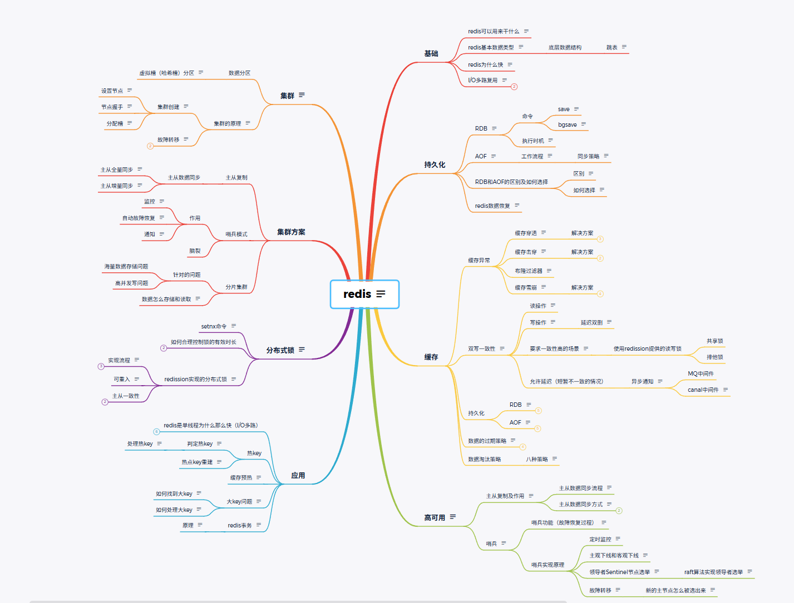

# Redis

## redis基础

### redis的作用

1.缓存：由于redis的数据存储在内存当中，读写速度非常快。可以极大的提高应用的响应速度和吞吐量

2.排行榜、计数器：redis中的数据结构ZSet非常适合实现排行榜的功能。同时Redis的原子递增可以用来实现计数器的功能

3.分布式锁：reids可以实现分布式锁，用来控制多个进程和服务器的资源访问。

### redis的基本数据结构

**1.存储的基本数据类型**

字符串(string) - 可存储字符串、数字（整数 / 浮点数）、二进制数据（如图片、序列化对象），单个 String 最大支持 512MB。作用 : 存储简单值（如用户昵称、商品价格）；计数器（如文章阅读量、点赞数）；分布式锁（利用 setnx 命令）；缓存 JSON 序列化后的对象。

列表(list) - 基于双向链表实现的有序集合（元素可重复），支持从头部 / 尾部增删元素，访问两端元素速度极快，访问中间元素较慢。作用 ： 消息队列（如简单的任务队列）；最新消息列表（如朋友圈动态、评论列表）；分页查询（如获取前 10 条数据）。

集合(set) - 无序、唯一的字符串集合（元素不可重复），支持集合间的交、并、差运算。作用 ： 存储用户标签（如用户 1 的标签：运动、美食）；共同好友 / 关注列表（交集运算）；抽奖（随机取元素）。

有序集合(sorted set) - 类似 Set，但每个元素会关联一个分数（score），Redis 会根据分数自动排序，元素唯一但分数可重复。作用 ： 排行榜 、 延时队列

**2.底层的数据结构**

|Redis 抽象数据结构	|底层实现（按优先级 / 场景）|
|---|---|
|String	|SDS（小字符串）、embstr（紧凑 SDS）、raw（大字符串）|
|List	|quicklist（默认）|
|Hash	|ziplist（小数据）→ 哈希表（大数据）|
|Set	|intset（整数 + 少量）→ 哈希表（其他场景）|
|ZSet	|ziplist（小数据）→ 跳表 + 哈希表（大数据）|

**3.跳表**

是一种有序的数据结构，通过在每个节点中维持多个指向其他节点的指针，从而达到快速访问节点的目的。跳表由zskiplist和zskiplistnode组成。前者用于保存跳表的基本信息（表头、表尾、长度、层高等）后者用于表示跳表的节点，每个节点的层高不固定，每个节点都有一个指向了保存当前节点的分值和成员对象的指针。

跳表通过多层设计降低了查询的时间复杂度。比如说我原始数据有64个节点，我上层会随机选择16个节点，这些节点会有下层本节点的指针。以此类推，可以视作为二分查找的链表版本。空间复杂度听起来很高，但当我们按照1/4抽取上层节点时，四层节点的空间浪费率也只有33%。所以跳表是一种优质的有序链表存储结构

### redis为什么快？

1.基于内存存储，使得数据的读写操作避开了磁盘IO。而内存的访问速度远超硬盘。

2.单线程模型。redis使用单线程模型处理客户端的请求。意味着在任何时刻只有一个命令在执行。避免了线程切换和锁竞争带来的消耗

3.IO多路复用。基于Linux的sellect/epoll机制。该机制允许内核中同时存在多个监听套接字和已连接套接字，内核会一直监听这些套接字上的链接请求或者数据请求，一旦由请求到达，就会交给redis进行处理。实现了所谓的单线程redistribution处理多个IO读写的请求

4.提供了多种高效的数据结构，包括字符串(string)，列表(list)，集合(set)，有序集合(sorted set)等，这些数据结构经过了高度优化，能够支持快速的数据操作。

### IO多路复用

1.select/poll ： 只会通知用户进程由socket准备就绪，不确定是哪个具体的，需要用户进程遍历确认。

2.epoll：将用户socket对应的fd注册进epoll，然后epoll帮你监听有哪些socket上有消息到达，这样避免了大量的无用操作。此时socket应该采用阻塞模式。

## Redis的持久化

### RDB

**1.RDB是什么？** 

RDB持久化通过创建数据集的快照来工作，在指定的时间间隔内将redis的某一时刻的数据状态保存在磁盘的一个RDB文件中。可以通过save和bgsave两个命令手动触发RDB持久化操作

**2.RDB命令**

save命令：同步的将redis中所有数据保存到磁盘的一个RDB文件中，这个操作会阻塞所有客户端请求直到RDB文件被完全写入磁盘

bgsave命令：命令执行期间Redis继续响应刻画的请求，对服务可用性影响较小。快照的创建过程主要有一个子进程完成，主进程不会被阻塞。在生产环境中执行RDB持久化的推荐方式。

**为什么有了bgsave还要保留save函数？因为bgsave是frok()子线程去读主线程的内存页表，但当主线程中的内存页表过大时可能会导致读取速度太慢或者直接读取失败，此时save函数就可以作为保底机制保证能成功缓存RDB文件**

**3.RDB执行时机**

1.Redis配置中通过save<seconds><changes>指令进行配置。save 900 1 表示每当出现了1个变更900s后自动触发一次RDB持久化 ；  
2.每次Rediso服务器通过SHUTDOWN正常关闭时如果没禁用RDB持久化。Redis会自动执行一次RDB持久化，以确保下次启动时Redis快速恢复 ；  
3.在Redis复制场景中当一个Redis实例被配置为从节点且与主节点建立连接后，可能会根据配置接收主节点的RDB用于初始化。  

### AOF

AOF持久化通过记录每个写操作命令，并将其追加到AOF文件中来工作。恢复时通过重新执行这些命令来重建数据集。AOF主要作用是解决了数据持久化的实时性，目前是Redis持久化存储的主流方式。

**1.工作流程：**

1.当AOF持久化功能启用时，Redis服务器会将接收到的所有写命令追加到AOF缓存区（buffer）的末尾。  
2.为了将缓存区中的命令持久化到磁盘中的AOF文件中，Redis提供了几种不同的同步策略  
3.随着操作的不断执行，AOF文件会不断增长，为了减少AOF文件大小，Reids可以重写AOF文件：  
重写过程不会解析原始的AOF文件，而是通过将当前内存中数据库的状态转换为一系列写命令，然后保存到一个新的AOF文件中  

AOF重写操作 由BGREWRITEAOF命令触发，他会创建一个子进程来执行重写操作，因此不会阻塞主进程  
重写过程中，新的写命令会继续追加到旧的AOF文件中，同时也会被记录到一个缓存区中，一旦重写完成，Redis会将这个缓冲区中的命令追加到新的AOF文件中

**2.同步策略：**

alway：每次写命令都会同步到AOF文件中，提供了最高的数据安全性，但可能因为IO延迟影响性能  
erverysec（默认）：每秒同步一次，折中的方案。提供较好的性能和数据安全性。如果系统崩溃，最多可能丢失系统最后一秒的数据。  
no：只会在AOF关闭或Redis关闭时执行或由系统内核触发。这种情况下如果发生宕机那么丢失的数据量由操作系统内核的缓存冲洗策略决定。  

### RDB和AOF的区别和如何进行选择

**1.区别**

RDB是一个非常紧凑的单文件，代表了Redis在某个时间点的数据快照。非常适合于备份数据，比如在夜间进行备份然后将RDB文件复制到远程服务器，但可能会丢失最后一次持久化后的数据

AOF的优点是灵活，实时性好，可以设置不同的fsync策略，如每秒同步一次，每次写入命令就同步。但AOF文件往往比较大、恢复速度慢。因为他记录了每个写操作。

**2.如何选择**

想要达到媲美数据库的数据安全性：同时使用两种持久化功能。Redis重启时优先载入AOF文件恢复原始数据（通常情况下AOF存储的数据集更加完整）/

如果可以接受数分钟的数据丢失，那么只用RDB持久化就可以

只用AOF不太利于数据备份，并且RDB恢复数据要比AOF快得多

**3.redis数据恢复**

把RDB文件或者AOF文件拷贝到Redis数据目录下，然后启动Redis-server即可。

Redis启动时自动加载数据流程：

1.AOF持久化开启且存在AOF文件时优先加载AOF文件

2.AOF关闭或者AOF文件不存在时，加载RDB文件

3.加载AOF/RDB文件成功后，Redis启动成功

4.AOF/RDB文件存在错误时，Redis启动失败并打印错误信息

## 缓存

### 缓存异常

**1.缓存穿透**

查询不存在的数据，由于缓存没有命中，请求每次都会穿过缓存到达数据库

解决方案：

1.缓存空数据，查询返回的数据为空，仍把这个空结果进行缓存。优点：简单，缺点：消耗内存，可能发生不一致问题

2.布隆过滤器，检查一个元素是否在一个集合中，拦截不存在的数据。缺点：布隆过滤器使用hash。一个id哈希函数算出来的在位图的位置刚好为1，但这个id其实不存在。数组越小误判率越大，数组过大导致消耗内存过多。

**2.缓存击穿**

某一个或者某少数几个数据被高频访问，当数据在缓存过期的那一刻，大量请求会到数据库，导致瞬间压力过大

解决方案：

1.添加互斥锁。一个线程查询未命中获取互斥锁后查询数据库重建缓存数据，其他线程获取锁失败只能是吗一会重试。缺点：性能相对较低，但保证数据强一致

2.逻辑过期。热点的key不设置过期时间。一个线程查询缓存发现逻辑时间已过期，获取互斥锁成功后开一个新线程区重建缓存数据，同时返回原来的过期数据。没重建好之前，线程会返回过期的数据。缺点：性能好一些，保证了高可用性但不一定强一致

**为什么一定要让redis数据过期呢？因为在redis与数据库的更新不是原子操作，所以可能会难免出现redis与数据库不一致的情况，数据过期就是一种保底策略，保证redis中的数据不会永久错误**

**3.缓存雪崩**

在某一个时间点，大量缓存数据同时过期或服务器突然宕机导致所有请求落在数据库

解决方案：

1.给不同的key的TTL添加随机值（TTL过期时间）

2.利用redis集群提高服务的可用性（防止宕机）

3.给缓存业务添加降级限流政策（ngxin等当中设置限流规则，是一种系统保底策略，也能用于防穿透和击穿）【Nginx 是一种反向代理服务器，用于阻隔客户端和后端，可以用于反向代理、负载均衡、限流】

4.给业务加多级缓存（防止大量key过期）

**4.布隆过滤器**

布隆过滤器作用集中在「快速过滤无效请求 / 数据」，最典型的场景就是补充缓存穿透的空值方案，解决 “无效 key 极多” 的极端情况

原理是通过存入所有数据的值，数据进入是通过哈希函数判断是否存在该值

### 双写一致性

当修改了数据库的数据后也要同时更新缓存数据，缓存与数据库数据保持一致。redis数据存在与内存当中，mysql的数据如何与redis同步？回答时看自己的业务背景，要求一致性高还是允许延迟一致

**1.读操作**

缓存命中直接返回，未命中查询数据库写入缓存，设置超时时间

**2.写操作**

延迟双删：删除缓存->修改数据库->（延迟一会）删除缓存。因为无论是先删缓存还是先修改数据库都会有脏数据出现。延迟双删是因为数据库需要从主节点同步到从节点，这要占用一段不好把握的时间长度。延迟双删仍有脏数据风险

**3.要求一致性较高**

使用读写锁，因为缓存数据一般读多写少，读数据时加共享锁，加锁之后其他线程可以共享读操作。写数据使用排他锁，加上之后阻止其他线程读写操作。虽然一致性比较高，但是性能比较低。

使用redission提供的读写锁

**4.允许有一定延迟**

异步通知：保证数据的一致性。通过MQ（消息队列），数据库修改后发送消息到MQ，缓存监听MQ（MQ中间件、canal中间件）

**5.数据过期策略**

惰性删除：设置key过期时间后，当需要该key时，检查是否过期，过期了就删掉，优点：对CPU友好，用不到的key不用浪费时间检查。缺点：对内存不友好，一个key已经过期但一直没有使用，该key就会一直在内存中不释放

定期删除：每隔一段时间，对key进行检查，删除里面已经过期的key优点：可以限制删除频率和时长减少对CPU的影响。缺点：难以确定频率和时长

定期删除有两种模式：SLOW模式：定时任务，执行频率默认10HZ，每次不能超过25ms  FAST模式：执行频率不固定，但两次间隔不低于2ms，每次耗时不超过1ms

**6.数据淘汰策略**

|策略名称|	核心逻辑|	适用场景|
|---|---|---|
|volatile-lru（推荐）|	从过期键中，淘汰最近最少使用（LRU） 的键|	大部分业务场景（比如电商缓存、接口缓存）|
|volatile-ttl	|从过期键中，淘汰剩余过期时间最短（TTL） 的键|	优先清理快过期的临时数据（比如验证码、临时令牌）|
|volatile-random|	从过期键中，随机淘汰键	|无特殊优先级的场景（几乎不用）|
|volatile-lfu（Redis4.0+）	|从过期键中，淘汰最不常用（LFU） 的键|	比 LRU 更精准（比如低频访问的过期数据优先删）|

## 高可用

主从复制模式：允许一个redis服务器（主节点）将数据复制到一个或多个Redis服务器（从节点）。这种方式可以实现读写分离，适合读多写少额场景

哨兵模式：用于监控主节点和从节点的状态，实现自动故障转移和系统消息通知。如果主节点发生故障，哨兵可以自动将一个从节点升级为新的主节点，保证系统可用性

集群模式：Redis集群通过分片的方式存储数据，每个节点存储数据的一部分，用户请求可以并行处理。集群模式支持自动分区、故障转移。并且可以在不停机的情况下增加删除节点

**主从结合和分片存储不仅可以同时存在，而且这是生产环境中 Redis 集群的「标准部署方式」—— 分片（Sharding）解决「海量数据存储」问题，主从（Master/Slave）解决「高可用 + 读写分离」问题，两者缺一不可**

### 主从复制

能由主节点到从节点。Redis支持 主从同步 和从从同步两种。后者是Redis新功能解决主节点同步负担。

作用：数据复制、读写分离、负载均衡

数据冗余：主从复制实现了数据的热备份，是持久化之外的一种数据冗余方式

故障恢复：当主节点出现问题，可以由从节点提供服务，实现快速的故障恢复

负载均衡：配合读写分离，可以由主节点提供写服务，由从节点提供读服务。分担服务器负载，尤其是读多写少的情况下，通过多个从节点分担读负载，大大提高Redis吞吐量。

高可用基石：除了上述作用外主从复制还是哨兵和集群能实现的基础。所以说主从复制是Redis高可用的基础

**1.主从数据同步流程**

1.保存主节点的信息  这一步只保存主节点的信息，保存主节点的ip和port

2.主从之间建立连接

3.从节点发现新的主节点后会尝试和主节点建立网络连接

4.连接成功后发送ping命令请求进行首次通信，主要检测主从之间网络是否可用，主节点当前是否可接受处理命令。

5.权限验证

6.如果主节点要求密码验证，从节点必须用正确的密码

7.同步数据集：主节点会把持有的数据全部发送给从节点

8.命令持续复制：主节点会把写命令持续发给从节点保证主从数据一致

**2.主从数据同步方式**

全量同步：从节点建立连接后请求数据同步。主节点判断是否第一次同步，第一次就返回master版本信息，然后执行bqsave生成rdb文件发送给从节点。从节点清空本地数据加载rdb。在rdb期间主节点接受到新命令放在repl_baklog，然后发送给从节点

增量同步：一般发生在从节点重启或后期数据变化。通过从节点发送的replid判断主从不是第一次同步，直接从repl_baklog中获取从节点发来的offset后的命令给从节点。

### 哨兵

主从复制有一个问题，就是无法自动完成故障转移。哨兵就可以解决。它由两部分组成：

哨兵节点：哨兵系统由一个或多个哨兵节点组成，哨兵节点是特殊的redis节点，不存储数据对数据节点进行监控。

数据节点：存储数据，主节点和从节点都是数据节点。

**1.哨兵功能**

1.监控：哨兵会不断地检查主节点和从节点是否正常运作

2.自动故障转移：当主节点不能正常运作时，哨兵会开始自动故障转移操作。他会把失效主节点所有从节点当中的一个节点升级为主节点，并且让其他从节点改为复制新的主节点的数据

3.配置提供者：客户端初始化时，通过哨兵来获得当前redis服务的主节点。

4.通知：哨兵可以将故障转移结果发送给客户端

**2.哨兵实现原理**

1.定时监控任务：

每隔10秒每个哨兵节点会向主节点和从节点发送info命令获取当前的拓扑结构;  
每隔2秒哨兵节点会向redis的数据节点的**sentinel hello**频道上发送哨兵节点对于主节点的判断以及当前哨兵节点的信息;  
每隔1秒每个哨兵节点会向主节点、从节点、其余哨兵节点发送一条ping命令进行心跳检测确认这些节点是否可达  

2.主观下线和客观下线：

主观下线：哨兵节点每隔一秒对其余节点发送ping命令进行心跳检测。如果超过down-after-millseconds后哨没有收到回复，哨兵节点就会对这个节点做出失败判定，这个就叫做主观下线;  
客观下线：当哨兵主观下线的节点是主节点时，该哨兵会通过is -master-down-by-addr命令向其他哨兵节点询问对主节点的判断，当超过<quorum>个数。哨兵节点就会任务这个主节点确实有问题，这时哨兵节点就会做出客观下线的决定  

3.领导者sentinel节点的选取：

哨兵节点会做领导者选举的工作，选出一个sentinel节点去做故障转移的工作。redis使用raft算法来实现领导者的选举。

raft算法：

4.故障转移

在从节点列表中选择一个节点作为新的主节点，这是相对复杂的一步；（过滤不健康的从节点 、 从节点优先级列表中高的节点开始选择 、 选择复制偏移值最大（复制最完整） 、 选择runid最小的节点）

哨兵领导者节点会对选择出的节点执行slave no one命令使它成为主节点；

哨兵领导者节点会对其他从节点发送命令，让他们成为新主节点的从节点；

哨兵节点集合会将原来的主节点更新为从节点，并保持对其的关注（恢复后命令他去复制新的主节点）

## 集群

### 数据分区

**1.虚拟槽（哈希槽）分区：**

这种分区可以灵活的将槽（以及槽中数据）从一个节点迁移到另一个节点，从而实现的平滑扩容和缩容，数据分布也更加均衡，Redis Cluster采用的正是这种分区方式。

在虚拟槽分区中，槽是数据管理和迁移的基本单位，假设系统中有四个实际节点，假设为其分配了16个槽（0-15）. 处于（0-3）位于节点1  ...  
如果此时删除节点2，只需将槽4-7重新分配即可，例如将槽4-5分配给节点1.槽6分配给节点3，槽7分配给节点4，数据在节点上的分配仍然比较均衡。  
如果此时增加节点5，只需要将一部分槽分配给节点5即可  

槽的分配取决于CRC16（key）的具体结果，因为在RedisCluster中，槽的个数刚好是2的14次方，这和hashmap中数据长度必须是2的幂次方有着异曲同工之妙。它能保证扩容后大部分数据停留在扩容前的位置，只有少部分数据需要迁移到新的槽上。

### 集群的原理

集群通过数据分区实现数据的分布式存储，通过自动故障转移实现高可用

**1.集群创建**

设置节点：通过 redis-cli --cluster create 初始化集群，指定所有节点和主从比例；

节点握手：集群工具自动发送 CLUSTER MEET 命令，让节点互相识别，形成集群网络；

分配槽：自动把 16384 个哈希槽平均分配给主节点，这是分片的核心，只有分配槽的节点才能处理请求；

**2.故障转移**

故障发现：节点之间互相心跳，单个节点认为对方挂了（主观下线），超过半数主节点认为对方挂了（客观下线）

故障恢复：筛选候选从节点、竞选新主节点、执行切换、旧主节点变为从节点

## 集群方案（设计）

### 主从复制

**主从数据同步**

主从全量同步

主从增量同步

### 哨兵模式

**作用**

监控：

自动故障恢复：

通知：

**脑裂**

脑裂就是集群因网络隔离出现双主，导致数据不一致。  
Redis 通过「半数以上投票机制」和「最小从节点写入限制」，保证任何时刻只有一个主节点提供写服务，从而防止脑裂。

### 分片集群

**针对的问题**

海量数据存储问题：

高并发写问题：

**数据怎么存储和读取**

引入哈希槽，分配给不同的实例，先计算key有小部分的哈希值在对哈希槽数量取余，余数作为插值，寻找插槽所在的实例。

## 分布式锁

主要适用于：集群情况下的定时任务、抢单、幂等场景。

**1.setnx命令**

要设置超时时间，以防止服务器宕机后，线程没有释放锁，别的线程也拿不到锁。

**2.如何合理控制锁的有效时长**

根据业务执行时间进行预估：

给锁续期：另开一个线程监视当前线程的执行情况。

**3.redission实现的分布式锁**

底层是setnx和lua脚本（lua脚本：redis执行脚本是有原子性的，所以用lua实现加锁解锁。lua和事务有什么不同？Redis 事务和 Lua 脚本不是互相替代的关系。事务主要用于把多条命令按顺序一次提交执行，适合固定命令组合，也能结合 WATCH 实现乐观锁。Lua 脚本则更适合带条件判断的复合原子操作，比如先查询再修改、分布式锁解锁、库存扣减等。）

实现流程：加锁后执行业务时开一个线程watch dog每隔一段时间给业务做一次续期，更新锁时间。释放锁后通知watchdog不要再做续期。当别的线程想要获取锁，线程会不断while循环尝试获取，循环几次超过阈值后获取失败（重试机制）

可重入：执行同步代码，判断当前线程id是否时同一个，同一线程就可以获取锁成功。利用hash结构记录线程id和重入次数

主从一致性：RedLock（红锁）不能只在一个Redis实例上创建锁【实现复杂性能差】、zookeeper（可以保证强一致性）

|特性|	单 Redis 锁|	RedLock	|ZooKeeper 锁|
|---|---|---|---|
|核心依赖	|Redis SET NX PX|	多 Redis 节点 + 多数派投票	|ZooKeeper 临时有序节点|
|单点故障	|有	|无（容忍 2/5 节点故障）|	无（ZooKeeper 集群容错）|
|性能（QPS）|	10W+|	3W~5W	|1W 左右|
|死锁风险	|低（靠过期时间）|	低	|无（临时节点）|
|时钟依赖	|是|	是	|否|
|实现复杂度|	极低|	中|	中高|
|运维成本|	极低	|中	|高|
|适用 QPS|	＜1W	|1W~5W|	＜1W|

## 应用

### redis是单线程为什么这么快？（IO多路复用）

1.纯内存操作，执行速度快  
2.单线程操作，避免上下文切换。多线程还要考虑安全（多线程锁也占用时间）  
3.IO多路复用模型，非阻塞IO（select、poll、epoll）  

### 热key

**1.判定热key**

redis是集群部署，热key可能会造成整体流量的不均衡（网络带宽、CPU、内存资源），个别节点出现OPS过大的情况，极端情况下热key甚至会超过Redis本身能承受的最大OPS（OPS Redis每秒能处理的命令数）。通常以key被请求的频率来判断

1.OPS集中在特定的key，总OPS为1000，其中一个keyOPS为800  
2.带宽使用率集中在特定的key：一个有上千成员总大小为1M的哈希Key，每秒发送大量的HGETALL请求。（请求用于返回哈希表中所有的字段和值）  
3.CPU使用率集中在特定的key：一个拥有数万个成员的Zset Key每秒发送大量ZRANGE请求（用于返回有序集中指定区间的成员）  

**2.处理热key**

对热key的处理关键是对热key的监控：

1.客户端：客户端其实是距离key最近的地方，因为Redis命令就是从客户端发出的，例如在客户端设置全局字典（key和调用次数），每次调用Redis命令时使用这个字典进行记录。

2.代理端：像Twemproxy、Codis这些基于代理的Redis分布式架构，所有客户端的请求可以在代理端进行监控

3.Redis服务端：使用monitor命令统计热点key是很多开发和运维人员首先想到的方案。monitor命令可以监控到Redis执行的所有命令。只要监控到热key对热key的处理就简单了：把热key打散到不同的服务器，降低压力 ， 基本思路就是给热key加上前缀或者后缀 ； 加入二级缓存，当出现热key后，把热key加入到JVM中，后续针对这些热key的请求，直接从JVM中读取。

**3.热点key的重建**

开发的时候一般使用“缓存+过期时间”的策略，既可以加速数据的读写，又保证数据的定期更新，这种模式基本能够满足绝大部分需求。

但满足下面条件可能会出现较大的问题：

1.当前key是一个热点key（例如一个热门的娱乐新闻），并发量非常大。    
2.重建缓存不能在短时间完成，可能是一个复杂计算，例如复杂的SQL，多次IO，多个依赖等。在缓存失效的瞬间，又大量线程来重建缓存，造成后端负载加大，甚至可能会让应用崩溃。  

处理方法：

减少重建缓存的次数  
数据尽可能一致

**4.缓存预热**

缓存预热是指在系统启动时，提前将一些预定义的数据加载到缓存中，以避免在系统运行初期由于缓存未命中导致的性能问题。通过缓存预热，可以确保系统上线后能立即提供高效的服务，减少首次访问的延迟。

**5.大key问题**

存储了大量数据的键，比如：单个简单的key存储的value很大，size超过10KB ； hash，set，zset，list中存储过多的元素（以万为单位）

大key会造成什么问题呢？客户端耗时增加，甚至超时 ； 对大key进行IO操作时会严重占用带宽和CPU ； 造成Redis集群中数据倾斜 ； 主动删除，被动删等，可能导致阻塞

1.如何找到大key？

bigkey参数：使用bigkeys命令以遍历的方式分析Redis中的所有key，并返回整体统计信息与每个数据类中TOP1的大key（redis-cli -bigkeys）

redis-rdb-tools:是python语言编写的用来分析Redis中rdb快照文件的工具

2.如何处理大key

删除大key：redis版本大于4.0时，可使用UNLINK命令安全的删除大key，该命令能够以非阻塞的方式逐步的清理传入的大key。 当redis版本小于4.0时建议通过SCAN命令执行增量迭代扫描key，然后判断进行删除

压缩和拆分key：当value是string时，比较难拆分，则使用序列化、压缩算法将key的大小控制在合理的范围内，但序列化和反序列化都会带来额外的性能消耗。 当value是list/set等集合类型时，根据预估的数据规模进行分片，不同元素计算后分到不同的片

**6.redis事务**

Redis支持简单的事务，可以将多个命令打包，然后一次性的按照顺序执行、主要通过multi（标记一个事务块开始）、exec（执行所有事务块内命令）、discard（取消事务，放弃执行事务块内所有命令）、watch（监视一个或多个key，如果事务执行之前这个key被其他命令所改动，那么事务将会被打断）等命令来实现：

原理：

使用multi开启一个事务，从这个命令执行之后，所有后续命令都不会立即执行，而是被放入一个队列中。这个阶段，redis只是记录下了这些命令。  
使用exec命令触发了事务的执行，一旦执行了exec，之前MULTI后队列中的所有命令都会被原子的执行  
如果在执行EXEC之前决定不执行事务，可以使用Discard命令来取消事务，此时会清空事务队列并退出事务状态  
WATCH命令用于实现乐观锁，如果在事务执行过程中（multi开始，但未exec），被监视的key的键被其他命令改变了，那么执行exec时，事务将被取消，并且返回一个错误